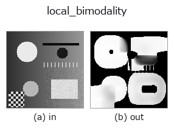
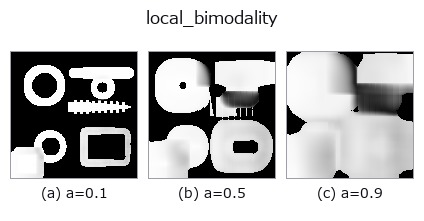
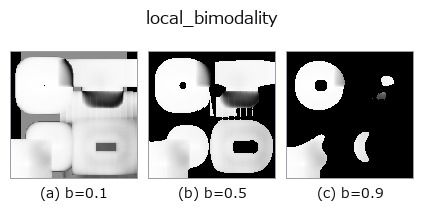
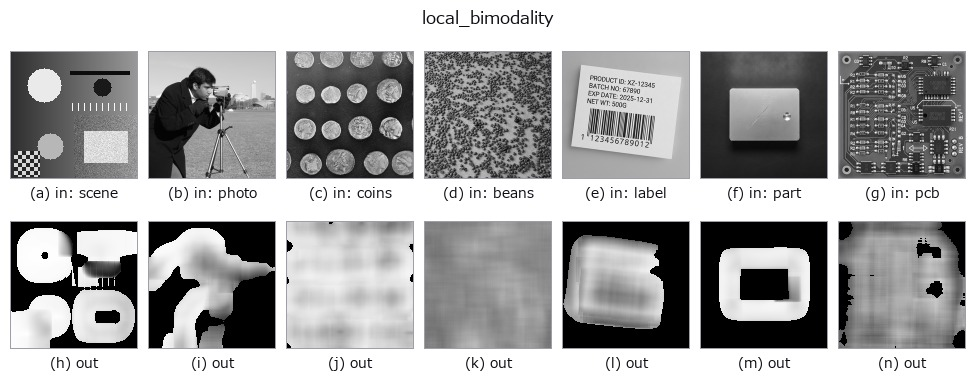

# local_bimodality — 2D `texture` op

- **データ種**: `image` → `image`
- **呼び出し**: `fullseye.apply(img, "local_bimodality", a=0.5, b=0.5)` (2-D は 1 画像 + 2 スカラつまみ `a,b∈[0,1]` のモデル)



*図は合成の入力 128×128 で実際に走らせた出力。左が入力、右が出力。点群は上から見た散布(明るさ = z)、1-D 列は折れ線、体積は z 方向の最大値投影、動画は中央フレーム、複素画像は振幅、絵にならない返り値は値そのもの。*

**つまみ a を振る**(0.1 / 0.5 / 0.9、もう一方は既定):



**つまみ b を振る**(0.1 / 0.5 / 0.9、もう一方は既定):



**別の画像でも**(合成シーン / 写真 / 硬貨。上段が入力、下段がその出力。つまみは既定):



*4 列目はカラー (H,W,3) の入力。この op は色を跨がずに扱える(色チャネルを 3 本目の空間軸として畳み込まない)。*

## 使い方

**局所の二峰性**(bimodality coefficient)。閾値を 1 つも選ばずに「ここは 2 つの
値に分かれているか」だけを 0〜1 の地図で返す。

``a`` が窓の一辺を ``9, 15, 25, 41`` に振る(大きいほど推定は安定するが、細い構造は
周りに溶ける)。``b`` が**コントラストの床**を ``max(1e-5, 0.25b x 画像の値域)`` に
振る ―― 窓の標準偏差がこれ未満なら 0 を返す(b=0 でも 1e-5 の絶対床は残る)。

``BC = (歪度^2 + 1) / 尖度`` で、窓の 1〜4 次モーメント(箱型平均 4 回)だけから
閉形式に出る。**平行移動にもスケールにも不変**なので、薄い模様でも濃い模様でも
同じ値になる。参照値は解析解で決まっていて、実測もそこへ収束する(窓 41):

* **2 点分布(半々の 2 値)= 1.0**(尖度 1 が下限)―― 段差の真上で実測 1.0000
* **一様分布 = 5/9 = 0.5556** ―― 一様乱数で実測 0.5598
* **正規分布 = 1/3 = 0.3333** ―― 正規乱数で実測 0.3306

``> 5/9`` が「一様より尖った 2 山」の古典的な目安。★**一峰でも 0 にはならない**
―― 正規分布の床は 1/3 であって 0 ではないので、使えるのは 0.33〜1.0 の帯である。

**出典と、引き継いでいる限界**(Pfister, Schwarz, Janczyk, Dale & Freeman 2013,
*Frontiers in Psychology* 4:700)。★**歪んだ単峰分布が偽陽性を出す**: 論文の図では
**明らかに単峰の分布が BC = 0.73**、**本当に二峰の分布が BC = 0.67** で、順位が
逆転している。歪度が絶対値で大きいほど、山の数と無関係に BC が上がるため。
**この op も同じ性質を持つ** —— 片側に尾を引く窓(暗い地に明るい点が少しだけ、など)は
高く出る。二峰性の判定を 1 本で決めず、``local_std`` や ``otsu`` の分離度と併せること。
なお論文の式は標本補正つき ``(m3^2+1)/(m4 + 3(n-1)^2/((n-2)(n-3)))`` で、この op は
**母集団版**を使う(窓は 81〜1,681 標本あり補正は無視できる。上の参照値 1/3・5/9・1.0 は
母集団版で厳密に成り立つ)。

**閾値を選ぶ側の一般化との関係**: Barron (2020) の Generalized Histogram Thresholding
(arXiv:2007.07350)は Otsu・Minimum Error Thresholding・重み付きパーセンタイル閾値を
特殊ケースとして包含し、**どの閾値にするか**を連続に補間する。この op は対になる側で、
**そもそも閾値が在るか**を測る。

**なぜ閾値を選ぶ op(``otsu`` / ``threshold``)の前に要るか**: 二値化はどんな画像
でも答えを返すが、山が 1 つしか無い窓では**意味の無い位置で切る**(``otsu`` の
docstring が自ら認めている限界)。この op は切る前に「そもそも分かれるのか」を
返すので、「分かれない場所は切らない」と決められる。文字のマスが 1 色の地に 1 色の
字か、板が均一に照っているか、傷が本当に地と別の階調かの判定に使う。

★**床は必須**。一様な面では分散が丸め屑になり、屑どうしの 3 次・4 次の比が構造に
化ける ―― 床を画像の値域に対する相対量だけで置いた版は、0.5 一色に振幅 1e-12〜1e-8
の屑を乗せただけの画像で **BC の最大が 1.0000** になった(値域そのものが屑なので
相対床が効かない)。絶対床 1e-5 を併せて初めて 0 に落ちる(実測)。

**正規化しない**(値は BC そのもの)ので、**画像間で比較できる**。縁は反射
(``mode="reflect"``)。空フレームは全 0。★窓が広いので**タイル分割してはいけない**
(``scale.py`` に理由つきで登録済み)。

## 詳しい使い方ガイド

- [gallery2d_texture_freq ファミリ ガイド](../guides/gallery2d_texture_freq.md)

## 参考(サンプルデータ・文献)

- [サンプルデータ カタログ(DL URL / ライセンス)](../../SAMPLES.md) — 2-D は skimage.data(BSD/public)+ 合成、3-D は実データ源(Stanford/PDS 等)の DL URL。
- [演算子の来歴・参考文献](../../../REFERENCES.md) — この op 族の元になった研究/手法の出典。
- アルゴリズムの正典(著者・年)と用途は上記**ファミリ使い方ガイド**に記載。

## Studio で試す

下のプログラムは実際に走ることを確かめてある(図と同じ入力)。Studio のヘルプではこのブロックがボタンになり、その場で読み込んで実行できる。

```program
local_bimodality 0.50 0.50
```

## 実行できる例(この op を実際に呼ぶ検証済みサンプル)

- [gallery2d_texture_freq](../../../../examples/gallery2d_texture_freq.py) — `py -3.11 examples/gallery2d_texture_freq.py`

## 型が繋がる次の op(`image` を入力に取れる)

[identity](../misc/identity.md) · [gaussian](../smoothing/gaussian.md) · [mean_box](../smoothing/mean_box.md) · [bilateral](../smoothing/bilateral.md) · [unsharp](../smoothing/unsharp.md) · [median](../rank/median.md) · [min_filter](../rank/min_filter.md) · [max_filter](../rank/max_filter.md)

## 同カテゴリ(`texture`)

[std_filter](std_filter.md) · [local_std](local_std.md) · [scale_select_std](scale_select_std.md) · [bootstrap_std_error](bootstrap_std_error.md) · [structure_tensor_orientation](structure_tensor_orientation.md) · [structure_tensor_coherence](structure_tensor_coherence.md) · [gabor](gabor.md) · [sk_frangi](sk_frangi.md)

---
*Provenance: ops.py — 2D operator registry. この per-op ノートは `tools/opdocs.py md` が自動生成(手編集しない)。*

© 2026 Kazufumi Furuse — Fullseye operator documentation. Licensed under Apache-2.0.
