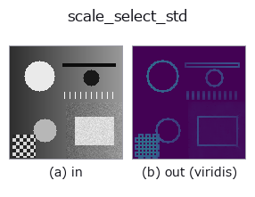
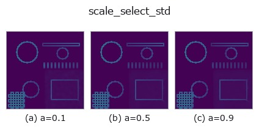
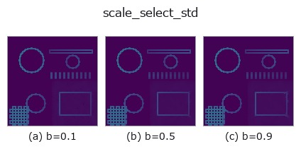
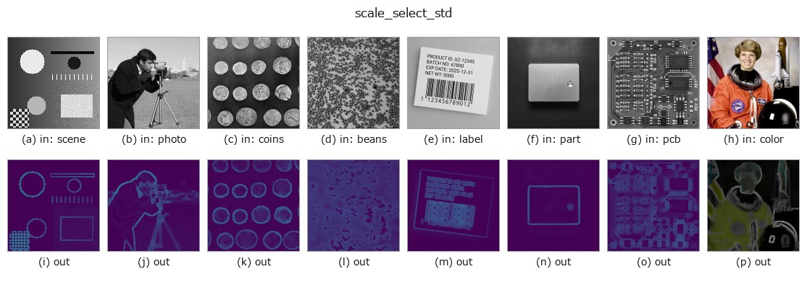

# scale_select_std — 2D `texture` op

- **データ種**: `image` → `image`
- **呼び出し**: `fullseye.apply(img, "scale_select_std", a=0.5, b=0.5)` (2-D は 1 画像 + 2 スカラつまみ `a,b∈[0,1]` のモデル)



*図は合成の入力 128×128 で実際に走らせた出力。左が入力、右が出力。点群は上から見た散布(明るさ = z)、1-D 列は折れ線、体積は z 方向の最大値投影、動画は中央フレーム、複素画像は振幅、絵にならない返り値は値そのもの。*

*出力は viridis 風の疑似カラー(暗い紫 = 小、黄 = 大)。距離・位相・向き・深度のような「量の場」を読むため。*

**つまみ a を振る**(0.1 / 0.5 / 0.9、もう一方は既定):



**つまみ b を振る**(0.1 / 0.5 / 0.9、もう一方は既定):



**別の画像でも**(合成シーン / 写真 / 硬貨。上段が入力、下段がその出力。つまみは既定):



*4 列目はカラー (H,W,3) の入力。この op は色を跨がずに扱える(色チャネルを 3 本目の空間軸として畳み込まない)。*

## 使い方

画素ごとに**窓の大きさを選ぶ**局所標準偏差(Lepski / ICI 規則)。

窓を広げるほど推定は安定するが(相対標準誤差 ``1/sqrt(2(n-1))``)、縁がにじんで
分解能が落ちる —— **大きさを 1 つ選ぶ限りこの矛盾は解けない**。解き方は「時間でも
場所でもなく**場所ごとに別の答えを持つ**」こと: 小さい窓から順に、推定値の信頼区間が
交わり続ける間だけ窓を広げ、交わらなくなった 1 つ手前で止める。平坦な所では大きな窓
(安定)、縁の近くでは小さな窓(にじまない)が自動で選ばれる。

``a`` が試す窓の上限(``3,5,7,9,11,13,15`` のどこまでか)、``b`` が信頼区間の倍率
``gamma``(1.0〜3.0)。``gamma`` を大きくすると窓が伸びやすくなる(安定寄り)。

**``local_std`` との関係**: ``local_std`` は窓を固定する。平坦部の推定を締めたくて
窓を広げると縁がにじむ、という取引をこちらは場所ごとに解く。**縁の鋭さを保ったまま
平坦部の誤差だけ下げられる**のが取り柄で、代わりに計算量が窓の数だけ増える。

**適用条件**: (1) 「交わるか」の判定は誤差限界が正しいことに依存する —— 白色雑音
でない(空間相関のある)雑音では窓が伸びすぎる。(2) ``gamma`` が小さすぎると常に
最小窓が選ばれ、``local_std`` の 3x3 と同じになる(効いていないときの見分け方)。

## 詳しい使い方ガイド

- [gallery2d_texture_freq ファミリ ガイド](../guides/gallery2d_texture_freq.md)

## 参考(サンプルデータ・文献)

- [サンプルデータ カタログ(DL URL / ライセンス)](../../SAMPLES.md) — 2-D は skimage.data(BSD/public)+ 合成、3-D は実データ源(Stanford/PDS 等)の DL URL。
- [演算子の来歴・参考文献](../../../REFERENCES.md) — この op 族の元になった研究/手法の出典。
- アルゴリズムの正典(著者・年)と用途は上記**ファミリ使い方ガイド**に記載。

## Studio で試す

下のプログラムは実際に走ることを確かめてある(図と同じ入力)。Studio のヘルプではこのブロックがボタンになり、その場で読み込んで実行できる。

```program
scale_select_std 0.50 0.50
```

## 実行できる例(この op を実際に呼ぶ検証済みサンプル)

- [gallery2d_texture_freq](../../../../examples/gallery2d_texture_freq.py) — `py -3.11 examples/gallery2d_texture_freq.py`

## 型が繋がる次の op(`image` を入力に取れる)

[identity](../misc/identity.md) · [gaussian](../smoothing/gaussian.md) · [mean_box](../smoothing/mean_box.md) · [bilateral](../smoothing/bilateral.md) · [unsharp](../smoothing/unsharp.md) · [median](../rank/median.md) · [min_filter](../rank/min_filter.md) · [max_filter](../rank/max_filter.md)

## 同カテゴリ(`texture`)

[std_filter](std_filter.md) · [local_bimodality](local_bimodality.md) · [local_std](local_std.md) · [bootstrap_std_error](bootstrap_std_error.md) · [structure_tensor_orientation](structure_tensor_orientation.md) · [structure_tensor_coherence](structure_tensor_coherence.md) · [gabor](gabor.md) · [sk_frangi](sk_frangi.md)

---
*Provenance: ops.py — 2D operator registry. この per-op ノートは `tools/opdocs.py md` が自動生成(手編集しない)。*

© 2026 Kazufumi Furuse — Fullseye operator documentation. Licensed under Apache-2.0.
