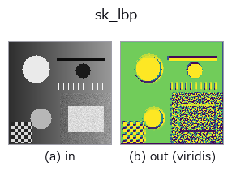
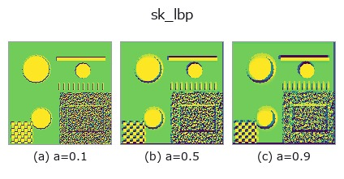
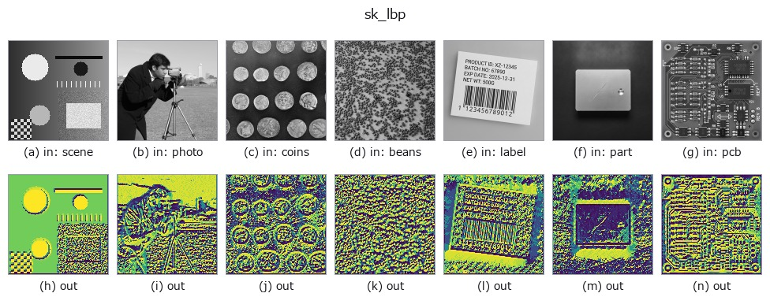

# sk_lbp — 2D `texture` op

- **データ種**: `image` → `image`
- **呼び出し**: `fullseye.apply(img, "sk_lbp", a=0.5, b=0.5)` (2-D は 1 画像 + 2 スカラつまみ `a,b∈[0,1]` のモデル)



*図は合成の入力 128×128 で実際に走らせた出力。左が入力、右が出力。点群は上から見た散布(明るさ = z)、1-D 列は折れ線、体積は z 方向の最大値投影、動画は中央フレーム、複素画像は振幅、絵にならない返り値は値そのもの。*

*出力は viridis 風の疑似カラー(暗い紫 = 小、黄 = 大)。距離・位相・向き・深度のような「量の場」を読むため。*

**つまみ a を振る**(0.1 / 0.5 / 0.9、もう一方は既定):



*つまみ b は出力を変えない(実測: 0.1 / 0.5 / 0.9 で同一)。*

**別の画像でも**(合成シーン / 写真 / 硬貨。上段が入力、下段がその出力。つまみは既定):



*4 列目はカラー (H,W,3) の入力。この op は色を跨がずに扱える(色チャネルを 3 本目の空間軸として畳み込まない)。*

## 使い方

LBP(Local Binary Pattern、局所二値パターン)。各画素を中心に円周上の近傍画素と大小比較して 2 進コードを作る、照明変化に強いテクスチャ記述子。

HALCON に直接対応するものは無い。実装は ``feature.local_binary_pattern(v, 8, 1+int(a*3))`` を正規化したもの —— 近傍点数 P=8 は固定、a は半径 R を 1〜4 に振る(半径が大きいほど粗いスケールのテクスチャを拾う)。★``b`` は符号化 ``method`` を選ぶ ―― ``b<0.60`` で ``'default'``(既定。回転不変ではない)、``<0.75`` で ``'ror'``、``<0.90`` で ``'uniform'``、それ以上で ``'nri_uniform'``。

実写のテクスチャで測ると、**回転不変な符号化にしても異方な素材は救えない** ―― brick / grass / gravel で、回転による自分自身からのずれを素材間の最小距離で割った比は ``'default'`` で 9.64 / 0.17 / 0.19、``'uniform'`` で **1.72** / 0.02 / 0.01。等方な 2 つは 10 倍良くなるのに、brick は 1 を割らない(回した自分より別の素材のほうが近い)。LBP の回転不変性は**局所パターンの巡回**に対するもので、**素材そのものの向きの分布**は消せないため。詳細 = ``examples/poc_real_texture_invariance.py``。

## 詳しい使い方ガイド

- [gallery2d_texture_freq ファミリ ガイド](../guides/gallery2d_texture_freq.md)

## 参考(サンプルデータ・文献)

- [サンプルデータ カタログ(DL URL / ライセンス)](../../SAMPLES.md) — 2-D は skimage.data(BSD/public)+ 合成、3-D は実データ源(Stanford/PDS 等)の DL URL。
- [演算子の来歴・参考文献](../../../REFERENCES.md) — この op 族の元になった研究/手法の出典。
- アルゴリズムの正典(著者・年)と用途は上記**ファミリ使い方ガイド**に記載。

## Studio で試す

下のプログラムは実際に走ることを確かめてある(図と同じ入力)。Studio のヘルプではこのブロックがボタンになり、その場で読み込んで実行できる。

```program
sk_lbp 0.50 0.50
```

## 実行できる例(この op を実際に呼ぶ検証済みサンプル)

- [gallery2d_texture_freq](../../../../examples/gallery2d_texture_freq.py) — `py -3.11 examples/gallery2d_texture_freq.py`
- [poc_real_texture_invariance](../../../../examples/poc_real_texture_invariance.py) — `py -3.11 examples/poc_real_texture_invariance.py`

## 型が繋がる次の op(`image` を入力に取れる)

[identity](../misc/identity.md) · [gaussian](../smoothing/gaussian.md) · [mean_box](../smoothing/mean_box.md) · [bilateral](../smoothing/bilateral.md) · [unsharp](../smoothing/unsharp.md) · [median](../rank/median.md) · [min_filter](../rank/min_filter.md) · [max_filter](../rank/max_filter.md)

## 同カテゴリ(`texture`)

[std_filter](std_filter.md) · [gabor](gabor.md) · [sk_frangi](sk_frangi.md) · [sk_meijering](sk_meijering.md) · [sk_hessian](sk_hessian.md) · [sk_gabor](sk_gabor.md) · [sk_entropy](sk_entropy.md) · [sk_shape_index](sk_shape_index.md)

---
*Provenance: ops.py — 2D operator registry. この per-op ノートは `tools/opdocs.py md` が自動生成(手編集しない)。*

© 2026 Kazufumi Furuse — Fullseye operator documentation. Licensed under Apache-2.0.
