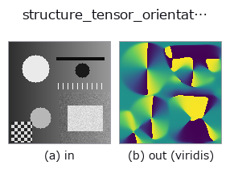
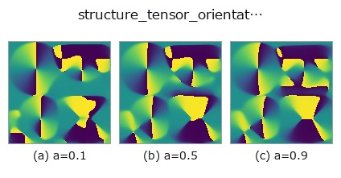
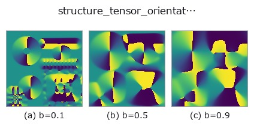
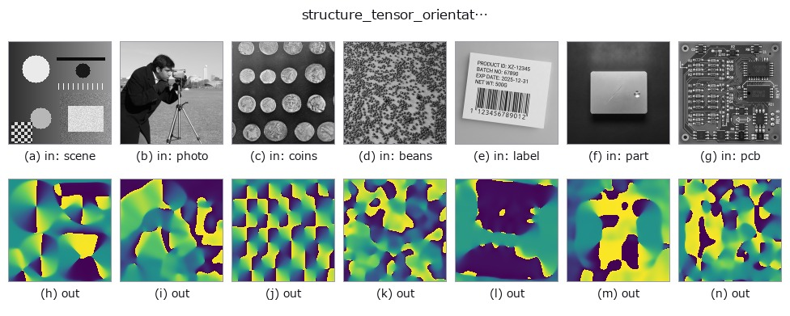

# structure_tensor_orientation — 2D `texture` op

- **データ種**: `image` → `image`
- **呼び出し**: `fullseye.apply(img, "structure_tensor_orientation", a=0.5, b=0.5)` (2-D は 1 画像 + 2 スカラつまみ `a,b∈[0,1]` のモデル)



*図は合成の入力 128×128 で実際に走らせた出力。左が入力、右が出力。点群は上から見た散布(明るさ = z)、1-D 列は折れ線、体積は z 方向の最大値投影、動画は中央フレーム、複素画像は振幅、絵にならない返り値は値そのもの。*

*出力は viridis 風の疑似カラー(暗い紫 = 小、黄 = 大)。距離・位相・向き・深度のような「量の場」を読むため。*

**つまみ a を振る**(0.1 / 0.5 / 0.9、もう一方は既定):



**つまみ b を振る**(0.1 / 0.5 / 0.9、もう一方は既定):



**別の画像でも**(合成シーン / 写真 / 硬貨。上段が入力、下段がその出力。つまみは既定):



*4 列目はカラー (H,W,3) の入力。この op は色を跨がずに扱える(色チャネルを 3 本目の空間軸として畳み込まない)。*

## 使い方

局所の**縞の走る向き**(構造テンソルの主軸)を ``[0,1]`` に写して返す。

``0`` と ``1`` がともに水平、``0.5`` が垂直にあたる(向きは 180 度で一周するので、
``0`` と ``1`` は同じ向き —— **この出力を差分すると境目で偽の段差が出る**ことに注意)。

``a`` が微分前の平滑 ``sigma``(0.5〜3.0 画素)、``b`` が積分窓 ``rho``(1.0〜8.0 画素)。
``rho`` は「どれくらいの広さで向きが揃っているとみなすか」で、繊維や研磨目のピッチより
大きく取る。

**適用条件**: 向きが定義できるのは**勾配が構造的に偏っている所だけ**。テンソルの
異方度が跡に対して ``1e-6`` を下回る画素(平坦面・等方な雑音)は「向き未定義」として
``0.5`` を返す —— ここで床を置かないと、一様な面で丸め屑が ``arctan2`` に増幅されて
**明るさを 0.01 変えただけで向きが一斉に反転する**。向きの確からしさは
``structure_tensor_coherence`` で別に測ること。

**用途**: 繊維強化材の繊維配向、圧延・研磨の条痕方向、木目、結晶粒の伸長方向。
HALCON に対応する単体 op は無い。

## 詳しい使い方ガイド

- [gallery2d_texture_freq ファミリ ガイド](../guides/gallery2d_texture_freq.md)

## 参考(サンプルデータ・文献)

- [サンプルデータ カタログ(DL URL / ライセンス)](../../SAMPLES.md) — 2-D は skimage.data(BSD/public)+ 合成、3-D は実データ源(Stanford/PDS 等)の DL URL。
- [演算子の来歴・参考文献](../../../REFERENCES.md) — この op 族の元になった研究/手法の出典。
- アルゴリズムの正典(著者・年)と用途は上記**ファミリ使い方ガイド**に記載。

## Studio で試す

下のプログラムは実際に走ることを確かめてある(図と同じ入力)。Studio のヘルプではこのブロックがボタンになり、その場で読み込んで実行できる。

```program
structure_tensor_orientation 0.50 0.50
```

## 実行できる例(この op を実際に呼ぶ検証済みサンプル)

- [gallery2d_texture_freq](../../../../examples/gallery2d_texture_freq.py) — `py -3.11 examples/gallery2d_texture_freq.py`

## 型が繋がる次の op(`image` を入力に取れる)

[identity](../misc/identity.md) · [gaussian](../smoothing/gaussian.md) · [mean_box](../smoothing/mean_box.md) · [bilateral](../smoothing/bilateral.md) · [unsharp](../smoothing/unsharp.md) · [median](../rank/median.md) · [min_filter](../rank/min_filter.md) · [max_filter](../rank/max_filter.md)

## 同カテゴリ(`texture`)

[std_filter](std_filter.md) · [local_std](local_std.md) · [scale_select_std](scale_select_std.md) · [bootstrap_std_error](bootstrap_std_error.md) · [structure_tensor_coherence](structure_tensor_coherence.md) · [gabor](gabor.md) · [sk_frangi](sk_frangi.md) · [sk_meijering](sk_meijering.md)

---
*Provenance: ops.py — 2D operator registry. この per-op ノートは `tools/opdocs.py md` が自動生成(手編集しない)。*

© 2026 Kazufumi Furuse — Fullseye operator documentation. Licensed under Apache-2.0.
