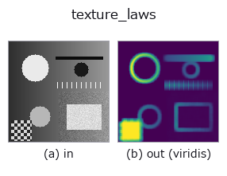
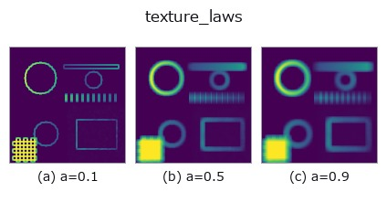
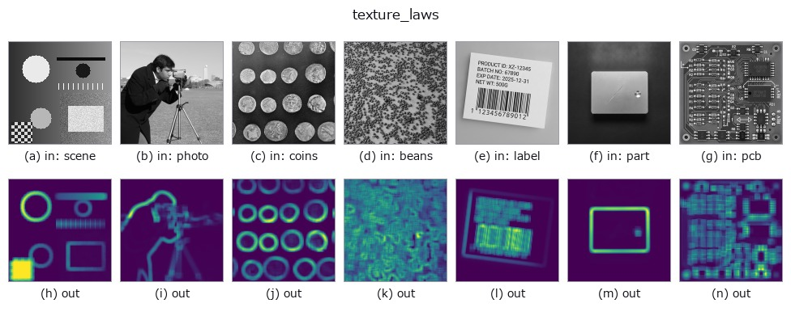

# texture_laws — 2D `texture` op

- **データ種**: `image` → `image`
- **呼び出し**: `fullseye.apply(img, "texture_laws", a=0.5, b=0.5)` (2-D は 1 画像 + 2 スカラつまみ `a,b∈[0,1]` のモデル)
- **HALCON 相当**: `texture_laws`(意味・パラメータは HALCON リファレンスが参考になる)



*図は合成の入力 128×128 で実際に走らせた出力。左が入力、右が出力。点群は上から見た散布(明るさ = z)、1-D 列は折れ線、体積は z 方向の最大値投影、動画は中央フレーム、複素画像は振幅、絵にならない返り値は値そのもの。*

*出力は viridis 風の疑似カラー(暗い紫 = 小、黄 = 大)。距離・位相・向き・深度のような「量の場」を読むため。*

**つまみ a を振る**(0.1 / 0.5 / 0.9、もう一方は既定):



*つまみ b は出力を変えない(実測: 0.1 / 0.5 / 0.9 で同一)。*

**別の画像でも**(合成シーン / 写真 / 硬貨。上段が入力、下段がその出力。つまみは既定):



*カラー (H,W,3) の入力は載せていない: この op は色チャネルを 3 本目の空間軸として扱う(色を跨ぐ)ため。チャネルごとに分けて呼ぶこと。*

## 使い方

実装は局所分散(``deviation_image`` の分散版、窓内の
``E[x^2]-E[x]^2``)。本来の Laws' テクスチャフィルタは L5/E5/S5/W5/R5 などの
1 次元カーネル対から作る 25 種類の畳み込みバンク(エネルギー/エッジ/波状/
斑点/波紋を捉える)だが、この代役ではその全カーネルバンクではなく単一の
局所分散で代用している(近似の限界 ―― 方向別・周波数別の情報は失われる)。
HALCON の ``texture_laws``（Filter an image using a Laws texture filter.）
の代役。

``a`` が窓の一辺を ``{3,5,7,9}`` で振る。``b`` は未使用。

**つまみ(実測)**: ``a`` は**段階的**に効き、切り替わるのは a ≈ 0.25、0.49、0.75(実測。刻み 0.02 の掃きで測った位置)。

**値の比較可能性(実測)**: 出力を**その画像の最大値で正規化**している(出力の最大が常に 1.0、入力を定数倍しても出力が変わらない)。したがって**画像をまたいで値を比較できない** —— 同じ強さの特徴でも、その画像の中で最も強い特徴が何かによって値が変わる。弱い特徴しか無い画像では雑音が 1.0 まで持ち上がる。画像間で比べたいときは、共通の基準で割り直すこと。

**何も写っていないフレーム(実測)**: 明るさが一様な画像を入れると、**明るさに関係なく空(全画素が背景 0)**になる。真っ白でも真っ黒でも同じで、明るさそのものでは何も検出しない。

## 詳しい使い方ガイド

- [gallery2d_texture_freq ファミリ ガイド](../guides/gallery2d_texture_freq.md)

## 参考(サンプルデータ・文献)

- [サンプルデータ カタログ(DL URL / ライセンス)](../../SAMPLES.md) — 2-D は skimage.data(BSD/public)+ 合成、3-D は実データ源(Stanford/PDS 等)の DL URL。
- [演算子の来歴・参考文献](../../../REFERENCES.md) — この op 族の元になった研究/手法の出典。
- アルゴリズムの正典(著者・年)と用途は上記**ファミリ使い方ガイド**に記載。

## Studio で試す

下のプログラムは実際に走ることを確かめてある(図と同じ入力)。Studio のヘルプではこのブロックがボタンになり、その場で読み込んで実行できる。

```program
texture_laws 0.50 0.50
```

## 実行できる例(この op を実際に呼ぶ検証済みサンプル)

- [gallery2d_texture_freq](../../../../examples/gallery2d_texture_freq.py) — `py -3.11 examples/gallery2d_texture_freq.py`

## 型が繋がる次の op(`image` を入力に取れる)

[identity](../misc/identity.md) · [gaussian](../smoothing/gaussian.md) · [mean_box](../smoothing/mean_box.md) · [bilateral](../smoothing/bilateral.md) · [unsharp](../smoothing/unsharp.md) · [median](../rank/median.md) · [min_filter](../rank/min_filter.md) · [max_filter](../rank/max_filter.md)

## 同カテゴリ(`texture`)

[std_filter](std_filter.md) · [local_bimodality](local_bimodality.md) · [local_std](local_std.md) · [scale_select_std](scale_select_std.md) · [bootstrap_std_error](bootstrap_std_error.md) · [structure_tensor_orientation](structure_tensor_orientation.md) · [structure_tensor_coherence](structure_tensor_coherence.md) · [gabor](gabor.md)

---
*Provenance: ops.py — 2D operator registry. この per-op ノートは `tools/opdocs.py md` が自動生成(手編集しない)。*

© 2026 Kazufumi Furuse — Fullseye operator documentation. Licensed under Apache-2.0.
