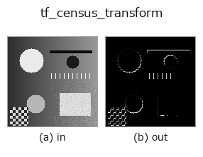
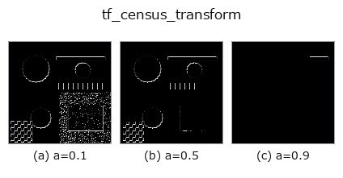
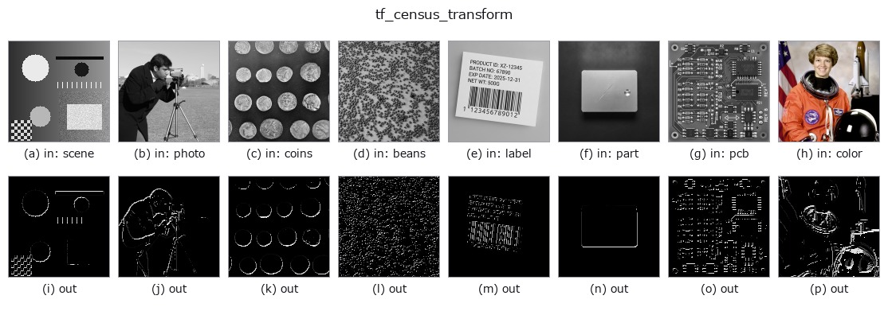

# tf_census_transform — 2D `texture` op

- **データ種**: `image` → `image`
- **呼び出し**: `fullseye.apply(img, "tf_census_transform", a=0.5, b=0.5)` (2-D は 1 画像 + 2 スカラつまみ `a,b∈[0,1]` のモデル)



*図は合成の入力 128×128 で実際に走らせた出力。左が入力、右が出力。点群は上から見た散布(明るさ = z)、1-D 列は折れ線、体積は z 方向の最大値投影、動画は中央フレーム、複素画像は振幅、絵にならない返り値は値そのもの。*

**つまみ a を振る**(0.1 / 0.5 / 0.9、もう一方は既定):



*つまみ b は出力を変えない(実測: 0.1 / 0.5 / 0.9 で同一)。*

**別の画像でも**(合成シーン / 写真 / 硬貨。上段が入力、下段がその出力。つまみは既定):



*4 列目はカラー (H,W,3) の入力。この op は色を跨がずに扱える(色チャネルを 3 本目の空間軸として畳み込まない)。*

## 使い方

census_transform: the 3x3 non-parametric census bit-signature image.

For every pixel each of its 8 neighbours contributes one bit, set when the
centre exceeds the neighbour by more than a *relative* tolerance
``a * |centre|`` (``a`` defaults the tolerance; ``b`` unused). The 8 bits form
a value 0..255 rendered as [0,1]. Because the tolerance is relative and the
comparison is on ordering only, the signature is invariant to a global gain
(multiplying the image by any positive constant leaves every bit unchanged) --
the robustness-to-gain property that makes census matching useful for stereo.
Uses the raw (non-luma-collapsed) reflected border.

**端の扱い**: 端画素を重複させずに折り返す (d c b | a b c d、OpenCV の ``BORDER_REFLECT_101``)(実測。`tools/impl2/border_probe.py`)。

**何も写っていないフレーム(実測)**: 明るさが一様な画像を入れると、**明るさに関係なく空(全画素が背景 0)**になる。真っ白でも真っ黒でも同じで、明るさそのものでは何も検出しない。

## 詳しい使い方ガイド

- [gallery2d_texture_freq ファミリ ガイド](../guides/gallery2d_texture_freq.md)

## 参考(サンプルデータ・文献)

- [サンプルデータ カタログ(DL URL / ライセンス)](../../SAMPLES.md) — 2-D は skimage.data(BSD/public)+ 合成、3-D は実データ源(Stanford/PDS 等)の DL URL。
- [演算子の来歴・参考文献](../../../REFERENCES.md) — この op 族の元になった研究/手法の出典。
- アルゴリズムの正典(著者・年)と用途は上記**ファミリ使い方ガイド**に記載。

## Studio で試す

下のプログラムは実際に走ることを確かめてある(図と同じ入力)。Studio のヘルプではこのブロックがボタンになり、その場で読み込んで実行できる。

```program
tf_census_transform 0.50 0.50
```

## 実行できる例(この op を実際に呼ぶ検証済みサンプル)

- [gallery2d_texture_freq](../../../../examples/gallery2d_texture_freq.py) — `py -3.11 examples/gallery2d_texture_freq.py`

## 型が繋がる次の op(`image` を入力に取れる)

[identity](../misc/identity.md) · [gaussian](../smoothing/gaussian.md) · [mean_box](../smoothing/mean_box.md) · [bilateral](../smoothing/bilateral.md) · [unsharp](../smoothing/unsharp.md) · [median](../rank/median.md) · [min_filter](../rank/min_filter.md) · [max_filter](../rank/max_filter.md)

## 同カテゴリ(`texture`)

[std_filter](std_filter.md) · [local_bimodality](local_bimodality.md) · [local_std](local_std.md) · [scale_select_std](scale_select_std.md) · [bootstrap_std_error](bootstrap_std_error.md) · [structure_tensor_orientation](structure_tensor_orientation.md) · [structure_tensor_coherence](structure_tensor_coherence.md) · [gabor](gabor.md)

---
*Provenance: ops.py — 2D operator registry. この per-op ノートは `tools/opdocs.py md` が自動生成(手編集しない)。*

© 2026 Kazufumi Furuse — Fullseye operator documentation. Licensed under Apache-2.0.
