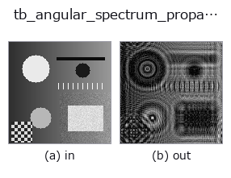
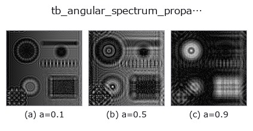
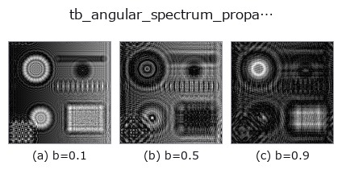
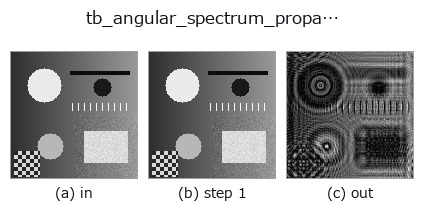
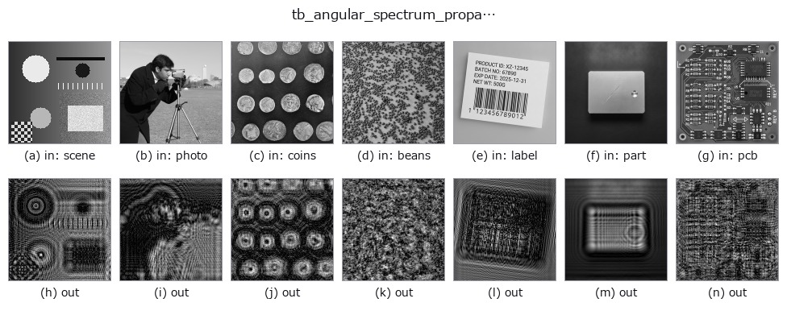

# tb_angular_spectrum_propagate — 2D `typed` op

- **データ種**: `cimage` → `cimage`
- **呼び出し**: `fullseye.apply(img, "tb_angular_spectrum_propagate", a=0.5, b=0.5)` (2-D は 1 画像 + 2 スカラつまみ `a,b∈[0,1]` のモデル)



*図は合成の入力 128×128 で実際に走らせた出力。左が入力、右が出力。点群は上から見た散布(明るさ = z)、1-D 列は折れ線、体積は z 方向の最大値投影、動画は中央フレーム、複素画像は振幅、絵にならない返り値は値そのもの。*

**つまみ a を振る**(0.1 / 0.5 / 0.9、もう一方は既定):



**つまみ b を振る**(0.1 / 0.5 / 0.9、もう一方は既定):



**段階**(前置きの op → この op。左から順):



**別の画像でも**(合成シーン / 写真 / 硬貨。上段が入力、下段がその出力。つまみは既定):



## 使い方

Exact scalar free-space propagation of a complex field (angular spectrum).

    ``U(z) = IFFT{ FFT{U(0)} * exp(i*2*pi*z*sqrt(1/lambda^2 - fx^2 - fy^2)) }``
    in the ``exp(-i*omega*t)`` convention, so a positive *distance_um*
    propagates forward. Components beyond the propagating cone
    (``fx^2 + fy^2 > 1/lambda^2``) are **attenuated** by
    ``exp(-2*pi*|z|*sqrt(fx^2 + fy^2 - 1/lambda^2))``, which is the physical
    evanescent decay — not zeroed, so ``distance_um = 0`` is an *exact*
    identity and the transfer function is continuous through it.

    Unlike Fresnel propagation this makes no paraxial approximation: it is the
    exact solution of the Helmholtz equation for a band-limited field, valid
    from a fraction of a wavelength outward.

    Returns a complex128 array with the same shape as *field*.

    Ground truth it reproduces (measured): ``distance_um = 0`` returns the field
    bit-identically (it short-circuits the transform pair); propagating ``+z``
    then ``-z`` returns the original to a relative L2 error of 4.3e-16 to
    5.3e-16 for a band-limited field (measured on three: 64x64 random at
    +/-50 um, a 64x64 Gaussian at +/-250 um, a 128x128 random at +/-500 um);
    total power is conserved to between 0 and 3.5e-16 relative on the same
    three. A field *with*
    evanescent content does **not** round-trip — those components are gone by
    construction, in both directions, because that is what physically happens.

    *field* is a field in the **space** domain, not a spectrum: do not hand it
    the fftshifted output of :func:`complexops.cx_fft`. Real input is promoted
    to complex, which loses nothing.

    Aliasing: the discrete transfer function is periodic, so a field that
    diffracts past the array edge wraps around. The practical guard is the
    usual one — pad the field so the propagated support stays inside, and keep
    ``pixel_pitch_um`` below ``lambda/(2*NA)``. No warning can detect this
    reliably from the array alone, so none is invented.

    **Raises** ``ValueError``: *field* is not 2-D, smaller than 2x2, larger than
    :data:`MAX_FIELD_ELEMENTS`, masked, or non-finite; non-positive or
    non-finite *wavelength_um* / *pixel_pitch_um*; non-finite *distance_um*.

Typed bridge of the optics op ``angular_spectrum_propagate`` into the 2-D evolution registry: the same implementation, called under the ``op(v, a, b)`` convention. ``a`` drives ``wavelength_um`` (default 0.55) and ``b`` drives ``distance_um`` (default 100).

## 参考(サンプルデータ・文献)

- [サンプルデータ カタログ(DL URL / ライセンス)](../../SAMPLES.md) — 2-D は skimage.data(BSD/public)+ 合成、3-D は実データ源(Stanford/PDS 等)の DL URL。
- [演算子の来歴・参考文献](../../../REFERENCES.md) — この op 族の元になった研究/手法の出典。

## Studio で試す

下のプログラムは実際に走ることを確かめてある(図と同じ入力)。Studio のヘルプではこのブロックがボタンになり、その場で読み込んで実行できる。

```program
img_to_cimage 0.50 0.50
tb_angular_spectrum_propagate 0.50 0.50
```

## 実行できる例(この op を実際に呼ぶ検証済みサンプル)

次の例は元の台帳 op `angular_spectrum_propagate` を呼ぶもの。この橋渡し op は同じ実装を `fn(v, a, b)` 規約に合わせただけなので、挙動はそのまま当てはまる(呼び出し形だけ違う)。
- [optics_imaging](../../../../examples/optics_imaging.py) — `py -3.11 examples/optics_imaging.py`

## 型が繋がる次の op(`cimage` を入力に取れる)

[identity](../misc/identity.md) · [tb_cx_ifft](tb_cx_ifft.md) · [tb_cx_magnitude](tb_cx_magnitude.md) · [tb_cx_phase](tb_cx_phase.md) · [tb_cx_real](tb_cx_real.md) · [tb_cx_imag](tb_cx_imag.md) · [tb_cx_log_magnitude](tb_cx_log_magnitude.md) · [tb_cx_apply_transfer_function](tb_cx_apply_transfer_function.md)

## 同カテゴリ(`typed`)

[tb_points_to_voxel](tb_points_to_voxel.md) · [tb_estimate_point_normals](tb_estimate_point_normals.md) · [tb_iss_keypoints](tb_iss_keypoints.md) · [tb_project_points](tb_project_points.md) · [tb_render_point_depth](tb_render_point_depth.md) · [tb_statistical_outlier_removal](tb_statistical_outlier_removal.md) · [tb_radius_outlier_removal](tb_radius_outlier_removal.md) · [tb_voxel_grid_downsample](tb_voxel_grid_downsample.md)

---
*Provenance: ops.py — 2D operator registry. この per-op ノートは `tools/opdocs.py md` が自動生成(手編集しない)。*

© 2026 Kazufumi Furuse — Fullseye operator documentation. Licensed under Apache-2.0.
