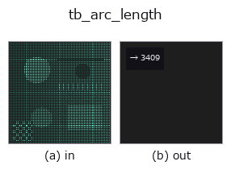
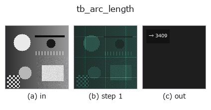

# tb_arc_length — 2D `typed` op

- **データ種**: `points` → `feature`
- **呼び出し**: `fullseye.apply(img, "tb_arc_length", a=0.5, b=0.5)` (2-D は 1 画像 + 2 スカラつまみ `a,b∈[0,1]` のモデル)



*図は合成の入力 128×128 で実際に走らせた出力。左が入力、右が出力。点群は上から見た散布(明るさ = z)、1-D 列は折れ線、体積は z 方向の最大値投影、動画は中央フレーム、複素画像は振幅、絵にならない返り値は値そのもの。*

*つまみ a は出力を変えない(実測: 0.1 / 0.5 / 0.9 で同一)。*

*つまみ b は出力を変えない(実測: 0.1 / 0.5 / 0.9 で同一)。*

**段階**(前置きの op → この op。左から順):



## 使い方

曲線の累積弧長と全長。→ (cumulative (N,), total float)。

    順序付き点列 ``curve`` (N,3) を index 順に折れ線とみなし、隣接点間のユークリッド距離
    を累積する。``cumulative[0]=0``、``cumulative[i]`` = 先頭から i 番目までの折れ線長、
    ``total = cumulative[-1]``。単位は座標と同じ。

    - 入力は ``float`` に変換されるだけで形状検証は無い(列数が 3 以外でも計算は通る)。
    - N=1 では ``cumulative=[0.0]``・``total=0.0``。閉曲線でも終点→始点の区間は数えない
      (閉じたい場合は先頭点を末尾に複製してから渡す)。
    - 重複点(距離 0 の区間)はそのまま 0 として累積されるので ``cumulative`` は単調非減少
      だが狭義増加ではない。

    ``resample_uniform`` はこの累積弧長をパラメータに線形補間する。曲率の弧長積分など
    ``curvature_torsion`` と組み合わせるときの ds はこの差分から取る。

2-D 進化レジストリへ橋渡しした 3d の op ``arc_length``。実装は同じで、呼び出し規約だけ ``op(v, a, b)`` に合わせてある。この op に調整点は無く、``a`` も ``b`` も使われない。

## 参考(サンプルデータ・文献)

- [サンプルデータ カタログ(DL URL / ライセンス)](../../SAMPLES.md) — 2-D は skimage.data(BSD/public)+ 合成、3-D は実データ源(Stanford/PDS 等)の DL URL。
- [演算子の来歴・参考文献](../../../REFERENCES.md) — この op 族の元になった研究/手法の出典。

## Studio で試す

下のプログラムは実際に走ることを確かめてある(図と同じ入力)。Studio のヘルプではこのブロックがボタンになり、その場で読み込んで実行できる。

```program
img_to_points 0.50 0.50
tb_arc_length 0.50 0.50
```

## 実行できる例(この op を実際に呼ぶ検証済みサンプル)

次の例は元の台帳 op `arc_length` を呼ぶもの。この橋渡し op は同じ実装を `fn(v, a, b)` 規約に合わせただけなので、挙動はそのまま当てはまる(呼び出し形だけ違う)。
- [space_curve](../../../../examples_3d/space_curve.py) — `py -3.11 examples_3d/space_curve.py`
- [torus_knot_curve](../../../../examples_3d/torus_knot_curve.py) — `py -3.11 examples_3d/torus_knot_curve.py`

## 型が繋がる次の op(`feature` を入力に取れる)

[identity](../misc/identity.md)

## 同カテゴリ(`typed`)

[tb_points_to_voxel](tb_points_to_voxel.md) · [tb_estimate_point_normals](tb_estimate_point_normals.md) · [tb_iss_keypoints](tb_iss_keypoints.md) · [tb_project_points](tb_project_points.md) · [tb_render_point_depth](tb_render_point_depth.md) · [tb_statistical_outlier_removal](tb_statistical_outlier_removal.md) · [tb_radius_outlier_removal](tb_radius_outlier_removal.md) · [tb_voxel_grid_downsample](tb_voxel_grid_downsample.md)

---
*Provenance: ops.py — 2D operator registry. この per-op ノートは `tools/opdocs.py md` が自動生成(手編集しない)。*

© 2026 Kazufumi Furuse — Fullseye operator documentation. Licensed under Apache-2.0.
