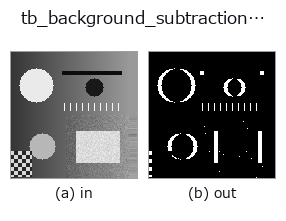
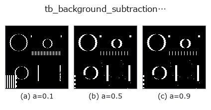
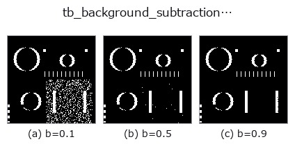
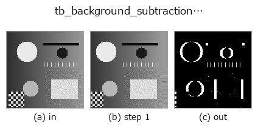
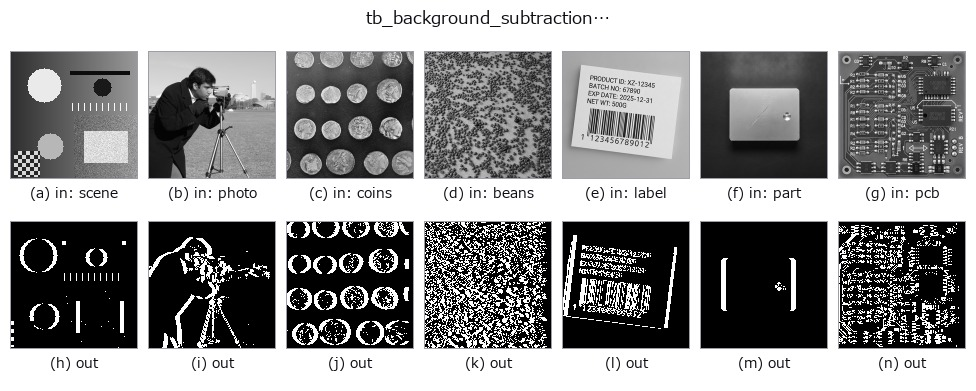

# tb_background_subtraction_window — 2D `typed` op

- **データ種**: `video` → `video`
- **呼び出し**: `fullseye.apply(img, "tb_background_subtraction_window", a=0.5, b=0.5)` (2-D は 1 画像 + 2 スカラつまみ `a,b∈[0,1]` のモデル)



*図は合成の入力 128×128 で実際に走らせた出力。左が入力、右が出力。点群は上から見た散布(明るさ = z)、1-D 列は折れ線、体積は z 方向の最大値投影、動画は中央フレーム、複素画像は振幅、絵にならない返り値は値そのもの。*

**つまみ a を振る**(0.1 / 0.5 / 0.9、もう一方は既定):



**つまみ b を振る**(0.1 / 0.5 / 0.9、もう一方は既定):



**段階**(前置きの op → この op。左から順):



**別の画像でも**(合成シーン / 写真 / 硬貨。上段が入力、下段がその出力。つまみは既定):



**動き**(GIF: フレーム / 視点 / スライスを順に。静止の図が完成形で、GIF は補助):


## 使い方

Causal window-median background → per-frame 0/1 foreground masks ``(T, H, W)`` (``video``).

    フレーム ``t`` ごとに、直近 ``window`` 枚(``max(0, t-window+1) .. t``、**そのフレーム
    自身を含む**)の画素ごとの中央値を背景 ``bg`` とし、``|frame_t - bg| > threshold``
    を 1、それ以外を 0 にする。未来のフレームは見ない(因果的)ので、先頭では
    枚数が足りないぶん窓が短い。

    - ``video``: ``(T, H, W)`` の配列、または同形・同 dtype の 2-D フレームの list。
      uint8/uint16 は dtype の最大値で ``[0, 1]`` に、float はそのまま ``[0, 1]`` に
      クリップ。カラー ``(T, H, W, C)`` は受けない。NaN/Inf は ``ValueError``。
    - ``window``: 1〜4096 の int(bool 不可)。1 だと背景 = 自分なので全画素 0。
      偶数枚のときの中央値は中間 2 値の平均。
    - ``threshold``: ``[0, 1]`` の強度単位(uint8 なら ``/255`` 換算)。
    - 返り値: ``(T, H, W)`` float64 の 0 / 1。
    - 失敗: ``ValueError``(形・dtype・範囲・非有限)。

    ゆっくり動く物体は ``window`` 枚以内に背景へ溶けるので、その場合は
    ``running_gaussian_foreground``(選択的更新)か ``exponential_foreground`` を。
    背景そのものが要るなら ``temporal_median_window``。

2-D 進化レジストリへ橋渡しした videostream の op ``background_subtraction_window``。実装は同じで、呼び出し規約だけ ``op(v, a, b)`` に合わせてある。``a`` が ``window``(既定 5)、``b`` が ``threshold``(既定 0.1)を振る。

## 参考(サンプルデータ・文献)

- [サンプルデータ カタログ(DL URL / ライセンス)](../../SAMPLES.md) — 2-D は skimage.data(BSD/public)+ 合成、3-D は実データ源(Stanford/PDS 等)の DL URL。
- [演算子の来歴・参考文献](../../../REFERENCES.md) — この op 族の元になった研究/手法の出典。

## Studio で試す

下のプログラムは実際に走ることを確かめてある(図と同じ入力)。Studio のヘルプではこのブロックがボタンになり、その場で読み込んで実行できる。

```program
img_to_video 0.50 0.50
tb_background_subtraction_window 0.50 0.50
```

## 実行できる例(この op を実際に呼ぶ検証済みサンプル)

次の例は元の台帳 op `background_subtraction_window` を呼ぶもの。この橋渡し op は同じ実装を `fn(v, a, b)` 規約に合わせただけなので、挙動はそのまま当てはまる(呼び出し形だけ違う)。
- [video_streaming](../../../../examples/video_streaming.py) — `py -3.11 examples/video_streaming.py`

## 型が繋がる次の op(`video` を入力に取れる)

[identity](../misc/identity.md) · [tb_temporal_bandpass](tb_temporal_bandpass.md) · [tb_temporal_band_power](tb_temporal_band_power.md) · [tb_temporal_median_window](tb_temporal_median_window.md) · [tb_moving_average_window](tb_moving_average_window.md) · [tb_frame_difference_causal](tb_frame_difference_causal.md) · [tb_exponential_background](tb_exponential_background.md) · [tb_exponential_foreground](tb_exponential_foreground.md)

## 同カテゴリ(`typed`)

[tb_points_to_voxel](tb_points_to_voxel.md) · [tb_estimate_point_normals](tb_estimate_point_normals.md) · [tb_iss_keypoints](tb_iss_keypoints.md) · [tb_project_points](tb_project_points.md) · [tb_render_point_depth](tb_render_point_depth.md) · [tb_statistical_outlier_removal](tb_statistical_outlier_removal.md) · [tb_radius_outlier_removal](tb_radius_outlier_removal.md) · [tb_voxel_grid_downsample](tb_voxel_grid_downsample.md)

---
*Provenance: ops.py — 2D operator registry. この per-op ノートは `tools/opdocs.py md` が自動生成(手編集しない)。*

© 2026 Kazufumi Furuse — Fullseye operator documentation. Licensed under Apache-2.0.
