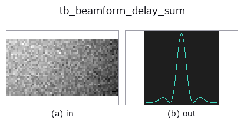
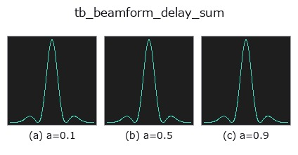
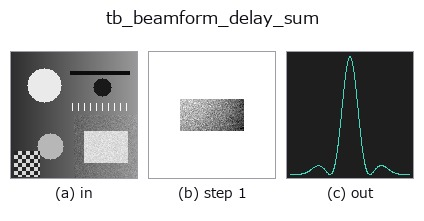
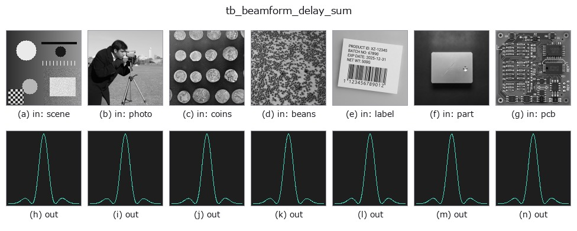

# tb_beamform_delay_sum — 2D `typed` op

- **データ種**: `beatcube` → `signal`
- **呼び出し**: `fullseye.apply(img, "tb_beamform_delay_sum", a=0.5, b=0.5)` (2-D は 1 画像 + 2 スカラつまみ `a,b∈[0,1]` のモデル)



*図は合成の入力 128×128 で実際に走らせた出力。左が入力、右が出力。点群は上から見た散布(明るさ = z)、1-D 列は折れ線、体積は z 方向の最大値投影、動画は中央フレーム、複素画像は振幅、絵にならない返り値は値そのもの。*

**つまみ a を振る**(0.1 / 0.5 / 0.9、もう一方は既定):



*つまみ b は出力を変えない(実測: 0.1 / 0.5 / 0.9 で同一)。*

**段階**(前置きの op → この op。左から順):



**別の画像でも**(合成シーン / 写真 / 硬貨。上段が入力、下段がその出力。つまみは既定):



## 使い方

Delay-and-sum (Bartlett) angle spectrum for one range-Doppler cell.

    Takes the per-antenna complex value at a single range-Doppler cell — by
    default the strongest one — and for each steering angle removes the expected
    inter-element phase and sums:

    ``P(theta) = |sum_k conj(exp(1j*2*pi*d*k*sin(theta)/lambda)) * x_k|^2``

    which peaks at the true arrival angle with value ``(N_a * |a|)^2``: the
    aperture gives ``N_a`` in amplitude, ``N_a^2`` in power. That is the exact
    ground truth the tests pin. Measured with 8 elements: the peak power is
    bit-exactly ``(N_a*N_c*N_s)^2 = 268435456`` (relative error 0.0), and
    sweeping the true angle from -80 to +80 degrees in 5-degree steps (33 cases)
    the reported angle matches the truth with a maximum error of 0.0 degrees.

    The steering grid defaults to ``arange(-90, 90.5, 1.0)``. ``normalize=True``
    divides by ``N_a^2 * N_c^2 * N_s^2`` so that a unit-amplitude bin-centred
    target peaks at 1.0.

    Returns a 1-D float64 array of powers, one per grid angle — a plain signal,
    so :mod:`dsp`'s ``find_peaks`` and :mod:`funct1d`'s smoothing apply to it.
    Use :func:`beamform_doa` if you want the angles themselves.

    *range_bin* is a plain ``0..N_s-1`` index; *doppler_bin* is the **signed**
    velocity bin, the same convention :func:`range_doppler_peaks` reports, so a
    detection can be handed straight back in. Both or neither — half a cell
    address raises rather than quietly beamforming the strongest cell instead.

    **Raises** ``ValueError``: **no aperture** — either a single element, or many
    elements packed into under ~0.28 wavelengths. In both cases the spectrum is
    flat to within float noise and ``argmax`` returns the first grid angle, i.e.
    a confident report of -90 degrees that is pure tie-breaking (measured: 8
    elements at 1e-12 m spacing gave a peak-to-trough spread of exactly 0.0 and
    reported -90.0). Also: an all-zero cube or an all-zero selected cell; only
    one of *range_bin* / *doppler_bin*; an out-of-bounds bin index; an angle grid
    outside ``[-90, 90]``; an FFT that overflows to NaN; plus the usual cube and
    scalar refusals.

Typed bridge of the rangedoppler op ``beamform_delay_sum`` into the 2-D evolution registry: the same implementation, called under the ``op(v, a, b)`` convention. ``a`` drives ``wavelength_m`` (default 0.0038934); ``b`` is unused.

## 参考(サンプルデータ・文献)

- [サンプルデータ カタログ(DL URL / ライセンス)](../../SAMPLES.md) — 2-D は skimage.data(BSD/public)+ 合成、3-D は実データ源(Stanford/PDS 等)の DL URL。
- [演算子の来歴・参考文献](../../../REFERENCES.md) — この op 族の元になった研究/手法の出典。

## Studio で試す

下のプログラムは実際に走ることを確かめてある(図と同じ入力)。Studio のヘルプではこのブロックがボタンになり、その場で読み込んで実行できる。

```program
img_to_beatcube 0.50 0.50
tb_beamform_delay_sum 0.50 0.50
```

## 実行できる例(この op を実際に呼ぶ検証済みサンプル)

次の例は元の台帳 op `beamform_delay_sum` を呼ぶもの。この橋渡し op は同じ実装を `fn(v, a, b)` 規約に合わせただけなので、挙動はそのまま当てはまる(呼び出し形だけ違う)。
- [fmcw_range_doppler](../../../../examples/fmcw_range_doppler.py) — `py -3.11 examples/fmcw_range_doppler.py`

## 型が繋がる次の op(`signal` を入力に取れる)

[identity](../misc/identity.md) · [tb_create_funct_1d_array](tb_create_funct_1d_array.md) · [tb_smooth_funct_1d_gauss](tb_smooth_funct_1d_gauss.md) · [tb_smooth_funct_1d_mean](tb_smooth_funct_1d_mean.md) · [tb_derivate_funct_1d](tb_derivate_funct_1d.md) · [tb_integrate_funct_1d](tb_integrate_funct_1d.md) · [tb_zero_crossings_funct_1d](tb_zero_crossings_funct_1d.md) · [tb_abs_funct_1d](tb_abs_funct_1d.md)

## 同カテゴリ(`typed`)

[tb_points_to_voxel](tb_points_to_voxel.md) · [tb_estimate_point_normals](tb_estimate_point_normals.md) · [tb_iss_keypoints](tb_iss_keypoints.md) · [tb_project_points](tb_project_points.md) · [tb_render_point_depth](tb_render_point_depth.md) · [tb_statistical_outlier_removal](tb_statistical_outlier_removal.md) · [tb_radius_outlier_removal](tb_radius_outlier_removal.md) · [tb_voxel_grid_downsample](tb_voxel_grid_downsample.md)

---
*Provenance: ops.py — 2D operator registry. この per-op ノートは `tools/opdocs.py md` が自動生成(手編集しない)。*

© 2026 Kazufumi Furuse — Fullseye operator documentation. Licensed under Apache-2.0.
