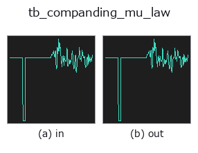
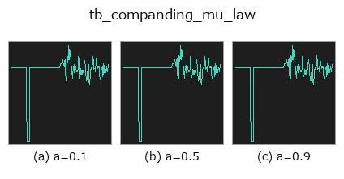
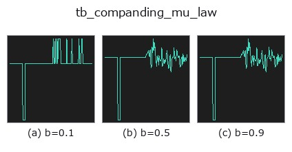
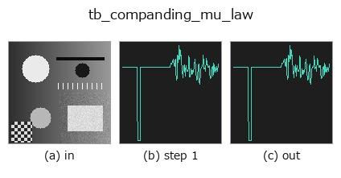
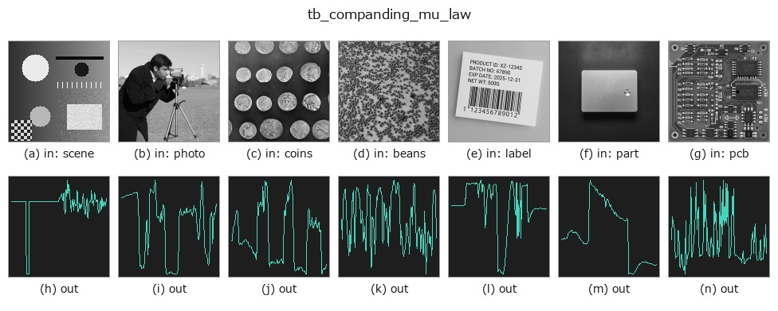

# tb_companding_mu_law — 2D `typed` op

- **データ種**: `signal` → `signal`
- **呼び出し**: `fullseye.apply(img, "tb_companding_mu_law", a=0.5, b=0.5)` (2-D は 1 画像 + 2 スカラつまみ `a,b∈[0,1]` のモデル)



*図は合成の入力 128×128 で実際に走らせた出力。左が入力、右が出力。点群は上から見た散布(明るさ = z)、1-D 列は折れ線、体積は z 方向の最大値投影、動画は中央フレーム、複素画像は振幅、絵にならない返り値は値そのもの。*

**つまみ a を振る**(0.1 / 0.5 / 0.9、もう一方は既定):



**つまみ b を振る**(0.1 / 0.5 / 0.9、もう一方は既定):



**段階**(前置きの op → この op。左から順):



**別の画像でも**(合成シーン / 写真 / 硬貨。上段が入力、下段がその出力。つまみは既定):



## 使い方

mu-law companding — the G.711 curve, used here on any 1-D signal.

    Compress with ``F(v) = sign(v) * ln(1 + mu|v|) / ln(1 + mu)`` on the signal
    scaled to ``[-1, 1]``, quantise uniformly, expand back. The steps end up fine
    near zero and coarse near full scale, which is the right allocation when the
    interesting part of the signal is small compared with its peaks — speech,
    vibration, anything with a large crest factor.

    **This is where mu-law comes from**: the image operator
    ``companding_mu_law`` is the same curve applied to intensity. Reporting both
    keeps the family honest about which dimension the technique was designed for.

    **Applicability — it is the crest factor that decides.** Measured on a sine
    of amplitude *A* with one sample pinned at full scale, so the crest factor is
    exactly ``1/A`` (mean square error relative to a uniform quantiser):

        crest 50    4 bit 0.011   6 bit 0.014     (about 90x better)
        crest 20    4 bit 0.122   6 bit 0.101
        crest 6.7   4 bit 0.613   6 bit 0.616
        crest 2.0   4 bit 4.22    6 bit 6.03      (several times WORSE)

    So the rule is **crest factor above roughly 7** — speech, vibration, impact.
    Below that, a plain uniform quantiser wins and mu-law actively hurts.
    ★Note the peak is a **single sample**: on random signals of the same family
    the advantage swung between 0.55 and 0.87 purely with the seed, because the
    largest excursion sets the scale. Measure the crest factor of *your* signal,
    do not assume it from the distribution.

    Other limits: ``mu`` near 0 degenerates to uniform quantisation (that is how
    you check the curve is doing anything), and the curve is fixed — unlike a
    Lloyd-Max codebook fitted to the signal — which is the point when values must
    stay comparable across recordings.

Typed bridge of the 1d op ``companding_mu_law`` into the 2-D evolution registry: the same implementation, called under the ``op(v, a, b)`` convention. ``a`` drives ``mu`` (default 255) and ``b`` drives ``bits`` (default 8).

## 参考(サンプルデータ・文献)

- [サンプルデータ カタログ(DL URL / ライセンス)](../../SAMPLES.md) — 2-D は skimage.data(BSD/public)+ 合成、3-D は実データ源(Stanford/PDS 等)の DL URL。
- [演算子の来歴・参考文献](../../../REFERENCES.md) — この op 族の元になった研究/手法の出典。

## Studio で試す

下のプログラムは実際に走ることを確かめてある(図と同じ入力)。Studio のヘルプではこのブロックがボタンになり、その場で読み込んで実行できる。

```program
img_to_signal 0.50 0.50
tb_companding_mu_law 0.50 0.50
```

## 実行できる例(この op を実際に呼ぶ検証済みサンプル)

次の例は元の台帳 op `companding_mu_law` を呼ぶもの。この橋渡し op は同じ実装を `fn(v, a, b)` 規約に合わせただけなので、挙動はそのまま当てはまる(呼び出し形だけ違う)。
- [gallery2d_gray_arith](../../../../examples/gallery2d_gray_arith.py) — `py -3.11 examples/gallery2d_gray_arith.py`

## 型が繋がる次の op(`signal` を入力に取れる)

[identity](../misc/identity.md) · [tb_create_funct_1d_array](tb_create_funct_1d_array.md) · [tb_smooth_funct_1d_gauss](tb_smooth_funct_1d_gauss.md) · [tb_smooth_funct_1d_mean](tb_smooth_funct_1d_mean.md) · [tb_derivate_funct_1d](tb_derivate_funct_1d.md) · [tb_integrate_funct_1d](tb_integrate_funct_1d.md) · [tb_zero_crossings_funct_1d](tb_zero_crossings_funct_1d.md) · [tb_abs_funct_1d](tb_abs_funct_1d.md)

## 同カテゴリ(`typed`)

[tb_points_to_voxel](tb_points_to_voxel.md) · [tb_estimate_point_normals](tb_estimate_point_normals.md) · [tb_iss_keypoints](tb_iss_keypoints.md) · [tb_project_points](tb_project_points.md) · [tb_render_point_depth](tb_render_point_depth.md) · [tb_statistical_outlier_removal](tb_statistical_outlier_removal.md) · [tb_radius_outlier_removal](tb_radius_outlier_removal.md) · [tb_voxel_grid_downsample](tb_voxel_grid_downsample.md)

---
*Provenance: ops.py — 2D operator registry. この per-op ノートは `tools/opdocs.py md` が自動生成(手編集しない)。*

© 2026 Kazufumi Furuse — Fullseye operator documentation. Licensed under Apache-2.0.
