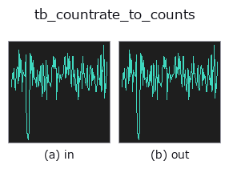
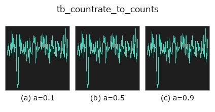
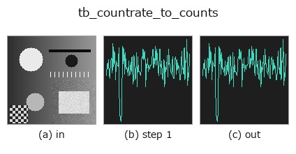
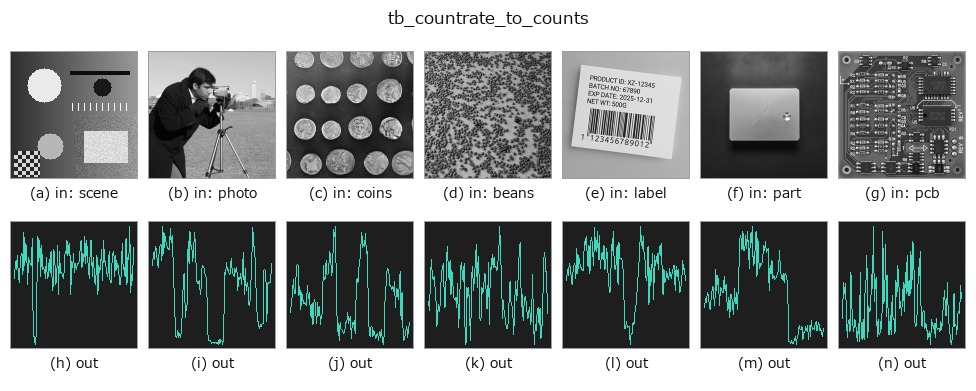

# tb_countrate_to_counts — 2D `typed` op

- **データ種**: `counts` → `counts`
- **呼び出し**: `fullseye.apply(img, "tb_countrate_to_counts", a=0.5, b=0.5)` (2-D は 1 画像 + 2 スカラつまみ `a,b∈[0,1]` のモデル)



*図は合成の入力 128×128 で実際に走らせた出力。左が入力、右が出力。点群は上から見た散布(明るさ = z)、1-D 列は折れ線、体積は z 方向の最大値投影、動画は中央フレーム、複素画像は振幅、絵にならない返り値は値そのもの。*

**つまみ a を振る**(0.1 / 0.5 / 0.9、もう一方は既定):



*つまみ b は出力を変えない(実測: 0.1 / 0.5 / 0.9 で同一)。*

**段階**(前置きの op → この op。左から順):



**別の画像でも**(合成シーン / 写真 / 硬貨。上段が入力、下段がその出力。つまみは既定):



## 使い方

計数レート ``[Hz]`` → 計数 ``counts``。``countrate`` の出口(**可逆**)。

    **単位が変換の全内容**: ``[1/s] * [s] = [1]``。``gate_s`` は積算窓の秒数で、
    既定 1 ms。``counts`` は「時間 bin ごとの光子数」の型なので、レート列を
    そのまま counts と名乗らせると**桁が 7 つずれたまま黙って通る**
    (``TYPE_CHECKS`` はどちらも「非負の 1-D」としか見ていない)。

    :func:`counts_to_countrate` と往復して実測 max|Δ| = 9.3e-10(値域が 1e3-1e7 Hz なので
    **相対** 1e-16 = 倍精度の丸め 1 単位ぶん。絶対値だけ見ると大きく見えるので、
    レートのように桁が広い量は相対で言う)。

    ★**2 度掛けても例外は出ない**。``TYPE_TO_SORT`` が ``countrate`` を ``counts`` に
    畳んでいるので、出口が入口にそのまま繋がる。実測(2026-09-08、1,200 Hz を
    gate 1 ms で): 1 回で 1.2000 counts、もう 1 回通すと 0.0012 counts ——
    **1,000 倍の取り違えが、負の値も NaN も出さずに通る**。値だけを見て
    「レートか計数か」を判定する方法は無いので、この 1 件は検査でなく
    **呼ぶ側の規律**で守るしかない(繋いだ経路を書き残すこと)。

    Args:
        countrate: (N,) の非負レート [Hz]。
        gate_s: 積算窓 [s]。> 0。
    Returns:
        (N,) float64 の非負計数。
    Raises:
        ValueError: 負のレート / gate_s <= 0 / 形状不正 / 非有限。

2-D 進化レジストリへ橋渡しした reprconv の op ``countrate_to_counts``。実装は同じで、呼び出し規約だけ ``op(v, a, b)`` に合わせてある。``a`` が ``gate_s``(既定 0.001)を振る。``b`` は未使用。

## 参考(サンプルデータ・文献)

- [サンプルデータ カタログ(DL URL / ライセンス)](../../SAMPLES.md) — 2-D は skimage.data(BSD/public)+ 合成、3-D は実データ源(Stanford/PDS 等)の DL URL。
- [演算子の来歴・参考文献](../../../REFERENCES.md) — この op 族の元になった研究/手法の出典。

## Studio で試す

下のプログラムは実際に走ることを確かめてある(図と同じ入力)。Studio のヘルプではこのブロックがボタンになり、その場で読み込んで実行できる。

```program
img_to_counts 0.50 0.50
tb_countrate_to_counts 0.50 0.50
```

## 実行できる例(この op を実際に呼ぶ検証済みサンプル)

次の例は元の台帳 op `countrate_to_counts` を呼ぶもの。この橋渡し op は同じ実装を `fn(v, a, b)` 規約に合わせただけなので、挙動はそのまま当てはまる(呼び出し形だけ違う)。
- [representation_roundtrip](../../../../examples/representation_roundtrip.py) — `py -3.11 examples/representation_roundtrip.py`

## 型が繋がる次の op(`counts` を入力に取れる)

[identity](../misc/identity.md) · [tb_spad_deadtime_apply](tb_spad_deadtime_apply.md) · [tb_spad_deadtime_correct](tb_spad_deadtime_correct.md) · [tb_tcspc_coates_correct](tb_tcspc_coates_correct.md) · [tb_tcspc_irf_convolve](tb_tcspc_irf_convolve.md) · [tb_tcspc_background_subtract](tb_tcspc_background_subtract.md) · [tb_dtof_depth](tb_dtof_depth.md) · [tb_counts_to_countrate](tb_counts_to_countrate.md)

## 同カテゴリ(`typed`)

[tb_points_to_voxel](tb_points_to_voxel.md) · [tb_estimate_point_normals](tb_estimate_point_normals.md) · [tb_iss_keypoints](tb_iss_keypoints.md) · [tb_project_points](tb_project_points.md) · [tb_render_point_depth](tb_render_point_depth.md) · [tb_statistical_outlier_removal](tb_statistical_outlier_removal.md) · [tb_radius_outlier_removal](tb_radius_outlier_removal.md) · [tb_voxel_grid_downsample](tb_voxel_grid_downsample.md)

---
*Provenance: ops.py — 2D operator registry. この per-op ノートは `tools/opdocs.py md` が自動生成(手編集しない)。*

© 2026 Kazufumi Furuse — Fullseye operator documentation. Licensed under Apache-2.0.
