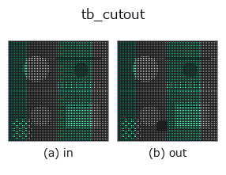
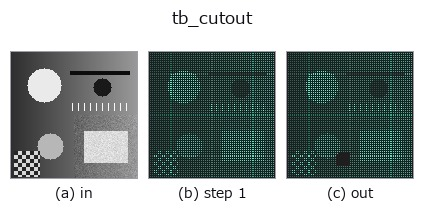
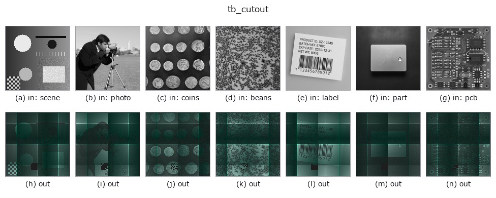

# tb_cutout — 2D `typed` op

- **データ種**: `points` → `points`
- **呼び出し**: `fullseye.apply(img, "tb_cutout", a=0.5, b=0.5)` (2-D は 1 画像 + 2 スカラつまみ `a,b∈[0,1]` のモデル)



*図は合成の入力 128×128 で実際に走らせた出力。左が入力、右が出力。点群は上から見た散布(明るさ = z)、1-D 列は折れ線、体積は z 方向の最大値投影、動画は中央フレーム、複素画像は振幅、絵にならない返り値は値そのもの。*

*つまみ a は出力を変えない(実測: 0.1 / 0.5 / 0.9 で同一)。*

*つまみ b は出力を変えない(実測: 0.1 / 0.5 / 0.9 で同一)。*

**段階**(前置きの op → この op。左から順):



**別の画像でも**(合成シーン / 写真 / 硬貨。上段が入力、下段がその出力。つまみは既定):



## 使い方

空間的な軸平行ボックス領域を除去し ``(kept, kept_idx)`` を返す(局所欠損の模倣)。

    既存の点を 1 つ一様サンプルして中心とし、辺長 ``extent``(スカラ=立方体, または
    ``(3,)``=各軸辺長)のボックス内の点をすべて除去する。中心点自身が必ず入るため
    最低 1 点は除去される。除去点は必ず辺長 ``extent`` のボックスに収まる(空間的に
    局所的 = ランダム散布とは判別可能)。``kept == points[kept_idx]``、``extent > 0``。

    ``extent`` に正でない値や ``(3,)`` 以外の形を渡すと ``ValueError``。空入力は空と空
    インデックスを返す。中心は ``rng.integers(n)`` で選ぶ点なので、``seed`` が同じでも点の
    並びが変わると別の場所が抜ける。ボックス判定は ``|P - center| <= extent/2`` の閉区間。
    除去点数は密度次第で、``extent`` を雲の大きさより大きくすると全点が消える。返り値は
    ``(kept float64 (M,3), kept_idx int64 (M,))``、順序は元のまま。一様な欠損は
    ``random_dropout``。

2-D 進化レジストリへ橋渡しした 3d の op ``cutout``。実装は同じで、呼び出し規約だけ ``op(v, a, b)`` に合わせてある。この op に調整点は無く、``a`` も ``b`` も使われない。

## 参考(サンプルデータ・文献)

- [サンプルデータ カタログ(DL URL / ライセンス)](../../SAMPLES.md) — 2-D は skimage.data(BSD/public)+ 合成、3-D は実データ源(Stanford/PDS 等)の DL URL。
- [演算子の来歴・参考文献](../../../REFERENCES.md) — この op 族の元になった研究/手法の出典。

## Studio で試す

下のプログラムは実際に走ることを確かめてある(図と同じ入力)。Studio のヘルプではこのブロックがボタンになり、その場で読み込んで実行できる。

```program
img_to_points 0.50 0.50
tb_cutout 0.50 0.50
```

## 実行できる例(この op を実際に呼ぶ検証済みサンプル)

次の例は元の台帳 op `cutout` を呼ぶもの。この橋渡し op は同じ実装を `fn(v, a, b)` 規約に合わせただけなので、挙動はそのまま当てはまる(呼び出し形だけ違う)。
- [sensor_seg](../../../../examples_3d/sensor_seg.py) — `py -3.11 examples_3d/sensor_seg.py`

## 型が繋がる次の op(`points` を入力に取れる)

[identity](../misc/identity.md) · [tb_points_to_voxel](tb_points_to_voxel.md) · [tb_estimate_point_normals](tb_estimate_point_normals.md) · [tb_iss_keypoints](tb_iss_keypoints.md) · [tb_project_points](tb_project_points.md) · [tb_render_point_depth](tb_render_point_depth.md) · [tb_statistical_outlier_removal](tb_statistical_outlier_removal.md) · [tb_radius_outlier_removal](tb_radius_outlier_removal.md)

## 同カテゴリ(`typed`)

[tb_points_to_voxel](tb_points_to_voxel.md) · [tb_estimate_point_normals](tb_estimate_point_normals.md) · [tb_iss_keypoints](tb_iss_keypoints.md) · [tb_project_points](tb_project_points.md) · [tb_render_point_depth](tb_render_point_depth.md) · [tb_statistical_outlier_removal](tb_statistical_outlier_removal.md) · [tb_radius_outlier_removal](tb_radius_outlier_removal.md) · [tb_voxel_grid_downsample](tb_voxel_grid_downsample.md)

---
*Provenance: ops.py — 2D operator registry. この per-op ノートは `tools/opdocs.py md` が自動生成(手編集しない)。*

© 2026 Kazufumi Furuse — Fullseye operator documentation. Licensed under Apache-2.0.
