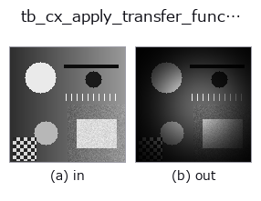
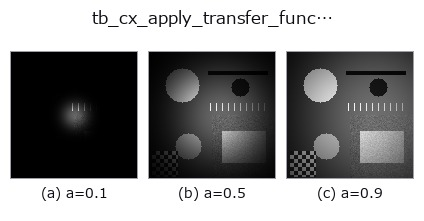
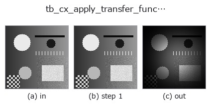
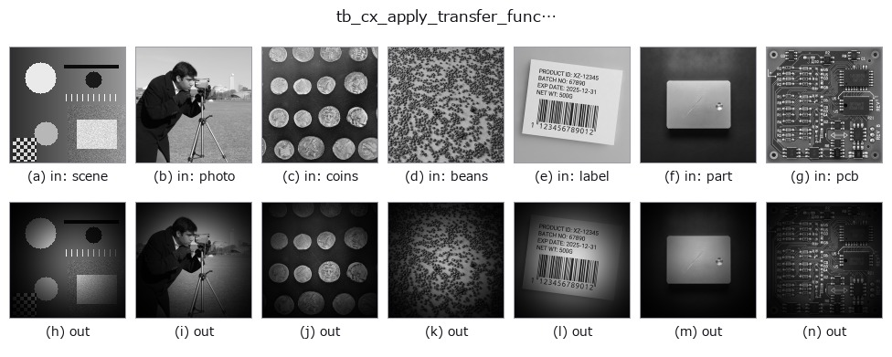

# tb_cx_apply_transfer_function — 2D `typed` op

- **データ種**: `cimage` → `cimage`
- **呼び出し**: `fullseye.apply(img, "tb_cx_apply_transfer_function", a=0.5, b=0.5)` (2-D は 1 画像 + 2 スカラつまみ `a,b∈[0,1]` のモデル)



*図は合成の入力 128×128 で実際に走らせた出力。左が入力、右が出力。点群は上から見た散布(明るさ = z)、1-D 列は折れ線、体積は z 方向の最大値投影、動画は中央フレーム、複素画像は振幅、絵にならない返り値は値そのもの。*

**つまみ a を振る**(0.1 / 0.5 / 0.9、もう一方は既定):



*つまみ b は出力を変えない(実測: 0.1 / 0.5 / 0.9 で同一)。*

**段階**(前置きの op → この op。左から順):



**別の画像でも**(合成シーン / 写真 / 硬貨。上段が入力、下段がその出力。つまみは既定):



## 使い方

Multiply a **centred** spectrum by a filter ``H`` -> ``(H, W)`` complex128.

The honest primitive under ``ops.lowpass`` / ``ops.highpass``, but
**complex-preserving**: the filtered spectrum is returned as a complex field
(not immediately inverted and real-cast), so it can be chained, inspected, or
handed to :func:`cx_ifft`. ``H`` is a same-shape transfer function laid out in
the *centred* convention of :func:`cx_fft` (DC at the centre); it may be real
(a magnitude mask) or complex (a phase-shifting filter). A real ``cx`` is
FFT'd first (module convenience).

Typed bridge of the 2d op ``cx_apply_transfer_function`` into the 2-D evolution registry: the same implementation, called under the ``op(v, a, b)`` convention. ``a`` sets the width of the transfer function ``H``, which the bridge builds **per call at the spectrum's own shape**: a centred Gaussian low-pass ``H = exp(-r^2 / (2 sigma^2))`` with ``sigma = 0.02 + 0.48 a`` cycles/pixel (0.26 at a=0.5). ``b`` is unused. (Until 2026-10-07 ``H`` was bound once as a fixed 32x32 array, so every other image size was refused.)

## 参考(サンプルデータ・文献)

- [サンプルデータ カタログ(DL URL / ライセンス)](../../SAMPLES.md) — 2-D は skimage.data(BSD/public)+ 合成、3-D は実データ源(Stanford/PDS 等)の DL URL。
- [演算子の来歴・参考文献](../../../REFERENCES.md) — この op 族の元になった研究/手法の出典。

## Studio で試す

下のプログラムは実際に走ることを確かめてある(図と同じ入力)。Studio のヘルプではこのブロックがボタンになり、その場で読み込んで実行できる。

```program
img_to_cimage 0.50 0.50
tb_cx_apply_transfer_function 0.50 0.50
```

## 実行できる例(この op を実際に呼ぶ検証済みサンプル)

- (まだありません)

## 型が繋がる次の op(`cimage` を入力に取れる)

[identity](../misc/identity.md) · [tb_cx_ifft](tb_cx_ifft.md) · [tb_cx_magnitude](tb_cx_magnitude.md) · [tb_cx_phase](tb_cx_phase.md) · [tb_cx_real](tb_cx_real.md) · [tb_cx_imag](tb_cx_imag.md) · [tb_cx_log_magnitude](tb_cx_log_magnitude.md) · [tb_cplx_cr_residual](tb_cplx_cr_residual.md)

## 同カテゴリ(`typed`)

[tb_points_to_voxel](tb_points_to_voxel.md) · [tb_estimate_point_normals](tb_estimate_point_normals.md) · [tb_iss_keypoints](tb_iss_keypoints.md) · [tb_project_points](tb_project_points.md) · [tb_render_point_depth](tb_render_point_depth.md) · [tb_statistical_outlier_removal](tb_statistical_outlier_removal.md) · [tb_radius_outlier_removal](tb_radius_outlier_removal.md) · [tb_voxel_grid_downsample](tb_voxel_grid_downsample.md)

---
*Provenance: ops.py — 2D operator registry. この per-op ノートは `tools/opdocs.py md` が自動生成(手編集しない)。*

© 2026 Kazufumi Furuse — Fullseye operator documentation. Licensed under Apache-2.0.
