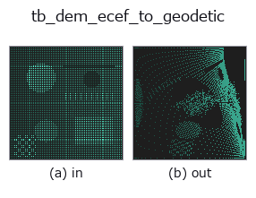
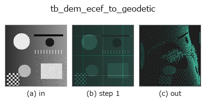
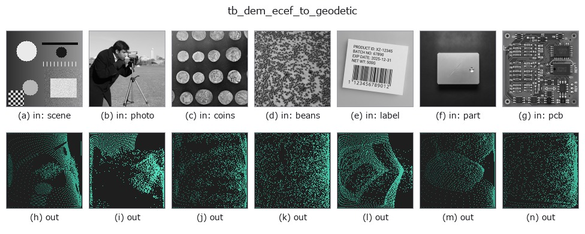

# tb_dem_ecef_to_geodetic — 2D `typed` op

- **データ種**: `points` → `points`
- **呼び出し**: `fullseye.apply(img, "tb_dem_ecef_to_geodetic", a=0.5, b=0.5)` (2-D は 1 画像 + 2 スカラつまみ `a,b∈[0,1]` のモデル)



*図は合成の入力 128×128 で実際に走らせた出力。左が入力、右が出力。点群は上から見た散布(明るさ = z)、1-D 列は折れ線、体積は z 方向の最大値投影、動画は中央フレーム、複素画像は振幅、絵にならない返り値は値そのもの。*

*つまみ a は出力を変えない(実測: 0.1 / 0.5 / 0.9 で同一)。*

*つまみ b は出力を変えない(実測: 0.1 / 0.5 / 0.9 で同一)。*

**段階**(前置きの op → この op。左から順):



**別の画像でも**(合成シーン / 写真 / 硬貨。上段が入力、下段がその出力。つまみは既定):



## 使い方

ECEF → 測地座標。返りは ``(..., 3)`` の ``(緯度[度], 経度[度], 高さ[m])``。

    Bowring (1976) の閉形式に近い解法。往復(測地→ECEF→測地)の誤差は
    **どこを標本にしたかで 1 桁以上動く**ので、範囲つきで書く(2026-09-08 再測。
    以前は「緯度・経度 1e-12 度未満、高さ 1e-7 m 未満」と書いていたが、
    ★これは緯度 ±85 度・高さ -500〜9000 m の 4000 点で既に **最大 6.4e-12 度 /
    8.5e-07 m** と超えていた —— 中央値 2.6e-13 度 / 3.3e-08 m と混同していた):

    * 緯度 ±85 度・高さ -500〜9000 m … 緯度 中央 2.6e-13 / 最大 6.4e-12 度、
      高さ 中央 3.3e-08 / 最大 8.5e-07 m
    * 緯度 ±89.9 度・高さ -11 km〜40 km … 緯度 中央 2.9e-12 / 最大 1.3e-10 度、
      高さ 中央 3.5e-07 / 最大 1.7e-05 m(**極に寄せると 20 倍悪くなる**)

    経度はどちらでも最大 2.8e-14 度。いずれも地上では µm 以下で、実用上は
    「誤差の床」として扱ってよいが、**中央値を最大値として引用しないこと**。

    地心**球**座標が欲しいだけなら、``r = |xyz|`` と
    ``geocentric_lat = asin(z/r)`` で足りる —— ただしそれは**測地緯度ではない**
    (両者は最大 0.19 度、距離にして約 21 km ずれる)。この op が返すのは
    地図や GPS と同じ**測地**緯度のほう。

    ★**地球の中心付近では fail-closed で拒否する**(2026-09-08、
    `poc_geodetic_height_frames` が踏んだ)。楕円体の縮閉線(evolute)
    ``(a·p)^(2/3) + (b·|z|)^(2/3) < (a²-b²)^(2/3)`` の内側では、楕円体面から
    立てた法線が 1 本に決まらず、**測地緯度がそもそも一意でない**。それまでは
    ここで黙って ``lat = 180 度`` を返していた —— 緯度として存在しない値で、
    しかも**自分の逆関数 :func:`dem_geodetic_to_ecef` が
    「lat_deg must be within [-90, 90]」で拒否する**値だった。
    領域は赤道面で軸から ``e²a = 42697.7 m``、極軸上で ``(a²-b²)/b = 42841.3 m``
    まで(実測: 42600 m で 180 度、42700 m で 0 度 —— 閉形式の境界とちょうど一致)。

2-D 進化レジストリへ橋渡しした dem の op ``dem_ecef_to_geodetic``。実装は同じで、呼び出し規約だけ ``op(v, a, b)`` に合わせてある。この op に調整点は無く、``a`` も ``b`` も使われない。

## 参考(サンプルデータ・文献)

- [サンプルデータ カタログ(DL URL / ライセンス)](../../SAMPLES.md) — 2-D は skimage.data(BSD/public)+ 合成、3-D は実データ源(Stanford/PDS 等)の DL URL。
- [演算子の来歴・参考文献](../../../REFERENCES.md) — この op 族の元になった研究/手法の出典。

## Studio で試す

下のプログラムは実際に走ることを確かめてある(図と同じ入力)。Studio のヘルプではこのブロックがボタンになり、その場で読み込んで実行できる。

```program
img_to_points 0.50 0.50
tb_dem_ecef_to_geodetic 0.50 0.50
```

## 実行できる例(この op を実際に呼ぶ検証済みサンプル)

次の例は元の台帳 op `dem_ecef_to_geodetic` を呼ぶもの。この橋渡し op は同じ実装を `fn(v, a, b)` 規約に合わせただけなので、挙動はそのまま当てはまる(呼び出し形だけ違う)。
- [dem_geodesy_tour](../../../../examples/dem_geodesy_tour.py) — `py -3.11 examples/dem_geodesy_tour.py`
- [poc_geodetic_height_frames](../../../../examples/poc_geodetic_height_frames.py) — `py -3.11 examples/poc_geodetic_height_frames.py`

## 型が繋がる次の op(`points` を入力に取れる)

[identity](../misc/identity.md) · [tb_points_to_voxel](tb_points_to_voxel.md) · [tb_estimate_point_normals](tb_estimate_point_normals.md) · [tb_iss_keypoints](tb_iss_keypoints.md) · [tb_project_points](tb_project_points.md) · [tb_render_point_depth](tb_render_point_depth.md) · [tb_statistical_outlier_removal](tb_statistical_outlier_removal.md) · [tb_radius_outlier_removal](tb_radius_outlier_removal.md)

## 同カテゴリ(`typed`)

[tb_points_to_voxel](tb_points_to_voxel.md) · [tb_estimate_point_normals](tb_estimate_point_normals.md) · [tb_iss_keypoints](tb_iss_keypoints.md) · [tb_project_points](tb_project_points.md) · [tb_render_point_depth](tb_render_point_depth.md) · [tb_statistical_outlier_removal](tb_statistical_outlier_removal.md) · [tb_radius_outlier_removal](tb_radius_outlier_removal.md) · [tb_voxel_grid_downsample](tb_voxel_grid_downsample.md)

---
*Provenance: ops.py — 2D operator registry. この per-op ノートは `tools/opdocs.py md` が自動生成(手編集しない)。*

© 2026 Kazufumi Furuse — Fullseye operator documentation. Licensed under Apache-2.0.
