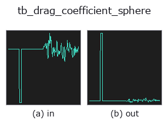
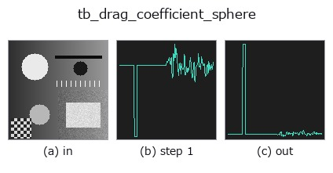
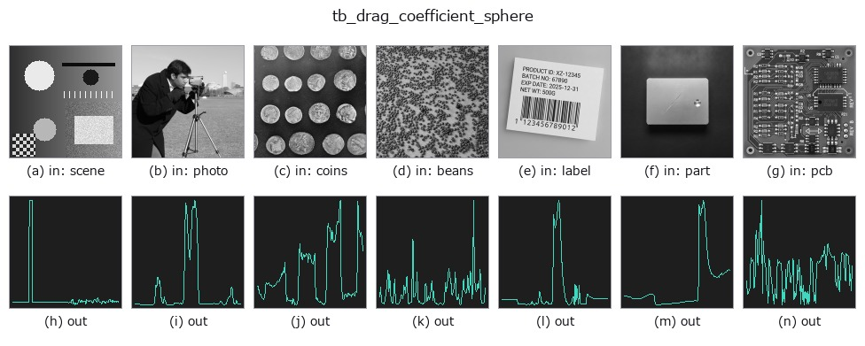

# tb_drag_coefficient_sphere — 2D `typed` op

- **データ種**: `signal` → `signal`
- **呼び出し**: `fullseye.apply(img, "tb_drag_coefficient_sphere", a=0.5, b=0.5)` (2-D は 1 画像 + 2 スカラつまみ `a,b∈[0,1]` のモデル)



*図は合成の入力 128×128 で実際に走らせた出力。左が入力、右が出力。点群は上から見た散布(明るさ = z)、1-D 列は折れ線、体積は z 方向の最大値投影、動画は中央フレーム、複素画像は振幅、絵にならない返り値は値そのもの。*

*つまみ a は出力を変えない(実測: 0.1 / 0.5 / 0.9 で同一)。*

*つまみ b は出力を変えない(実測: 0.1 / 0.5 / 0.9 で同一)。*

**段階**(前置きの op → この op。左から順):



**別の画像でも**(合成シーン / 写真 / 硬貨。上段が入力、下段がその出力。つまみは既定):



## 使い方

滑らかな球の抗力係数の経験式(Morrison 2013、Re ≲ 1e6): 24/Re + 2.6(Re/5)/(1 + (Re/5)^1.52) + 0.411(Re/263000)^−7.94/(1 + (Re/263000)^−8)
    + 0.25(Re/1e6)/(1 + Re/1e6)。卓球の球(Re ≈ 1〜5 × 10⁴)で ≈ 0.4〜0.5。

2-D 進化レジストリへ橋渡しした drive の op ``drag_coefficient_sphere``。実装は同じで、呼び出し規約だけ ``op(v, a, b)`` に合わせてある。この op に調整点は無く、``a`` も ``b`` も使われない。

## 参考(サンプルデータ・文献)

- [サンプルデータ カタログ(DL URL / ライセンス)](../../SAMPLES.md) — 2-D は skimage.data(BSD/public)+ 合成、3-D は実データ源(Stanford/PDS 等)の DL URL。
- [演算子の来歴・参考文献](../../../REFERENCES.md) — この op 族の元になった研究/手法の出典。

## Studio で試す

下のプログラムは実際に走ることを確かめてある(図と同じ入力)。Studio のヘルプではこのブロックがボタンになり、その場で読み込んで実行できる。

```program
img_to_signal 0.50 0.50
tb_drag_coefficient_sphere 0.50 0.50
```

## 実行できる例(この op を実際に呼ぶ検証済みサンプル)

- (まだありません)

## 型が繋がる次の op(`signal` を入力に取れる)

[identity](../misc/identity.md) · [tb_create_funct_1d_array](tb_create_funct_1d_array.md) · [tb_smooth_funct_1d_gauss](tb_smooth_funct_1d_gauss.md) · [tb_smooth_funct_1d_mean](tb_smooth_funct_1d_mean.md) · [tb_derivate_funct_1d](tb_derivate_funct_1d.md) · [tb_integrate_funct_1d](tb_integrate_funct_1d.md) · [tb_zero_crossings_funct_1d](tb_zero_crossings_funct_1d.md) · [tb_abs_funct_1d](tb_abs_funct_1d.md)

## 同カテゴリ(`typed`)

[tb_points_to_voxel](tb_points_to_voxel.md) · [tb_estimate_point_normals](tb_estimate_point_normals.md) · [tb_iss_keypoints](tb_iss_keypoints.md) · [tb_project_points](tb_project_points.md) · [tb_render_point_depth](tb_render_point_depth.md) · [tb_statistical_outlier_removal](tb_statistical_outlier_removal.md) · [tb_radius_outlier_removal](tb_radius_outlier_removal.md) · [tb_voxel_grid_downsample](tb_voxel_grid_downsample.md)

---
*Provenance: ops.py — 2D operator registry. この per-op ノートは `tools/opdocs.py md` が自動生成(手編集しない)。*

© 2026 Kazufumi Furuse — Fullseye operator documentation. Licensed under Apache-2.0.
