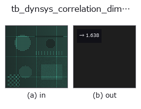
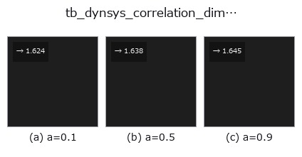
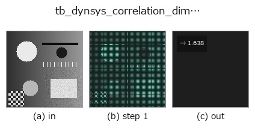

# tb_dynsys_correlation_dimension — 2D `typed` op

- **データ種**: `points` → `feature`
- **呼び出し**: `fullseye.apply(img, "tb_dynsys_correlation_dimension", a=0.5, b=0.5)` (2-D は 1 画像 + 2 スカラつまみ `a,b∈[0,1]` のモデル)



*図は合成の入力 128×128 で実際に走らせた出力。左が入力、右が出力。点群は上から見た散布(明るさ = z)、1-D 列は折れ線、体積は z 方向の最大値投影、動画は中央フレーム、複素画像は振幅、絵にならない返り値は値そのもの。*

**つまみ a を振る**(0.1 / 0.5 / 0.9、もう一方は既定):



*つまみ b は出力を変えない(実測: 0.1 / 0.5 / 0.9 で同一)。*

**段階**(前置きの op → この op。左から順):



## 使い方

Grassberger-Procaccia correlation dimension — the slope of ``log C(r)``.

    ``C(r)`` is the fraction of point pairs closer than ``r``; for a self-similar
    set it grows like ``r**D``, and *D* is read off the straight part of the
    log-log plot (fitted on the middle 60 % of the radii, where the curve is free
    of the small-``r`` noise floor and the large-``r`` saturation).

    ★**Why this earns its place**: unlike box counting it needs no grid, and its
    answers are known for simple sets — a circle gives **1**, a filled square
    **2**, a Cantor set ``log2/log3 = 0.6309``. It measures a different quantity
    from the existing ``fractal_dimension`` (box counting), so the two are an
    independent pair rather than two names for one number.

    Returns a ``measurement``: the fitted dimension.

    **Raises** ``ValueError``: fewer than 32 points; not a 2-D array; non-finite
    input; a degenerate cloud (every point identical); a radius range that leaves
    no pairs.

    Limits: sub-sampled to *max_points* (pairs grow quadratically). ★The
    dominant error is **not** the sub-sampling but the **radius window**: the
    default range is the 1st-25th percentile of pair distances, and on a *bounded*
    set its upper end runs into the boundary, where ``C(r)`` saturates and flattens
    the slope. Measured on a unit square (true D = 2): 1.879 with the default
    window and 1.873 / 1.879 / 1.871 at 400 / 1,500 / 3,000 points —— more points
    do **not** help; narrowing the window to ``r_lo=0.01, r_hi=0.1`` gives 1.947
    and ``0.002 / 0.05`` gives 2.050. Pass *r_lo* / *r_hi* explicitly when the
    answer matters, and report the window with the number.

Typed bridge of the math op ``dynsys_correlation_dimension`` into the 2-D evolution registry: the same implementation, called under the ``op(v, a, b)`` convention. ``a`` drives ``n_radii`` (default 24); ``b`` is unused.

## 参考(サンプルデータ・文献)

- [サンプルデータ カタログ(DL URL / ライセンス)](../../SAMPLES.md) — 2-D は skimage.data(BSD/public)+ 合成、3-D は実データ源(Stanford/PDS 等)の DL URL。
- [演算子の来歴・参考文献](../../../REFERENCES.md) — この op 族の元になった研究/手法の出典。

## Studio で試す

下のプログラムは実際に走ることを確かめてある(図と同じ入力)。Studio のヘルプではこのブロックがボタンになり、その場で読み込んで実行できる。

```program
img_to_points 0.50 0.50
tb_dynsys_correlation_dimension 0.50 0.50
```

## 実行できる例(この op を実際に呼ぶ検証済みサンプル)

次の例は元の台帳 op `dynsys_correlation_dimension` を呼ぶもの。この橋渡し op は同じ実装を `fn(v, a, b)` 規約に合わせただけなので、挙動はそのまま当てはまる(呼び出し形だけ違う)。
- [poc_what_a_picture_cannot_check](../../../../examples/poc_what_a_picture_cannot_check.py) — `py -3.11 examples/poc_what_a_picture_cannot_check.py`

## 型が繋がる次の op(`feature` を入力に取れる)

[identity](../misc/identity.md) · [feature_to_img](../bridge/feature_to_img.md)

## 同カテゴリ(`typed`)

[tb_points_to_voxel](tb_points_to_voxel.md) · [tb_estimate_point_normals](tb_estimate_point_normals.md) · [tb_iss_keypoints](tb_iss_keypoints.md) · [tb_project_points](tb_project_points.md) · [tb_render_point_depth](tb_render_point_depth.md) · [tb_statistical_outlier_removal](tb_statistical_outlier_removal.md) · [tb_radius_outlier_removal](tb_radius_outlier_removal.md) · [tb_voxel_grid_downsample](tb_voxel_grid_downsample.md)

---
*Provenance: ops.py — 2D operator registry. この per-op ノートは `tools/opdocs.py md` が自動生成(手編集しない)。*

© 2026 Kazufumi Furuse — Fullseye operator documentation. Licensed under Apache-2.0.
