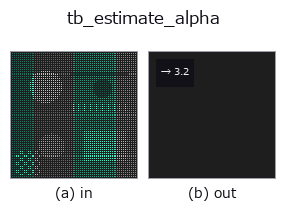
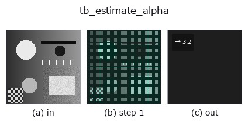

# tb_estimate_alpha — 2D `typed` op

- **データ種**: `points` → `feature`
- **呼び出し**: `fullseye.apply(img, "tb_estimate_alpha", a=0.5, b=0.5)` (2-D は 1 画像 + 2 スカラつまみ `a,b∈[0,1]` のモデル)



*図は合成の入力 128×128 で実際に走らせた出力。左が入力、右が出力。点群は上から見た散布(明るさ = z)、1-D 列は折れ線、体積は z 方向の最大値投影、動画は中央フレーム、複素画像は振幅、絵にならない返り値は値そのもの。*

*つまみ a は出力を変えない(実測: 0.1 / 0.5 / 0.9 で同一)。*

*つまみ b は出力を変えない(実測: 0.1 / 0.5 / 0.9 で同一)。*

**段階**(前置きの op → この op。左から順):



## 使い方

点群のスケールから推奨 alpha を返す(最近傍距離の中央値ベース)。

    各点の最近傍距離の中央値 ``m`` を求め、半径しきい値 1/alpha ≈ 2m(隣接間隔の約 2 倍まで
    許す)となるよう ``alpha = 1/(2m)`` を返す。これで表面付近の素性の良い四面体は残しつつ、
    大きく間延びした四面体(=凹み・外側)を切り落とせる。重複点は最近傍 0 になるため正の距離のみ使う。

    Parameters
    ----------
    points : array_like (N,3)

    Returns
    -------
    alpha : float
        正の有限値。

2-D 進化レジストリへ橋渡しした 3d の op ``estimate_alpha``。実装は同じで、呼び出し規約だけ ``op(v, a, b)`` に合わせてある。この op に調整点は無く、``a`` も ``b`` も使われない。

## 参考(サンプルデータ・文献)

- [サンプルデータ カタログ(DL URL / ライセンス)](../../SAMPLES.md) — 2-D は skimage.data(BSD/public)+ 合成、3-D は実データ源(Stanford/PDS 等)の DL URL。
- [演算子の来歴・参考文献](../../../REFERENCES.md) — この op 族の元になった研究/手法の出典。

## Studio で試す

下のプログラムは実際に走ることを確かめてある(図と同じ入力)。Studio のヘルプではこのブロックがボタンになり、その場で読み込んで実行できる。

```program
img_to_points 0.50 0.50
tb_estimate_alpha 0.50 0.50
```

## 実行できる例(この op を実際に呼ぶ検証済みサンプル)

次の例は元の台帳 op `estimate_alpha` を呼ぶもの。この橋渡し op は同じ実装を `fn(v, a, b)` 規約に合わせただけなので、挙動はそのまま当てはまる(呼び出し形だけ違う)。
- [alpha_shape_topology](../../../../examples_3d/alpha_shape_topology.py) — `py -3.11 examples_3d/alpha_shape_topology.py`
- [sfm_recon](../../../../examples_3d/sfm_recon.py) — `py -3.11 examples_3d/sfm_recon.py`

## 型が繋がる次の op(`feature` を入力に取れる)

[identity](../misc/identity.md)

## 同カテゴリ(`typed`)

[tb_points_to_voxel](tb_points_to_voxel.md) · [tb_estimate_point_normals](tb_estimate_point_normals.md) · [tb_iss_keypoints](tb_iss_keypoints.md) · [tb_angle_3points](tb_angle_3points.md) · [tb_project_points](tb_project_points.md) · [tb_render_point_depth](tb_render_point_depth.md) · [tb_statistical_outlier_removal](tb_statistical_outlier_removal.md) · [tb_radius_outlier_removal](tb_radius_outlier_removal.md)

---
*Provenance: ops.py — 2D operator registry. この per-op ノートは `tools/opdocs.py md` が自動生成(手編集しない)。*

© 2026 Kazufumi Furuse — Fullseye operator documentation. Licensed under Apache-2.0.
