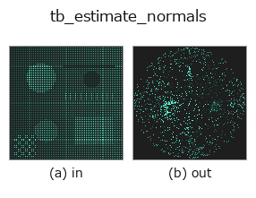
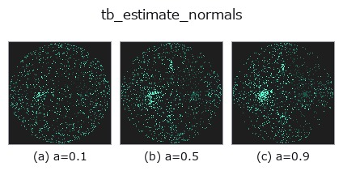
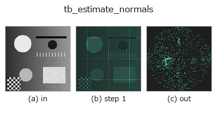
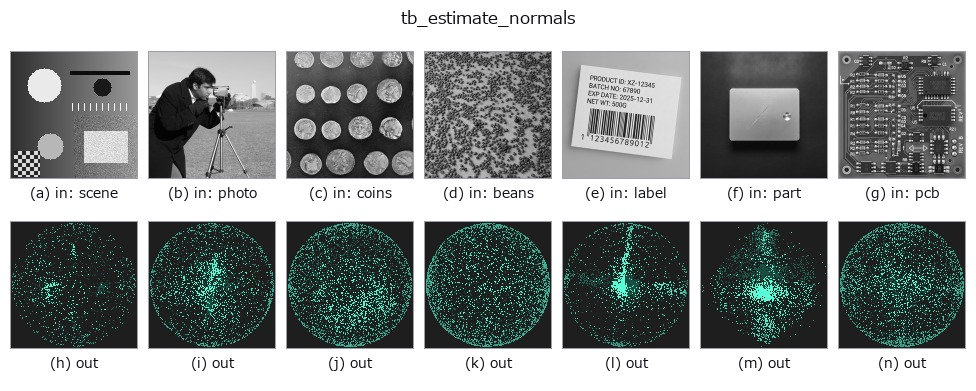

# tb_estimate_normals — 2D `typed` op

- **データ種**: `points` → `points`
- **呼び出し**: `fullseye.apply(img, "tb_estimate_normals", a=0.5, b=0.5)` (2-D は 1 画像 + 2 スカラつまみ `a,b∈[0,1]` のモデル)



*図は合成の入力 128×128 で実際に走らせた出力。左が入力、右が出力。点群は上から見た散布(明るさ = z)、1-D 列は折れ線、体積は z 方向の最大値投影、動画は中央フレーム、複素画像は振幅、絵にならない返り値は値そのもの。*

**つまみ a を振る**(0.1 / 0.5 / 0.9、もう一方は既定):



*つまみ b は出力を変えない(実測: 0.1 / 0.5 / 0.9 で同一)。*

**段階**(前置きの op → この op。左から順):



**別の画像でも**(合成シーン / 写真 / 硬貨。上段が入力、下段がその出力。つまみは既定):



## 使い方

外向き(近傍重心から離れる)に統一した点群法線。→ (N,3)。

    手順(各点、Python ループ): ``cKDTree`` で自身を含む k+1 近傍(k は N-1 に切り詰め)を取り、クエリ点を原点にした近傍座標の散布行列 ``local.T @ local`` の最小固有ベクトルを法線にする(単位長)。向きは「近傍重心との内積が正なら反転」= 近傍重心から離れる側に揃える。

    - 近傍が 5 点未満の点は固定値 ``(0, 0, 1)`` を返す(推定していない)。
    - 向き付けは局所ヒューリスティクスで、閉じた凸形状なら外向きだが、開いた面・薄板・凹部では隣接点どうしで向きが食い違い得る(大域一貫性は保証しない)。大域的に揃えるには ``orient_normals`` に通すか、最初から ``estimate_oriented_normals`` を使う。organized 深度画像なら ``normals_from_depth`` が視点向きで速い。
    - 返り値は float64 (N,3)。``k`` 既定 25。決定論的。
    - 内部は ``principal_curvatures`` と同じ計算を通る(法線推定にも二次曲面フィットまで走る)ので、点数が多いと遅い。

2-D 進化レジストリへ橋渡しした 3d の op ``estimate_normals``。実装は同じで、呼び出し規約だけ ``op(v, a, b)`` に合わせてある。``a`` が ``k``(既定 25)を振る。``b`` は未使用。

## 参考(サンプルデータ・文献)

- [サンプルデータ カタログ(DL URL / ライセンス)](../../SAMPLES.md) — 2-D は skimage.data(BSD/public)+ 合成、3-D は実データ源(Stanford/PDS 等)の DL URL。
- [演算子の来歴・参考文献](../../../REFERENCES.md) — この op 族の元になった研究/手法の出典。

## Studio で試す

下のプログラムは実際に走ることを確かめてある(図と同じ入力)。Studio のヘルプではこのブロックがボタンになり、その場で読み込んで実行できる。

```program
img_to_points 0.50 0.50
tb_estimate_normals 0.50 0.50
```

## 実行できる例(この op を実際に呼ぶ検証済みサンプル)

次の例は元の台帳 op `estimate_normals` を呼ぶもの。この橋渡し op は同じ実装を `fn(v, a, b)` 規約に合わせただけなので、挙動はそのまま当てはまる(呼び出し形だけ違う)。
- [cylinder_axis_metrology](../../../../examples_3d/cylinder_axis_metrology.py) — `py -3.11 examples_3d/cylinder_axis_metrology.py`
- [feature_register](../../../../examples_3d/feature_register.py) — `py -3.11 examples_3d/feature_register.py`
- [oriented_normals](../../../../examples_3d/oriented_normals.py) — `py -3.11 examples_3d/oriented_normals.py`

## 型が繋がる次の op(`points` を入力に取れる)

[identity](../misc/identity.md) · [tb_points_to_voxel](tb_points_to_voxel.md) · [tb_estimate_point_normals](tb_estimate_point_normals.md) · [tb_iss_keypoints](tb_iss_keypoints.md) · [tb_angle_3points](tb_angle_3points.md) · [tb_project_points](tb_project_points.md) · [tb_render_point_depth](tb_render_point_depth.md) · [tb_statistical_outlier_removal](tb_statistical_outlier_removal.md)

## 同カテゴリ(`typed`)

[tb_points_to_voxel](tb_points_to_voxel.md) · [tb_estimate_point_normals](tb_estimate_point_normals.md) · [tb_iss_keypoints](tb_iss_keypoints.md) · [tb_angle_3points](tb_angle_3points.md) · [tb_project_points](tb_project_points.md) · [tb_render_point_depth](tb_render_point_depth.md) · [tb_statistical_outlier_removal](tb_statistical_outlier_removal.md) · [tb_radius_outlier_removal](tb_radius_outlier_removal.md)

---
*Provenance: ops.py — 2D operator registry. この per-op ノートは `tools/opdocs.py md` が自動生成(手編集しない)。*

© 2026 Kazufumi Furuse — Fullseye operator documentation. Licensed under Apache-2.0.
