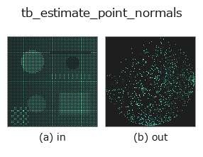
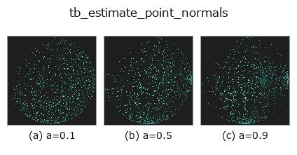
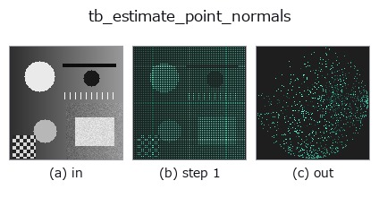
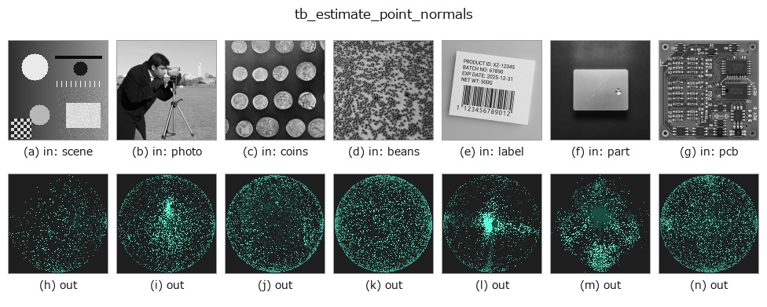

# tb_estimate_point_normals — 2D `typed` op

- **データ種**: `points` → `points`
- **呼び出し**: `fullseye.apply(img, "tb_estimate_point_normals", a=0.5, b=0.5)` (2-D は 1 画像 + 2 スカラつまみ `a,b∈[0,1]` のモデル)



*図は合成の入力 128×128 で実際に走らせた出力。左が入力、右が出力。点群は上から見た散布(明るさ = z)、1-D 列は折れ線、体積は z 方向の最大値投影、動画は中央フレーム、複素画像は振幅、絵にならない返り値は値そのもの。*

**つまみ a を振る**(0.1 / 0.5 / 0.9、もう一方は既定):



*つまみ b は出力を変えない(実測: 0.1 / 0.5 / 0.9 で同一)。*

**段階**(前置きの op → この op。左から順):



**別の画像でも**(合成シーン / 写真 / 硬貨。上段が入力、下段がその出力。つまみは既定):



## 使い方

点群 (N,3) → 単位法線(局所 k 近傍共分散の最小固有ベクトル=PCA)。

    FPFH/SHOT/点-面 ICP が要る法線を raw 点群から生成。向きの規約は 2 面:
    **viewpoint=None(既定)= 重心から外向き**(閉じた物体の全周点群向け)/
    **viewpoint 指定 = 視点(センサ)向き**(Hoppe 1992 / PCL 規約。単一視点スキャンの
    可視面はセンサ側を向くのが物理的に正しい。`pointcloud.estimate_normals` と同規約)。
    旧版(〜2026-08-30)は viewpoint 指定でも「視点から遠ざける」符号で、単一視点
    スキャンという本来用途で全点が裏返っていた。返り値 normals (N,3)。

    手順: ``cKDTree`` で各点の ``k`` 近傍(自分自身を含む。``k > N`` なら N に切り詰め)を取り、
    その共分散の最小固有ベクトルを法線にする。返り値 ``(N,3)`` float64 の単位ベクトル。
    ``viewpoint`` は 3 次元の座標(センサ位置)。点数が 3 未満・近傍が同一直線上だと法線は
    不定のまま返る(検証は無い)。``k`` が小さいとノイズに弱く、大きいと角が丸まる。
    後段: ``icp_point2plane`` の ``dst_normals``、``render_shaded`` 用の法線、``normals_to_egi``。
    ``pointcloud.estimate_normals``(台帳 ``estimate_normals``)と同じ規約。

2-D 進化レジストリへ橋渡しした 3d の op ``estimate_point_normals``。実装は同じで、呼び出し規約だけ ``op(v, a, b)`` に合わせてある。``a`` が ``k``(既定 16)を振る。``b`` は未使用。

## 参考(サンプルデータ・文献)

- [サンプルデータ カタログ(DL URL / ライセンス)](../../SAMPLES.md) — 2-D は skimage.data(BSD/public)+ 合成、3-D は実データ源(Stanford/PDS 等)の DL URL。
- [演算子の来歴・参考文献](../../../REFERENCES.md) — この op 族の元になった研究/手法の出典。

## Studio で試す

下のプログラムは実際に走ることを確かめてある(図と同じ入力)。Studio のヘルプではこのブロックがボタンになり、その場で読み込んで実行できる。

```program
img_to_points 0.50 0.50
tb_estimate_point_normals 0.50 0.50
```

## 実行できる例(この op を実際に呼ぶ検証済みサンプル)

次の例は元の台帳 op `estimate_point_normals` を呼ぶもの。この橋渡し op は同じ実装を `fn(v, a, b)` 規約に合わせただけなので、挙動はそのまま当てはまる(呼び出し形だけ違う)。
- [fpfh_correspondence](../../../../examples_3d/fpfh_correspondence.py) — `py -3.11 examples_3d/fpfh_correspondence.py`

## 型が繋がる次の op(`points` を入力に取れる)

[identity](../misc/identity.md) · [tb_points_to_voxel](tb_points_to_voxel.md) · [tb_iss_keypoints](tb_iss_keypoints.md) · [tb_project_points](tb_project_points.md) · [tb_render_point_depth](tb_render_point_depth.md) · [tb_statistical_outlier_removal](tb_statistical_outlier_removal.md) · [tb_radius_outlier_removal](tb_radius_outlier_removal.md) · [tb_voxel_grid_downsample](tb_voxel_grid_downsample.md)

## 同カテゴリ(`typed`)

[tb_points_to_voxel](tb_points_to_voxel.md) · [tb_iss_keypoints](tb_iss_keypoints.md) · [tb_project_points](tb_project_points.md) · [tb_render_point_depth](tb_render_point_depth.md) · [tb_statistical_outlier_removal](tb_statistical_outlier_removal.md) · [tb_radius_outlier_removal](tb_radius_outlier_removal.md) · [tb_voxel_grid_downsample](tb_voxel_grid_downsample.md) · [tb_mls_smooth](tb_mls_smooth.md)

---
*Provenance: ops.py — 2D operator registry. この per-op ノートは `tools/opdocs.py md` が自動生成(手編集しない)。*

© 2026 Kazufumi Furuse — Fullseye operator documentation. Licensed under Apache-2.0.
