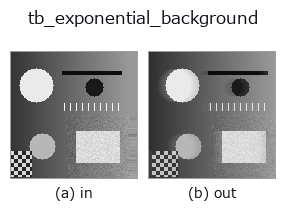
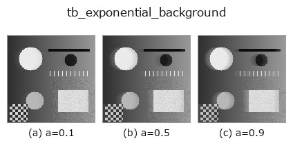
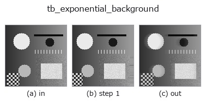
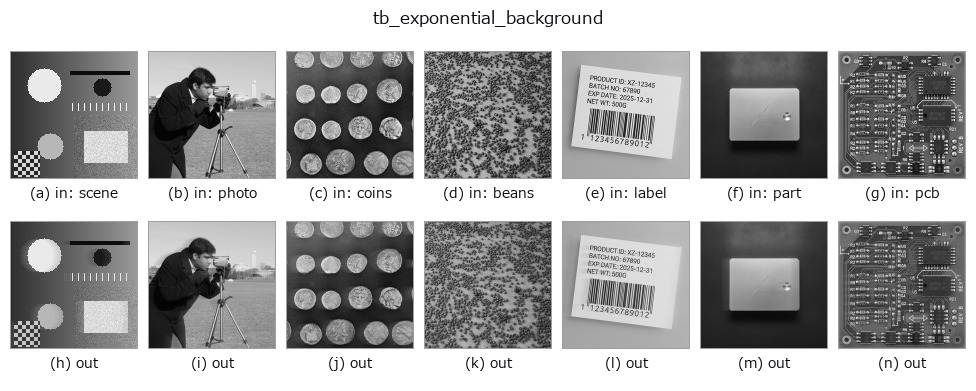
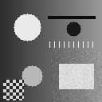

# tb_exponential_background — 2D `typed` op

- **データ種**: `video` → `video`
- **呼び出し**: `fullseye.apply(img, "tb_exponential_background", a=0.5, b=0.5)` (2-D は 1 画像 + 2 スカラつまみ `a,b∈[0,1]` のモデル)



*図は合成の入力 128×128 で実際に走らせた出力。左が入力、右が出力。点群は上から見た散布(明るさ = z)、1-D 列は折れ線、体積は z 方向の最大値投影、動画は中央フレーム、複素画像は振幅、絵にならない返り値は値そのもの。*

**つまみ a を振る**(0.1 / 0.5 / 0.9、もう一方は既定):



*つまみ b は出力を変えない(実測: 0.1 / 0.5 / 0.9 で同一)。*

**段階**(前置きの op → この op。左から順):



**別の画像でも**(合成シーン / 写真 / 硬貨。上段が入力、下段がその出力。つまみは既定):



**動き**(GIF: フレーム / 視点 / スライスを順に。静止の図が完成形で、GIF は補助):



## 使い方

Recursive background ``bg ← (1−α)·bg + α·frame`` per frame → ``(T, H, W)`` (``video``).

    最初のフレームで ``bg`` を初期化し、以後 ``bg += α (frame - bg)`` を画素ごとに
    繰り返す指数移動平均。状態は背景 1 枚だけ(窓を持たない)。フレーム ``t`` の
    出力はその時点の ``bg`` の写しで、``t = 0`` は入力の先頭フレームそのもの。

    - ``video``: ``(T, H, W)`` 配列か 2-D フレームの list。整数 dtype は最大値で
      ``[0, 1]`` に正規化、float は ``[0, 1]`` にクリップ。NaN/Inf は ``ValueError``。
    - ``alpha``: ``[0, 1]``。時定数はおよそ ``1/α`` フレーム(0.05 → 約 20 枚)。
      0 なら背景は先頭フレームのまま固定、1 なら常に現在のフレーム。
      **物体が止まると ``1/α`` 枚ほどで背景に吸収される**(選択的更新は無い)。
    - 返り値: ``(T, H, W)`` float64、``[0, 1]``。
    - 失敗: ``ValueError``(形・dtype・``alpha`` の範囲)。

    前景マスクまで欲しいなら同じモデルの ``exponential_foreground``。画素ごとの
    雑音に閾値を合わせたいなら ``running_gaussian_background``。

2-D 進化レジストリへ橋渡しした videostream の op ``exponential_background``。実装は同じで、呼び出し規約だけ ``op(v, a, b)`` に合わせてある。``a`` が ``alpha``(既定 0.05)を振る。``b`` は未使用。

## 参考(サンプルデータ・文献)

- [サンプルデータ カタログ(DL URL / ライセンス)](../../SAMPLES.md) — 2-D は skimage.data(BSD/public)+ 合成、3-D は実データ源(Stanford/PDS 等)の DL URL。
- [演算子の来歴・参考文献](../../../REFERENCES.md) — この op 族の元になった研究/手法の出典。

## Studio で試す

下のプログラムは実際に走ることを確かめてある(図と同じ入力)。Studio のヘルプではこのブロックがボタンになり、その場で読み込んで実行できる。

```program
img_to_video 0.50 0.50
tb_exponential_background 0.50 0.50
```

## 実行できる例(この op を実際に呼ぶ検証済みサンプル)

次の例は元の台帳 op `exponential_background` を呼ぶもの。この橋渡し op は同じ実装を `fn(v, a, b)` 規約に合わせただけなので、挙動はそのまま当てはまる(呼び出し形だけ違う)。
- [video_streaming](../../../../examples/video_streaming.py) — `py -3.11 examples/video_streaming.py`

## 型が繋がる次の op(`video` を入力に取れる)

[identity](../misc/identity.md) · [tb_temporal_bandpass](tb_temporal_bandpass.md) · [tb_temporal_band_power](tb_temporal_band_power.md) · [tb_temporal_median_window](tb_temporal_median_window.md) · [tb_moving_average_window](tb_moving_average_window.md) · [tb_background_subtraction_window](tb_background_subtraction_window.md) · [tb_frame_difference_causal](tb_frame_difference_causal.md) · [tb_exponential_foreground](tb_exponential_foreground.md)

## 同カテゴリ(`typed`)

[tb_points_to_voxel](tb_points_to_voxel.md) · [tb_estimate_point_normals](tb_estimate_point_normals.md) · [tb_iss_keypoints](tb_iss_keypoints.md) · [tb_project_points](tb_project_points.md) · [tb_render_point_depth](tb_render_point_depth.md) · [tb_statistical_outlier_removal](tb_statistical_outlier_removal.md) · [tb_radius_outlier_removal](tb_radius_outlier_removal.md) · [tb_voxel_grid_downsample](tb_voxel_grid_downsample.md)

---
*Provenance: ops.py — 2D operator registry. この per-op ノートは `tools/opdocs.py md` が自動生成(手編集しない)。*

© 2026 Kazufumi Furuse — Fullseye operator documentation. Licensed under Apache-2.0.
