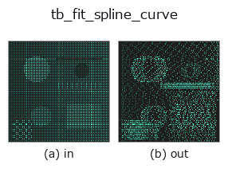
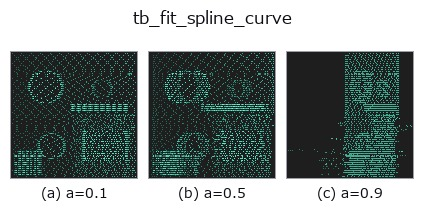
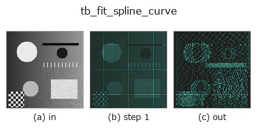
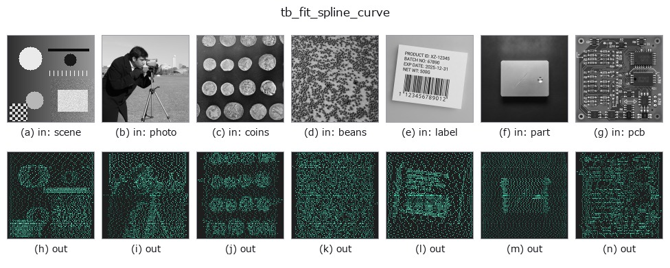

# tb_fit_spline_curve — 2D `typed` op

- **データ種**: `points` → `points`
- **呼び出し**: `fullseye.apply(img, "tb_fit_spline_curve", a=0.5, b=0.5)` (2-D は 1 画像 + 2 スカラつまみ `a,b∈[0,1]` のモデル)



*図は合成の入力 128×128 で実際に走らせた出力。左が入力、右が出力。点群は上から見た散布(明るさ = z)、1-D 列は折れ線、体積は z 方向の最大値投影、動画は中央フレーム、複素画像は振幅、絵にならない返り値は値そのもの。*

**つまみ a を振る**(0.1 / 0.5 / 0.9、もう一方は既定):



*つまみ b は出力を変えない(実測: 0.1 / 0.5 / 0.9 で同一)。*

**段階**(前置きの op → この op。左から順):



**別の画像でも**(合成シーン / 写真 / 硬貨。上段が入力、下段がその出力。つまみは既定):



## 使い方

順序付き 3D 点列を B スプラインで平滑し再サンプル。→ (M,3)。ノイズのある軌跡/エッジの平滑化。

    scipy.interpolate.splprep/splev。smooth=0 は補間、>0 で平滑。n=出力点数(既定=入力数)。

    ``splprep([x, y, z], s=smooth, k=k)`` でパラメトリック B スプライン(パラメータ u∈[0,1]、
    scipy 既定の弦長パラメータ化)を当て、``u = linspace(0, 1, n)`` で ``splev`` 評価した
    (n,3) float64 を返す。u 等間隔なので出力点は弧長で厳密に等間隔ではない(弧長等間隔が
    要るなら結果を ``resample_uniform`` に通す)。

    - ``smooth``: scipy の平滑化条件 s。残差二乗和が s 以下になる最少ノットで当てる。
      0 なら全点を通る補間、大きいほど滑らか(単位は座標の二乗)。
    - ``k``: スプライン次数(既定 3)。点数 N が k 以下だと ``ValueError``。
    - ``n``: 出力点数。None で入力点数。
    - 入力は index 順に並んだ (N,3) を前提とし、形状検証は点数以外に無い。

    ノイズのあるエッジ点列や軌跡を平滑してから ``curvature_torsion`` / ``frenet_frame`` に
    渡す前段として使う。tck を持ち回りたい場合は ``fit_bspline_curve`` / ``eval_bspline_curve``。

2-D 進化レジストリへ橋渡しした 3d の op ``fit_spline_curve``。実装は同じで、呼び出し規約だけ ``op(v, a, b)`` に合わせてある。``a`` が ``k``(既定 3)を振る。``b`` は未使用。

## 参考(サンプルデータ・文献)

- [サンプルデータ カタログ(DL URL / ライセンス)](../../SAMPLES.md) — 2-D は skimage.data(BSD/public)+ 合成、3-D は実データ源(Stanford/PDS 等)の DL URL。
- [演算子の来歴・参考文献](../../../REFERENCES.md) — この op 族の元になった研究/手法の出典。

## Studio で試す

下のプログラムは実際に走ることを確かめてある(図と同じ入力)。Studio のヘルプではこのブロックがボタンになり、その場で読み込んで実行できる。

```program
img_to_points 0.50 0.50
tb_fit_spline_curve 0.50 0.50
```

## 実行できる例(この op を実際に呼ぶ検証済みサンプル)

次の例は元の台帳 op `fit_spline_curve` を呼ぶもの。この橋渡し op は同じ実装を `fn(v, a, b)` 規約に合わせただけなので、挙動はそのまま当てはまる(呼び出し形だけ違う)。
- [bspline_freeform](../../../../examples_3d/bspline_freeform.py) — `py -3.11 examples_3d/bspline_freeform.py`

## 型が繋がる次の op(`points` を入力に取れる)

[identity](../misc/identity.md) · [tb_points_to_voxel](tb_points_to_voxel.md) · [tb_estimate_point_normals](tb_estimate_point_normals.md) · [tb_iss_keypoints](tb_iss_keypoints.md) · [tb_project_points](tb_project_points.md) · [tb_render_point_depth](tb_render_point_depth.md) · [tb_statistical_outlier_removal](tb_statistical_outlier_removal.md) · [tb_radius_outlier_removal](tb_radius_outlier_removal.md)

## 同カテゴリ(`typed`)

[tb_points_to_voxel](tb_points_to_voxel.md) · [tb_estimate_point_normals](tb_estimate_point_normals.md) · [tb_iss_keypoints](tb_iss_keypoints.md) · [tb_project_points](tb_project_points.md) · [tb_render_point_depth](tb_render_point_depth.md) · [tb_statistical_outlier_removal](tb_statistical_outlier_removal.md) · [tb_radius_outlier_removal](tb_radius_outlier_removal.md) · [tb_voxel_grid_downsample](tb_voxel_grid_downsample.md)

---
*Provenance: ops.py — 2D operator registry. この per-op ノートは `tools/opdocs.py md` が自動生成(手編集しない)。*

© 2026 Kazufumi Furuse — Fullseye operator documentation. Licensed under Apache-2.0.
