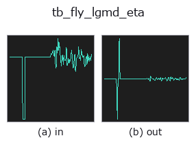
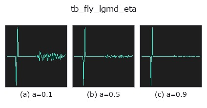
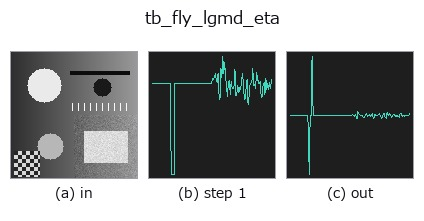
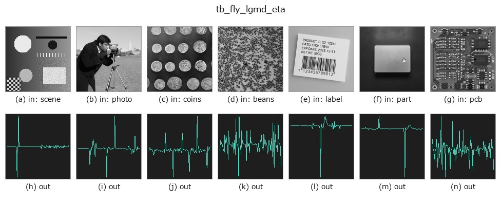

# tb_fly_lgmd_eta — 2D `typed` op

- **データ種**: `signal` → `signal`
- **呼び出し**: `fullseye.apply(img, "tb_fly_lgmd_eta", a=0.5, b=0.5)` (2-D は 1 画像 + 2 スカラつまみ `a,b∈[0,1]` のモデル)



*図は合成の入力 128×128 で実際に走らせた出力。左が入力、右が出力。点群は上から見た散布(明るさ = z)、1-D 列は折れ線、体積は z 方向の最大値投影、動画は中央フレーム、複素画像は振幅、絵にならない返り値は値そのもの。*

**つまみ a を振る**(0.1 / 0.5 / 0.9、もう一方は既定):



*つまみ b は出力を変えない(実測: 0.1 / 0.5 / 0.9 で同一)。*

**段階**(前置きの op → この op。左から順):



**別の画像でも**(合成シーン / 写真 / 硬貨。上段が入力、下段がその出力。つまみは既定):



## 使い方

LGMD/eta looming response from an expanding subtended angle.

    The multiplicative looming model::

        eta(t) = theta'(t - delay) * exp(-alpha * theta(t - delay))

    where *theta_signal* is the object's full subtended angle over time, in
    radians. The product of the angular expansion rate and an exponentially
    decaying gain gives a response that peaks a fixed time before collision.

    theta_signal: the full subtended angle per sample, radians.
    dt_s:  the sample interval, seconds.
    alpha: the gain-decay constant.
    delay_s: a fixed neural delay, seconds.

    Returns a 1-D float64 array ``eta(t)`` of the same length.

    Ground truth: for an object of half-size ``l`` approaching at speed ``|v|``,
    ``eta`` peaks at a time-to-contact of ``alpha*l/|v| - delay_s`` (Gabbiani et
    al. Eq. 5), where the subtended angle is exactly ``2*atan(1/alpha)`` (Eq. 6;
    24.0 degrees for ``alpha = 4.7``) — both pinned in the tests.

    **Raises** ``ValueError``: a non-1-D / empty / too-short (< 3) / non-finite
    *theta_signal*, a signal over :data:`MAX_SIGNAL_POINTS`, a non-positive *dt_s*
    / *alpha*, and a negative *delay_s*.

Typed bridge of the flyvision op ``fly_lgmd_eta`` into the 2-D evolution registry: the same implementation, called under the ``op(v, a, b)`` convention. ``a`` drives ``alpha`` (default 4.7); ``b`` is unused.

## 参考(サンプルデータ・文献)

- [サンプルデータ カタログ(DL URL / ライセンス)](../../SAMPLES.md) — 2-D は skimage.data(BSD/public)+ 合成、3-D は実データ源(Stanford/PDS 等)の DL URL。
- [演算子の来歴・参考文献](../../../REFERENCES.md) — この op 族の元になった研究/手法の出典。

## Studio で試す

下のプログラムは実際に走ることを確かめてある(図と同じ入力)。Studio のヘルプではこのブロックがボタンになり、その場で読み込んで実行できる。

```program
img_to_signal 0.50 0.50
tb_fly_lgmd_eta 0.50 0.50
```

## 実行できる例(この op を実際に呼ぶ検証済みサンプル)

次の例は元の台帳 op `fly_lgmd_eta` を呼ぶもの。この橋渡し op は同じ実装を `fn(v, a, b)` 規約に合わせただけなので、挙動はそのまま当てはまる(呼び出し形だけ違う)。
- [poc_fly_vision](../../../../examples/poc_fly_vision.py) — `py -3.11 examples/poc_fly_vision.py`

## 型が繋がる次の op(`signal` を入力に取れる)

[identity](../misc/identity.md) · [tb_create_funct_1d_array](tb_create_funct_1d_array.md) · [tb_smooth_funct_1d_gauss](tb_smooth_funct_1d_gauss.md) · [tb_smooth_funct_1d_mean](tb_smooth_funct_1d_mean.md) · [tb_derivate_funct_1d](tb_derivate_funct_1d.md) · [tb_integrate_funct_1d](tb_integrate_funct_1d.md) · [tb_zero_crossings_funct_1d](tb_zero_crossings_funct_1d.md) · [tb_abs_funct_1d](tb_abs_funct_1d.md)

## 同カテゴリ(`typed`)

[tb_points_to_voxel](tb_points_to_voxel.md) · [tb_estimate_point_normals](tb_estimate_point_normals.md) · [tb_iss_keypoints](tb_iss_keypoints.md) · [tb_project_points](tb_project_points.md) · [tb_render_point_depth](tb_render_point_depth.md) · [tb_statistical_outlier_removal](tb_statistical_outlier_removal.md) · [tb_radius_outlier_removal](tb_radius_outlier_removal.md) · [tb_voxel_grid_downsample](tb_voxel_grid_downsample.md)

---
*Provenance: ops.py — 2D operator registry. この per-op ノートは `tools/opdocs.py md` が自動生成(手編集しない)。*

© 2026 Kazufumi Furuse — Fullseye operator documentation. Licensed under Apache-2.0.
