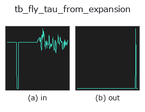
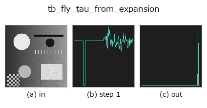
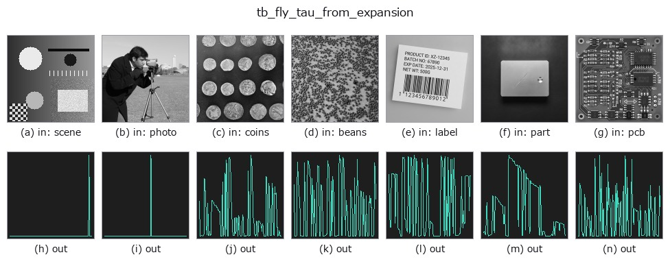

# tb_fly_tau_from_expansion — 2D `typed` op

- **データ種**: `signal` → `signal`
- **呼び出し**: `fullseye.apply(img, "tb_fly_tau_from_expansion", a=0.5, b=0.5)` (2-D は 1 画像 + 2 スカラつまみ `a,b∈[0,1]` のモデル)



*図は合成の入力 128×128 で実際に走らせた出力。左が入力、右が出力。点群は上から見た散布(明るさ = z)、1-D 列は折れ線、体積は z 方向の最大値投影、動画は中央フレーム、複素画像は振幅、絵にならない返り値は値そのもの。*

*つまみ a は出力を変えない(実測: 0.1 / 0.5 / 0.9 で同一)。*

*つまみ b は出力を変えない(実測: 0.1 / 0.5 / 0.9 で同一)。*

**段階**(前置きの op → この op。左から順):



**別の画像でも**(合成シーン / 写真 / 硬貨。上段が入力、下段がその出力。つまみは既定):



## 使い方

Time-to-contact from optical expansion — the tau margin.

    From the subtended angle and its rate::

        shape="disk":   tau = sin(theta) / theta'
        shape="sphere": tau = 2*tan(theta/2) / theta'

    ``theta_signal`` is the full subtended angle over time, radians.

    ★ The two object models differ by 33% at a 60-degree subtense (``sin 60 = 0.866``
    vs ``2 tan 30 = 1.155``); using the wrong one silently mis-times a landing, so
    the model is a required, named choice rather than a default guess.

    theta_signal: the full subtended angle per sample, radians.
    dt_s:  the sample interval, seconds.
    shape: ``"disk"`` (a frontal circular disk) or ``"sphere"``.

    Returns a 1-D float64 array of the time-to-contact per sample, seconds.
    Non-expanding samples (``theta' <= 0``) return ``NaN`` — a documented
    non-finite, because a contracting or static angle has no time-to-contact and
    inventing one would be a plausible-wrong number. (The registry op
    ``tb_fly_tau_from_expansion`` must return a finite signal, so it replaces those
    NaN by the signal fallback without recording a fallback event —
    ``backend_safe.NONFINITE_BY_DESIGN``; call this function directly to keep the NaN.)

    Ground truth: for the model's own object geometry (``theta = 2 asin(l/d)`` for a
    sphere, ``theta = 2 atan(l/d)`` for a disk) approaching at speed ``|v|``, the
    returned tau equals the true distance-over-speed ``d/|v|`` (pinned in the
    tests).

    **Raises** ``ValueError``: a non-1-D / empty / too-short (< 3) / non-finite
    *theta_signal*, a signal over :data:`MAX_SIGNAL_POINTS`, a non-positive *dt_s*,
    and an unknown *shape*. A non-expanding angle is **not** an error — it is the
    documented ``NaN`` return above.

Typed bridge of the flyvision op ``fly_tau_from_expansion`` into the 2-D evolution registry: the same implementation, called under the ``op(v, a, b)`` convention. This op has no tunable parameter; ``a`` and ``b`` are unused.

## 参考(サンプルデータ・文献)

- [サンプルデータ カタログ(DL URL / ライセンス)](../../SAMPLES.md) — 2-D は skimage.data(BSD/public)+ 合成、3-D は実データ源(Stanford/PDS 等)の DL URL。
- [演算子の来歴・参考文献](../../../REFERENCES.md) — この op 族の元になった研究/手法の出典。

## Studio で試す

下のプログラムは実際に走ることを確かめてある(図と同じ入力)。Studio のヘルプではこのブロックがボタンになり、その場で読み込んで実行できる。

```program
img_to_signal 0.50 0.50
tb_fly_tau_from_expansion 0.50 0.50
```

## 実行できる例(この op を実際に呼ぶ検証済みサンプル)

次の例は元の台帳 op `fly_tau_from_expansion` を呼ぶもの。この橋渡し op は同じ実装を `fn(v, a, b)` 規約に合わせただけなので、挙動はそのまま当てはまる(呼び出し形だけ違う)。
- [poc_fly_vision](../../../../examples/poc_fly_vision.py) — `py -3.11 examples/poc_fly_vision.py`

## 型が繋がる次の op(`signal` を入力に取れる)

[identity](../misc/identity.md) · [tb_create_funct_1d_array](tb_create_funct_1d_array.md) · [tb_smooth_funct_1d_gauss](tb_smooth_funct_1d_gauss.md) · [tb_smooth_funct_1d_mean](tb_smooth_funct_1d_mean.md) · [tb_derivate_funct_1d](tb_derivate_funct_1d.md) · [tb_integrate_funct_1d](tb_integrate_funct_1d.md) · [tb_zero_crossings_funct_1d](tb_zero_crossings_funct_1d.md) · [tb_abs_funct_1d](tb_abs_funct_1d.md)

## 同カテゴリ(`typed`)

[tb_points_to_voxel](tb_points_to_voxel.md) · [tb_estimate_point_normals](tb_estimate_point_normals.md) · [tb_iss_keypoints](tb_iss_keypoints.md) · [tb_project_points](tb_project_points.md) · [tb_render_point_depth](tb_render_point_depth.md) · [tb_statistical_outlier_removal](tb_statistical_outlier_removal.md) · [tb_radius_outlier_removal](tb_radius_outlier_removal.md) · [tb_voxel_grid_downsample](tb_voxel_grid_downsample.md)

---
*Provenance: ops.py — 2D operator registry. この per-op ノートは `tools/opdocs.py md` が自動生成(手編集しない)。*

© 2026 Kazufumi Furuse — Fullseye operator documentation. Licensed under Apache-2.0.
