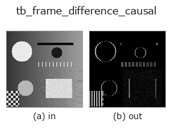
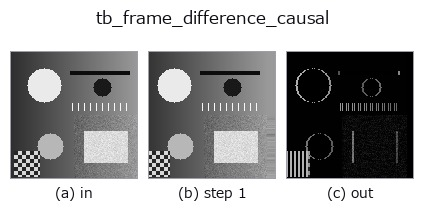
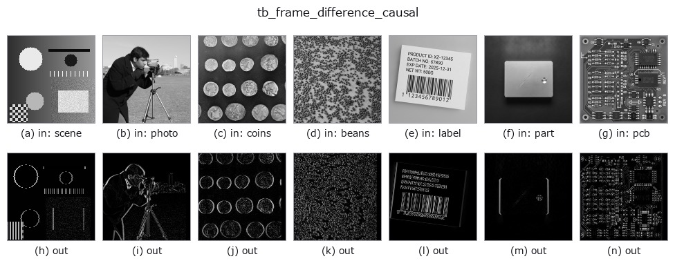

# tb_frame_difference_causal — 2D `typed` op

- **データ種**: `video` → `video`
- **呼び出し**: `fullseye.apply(img, "tb_frame_difference_causal", a=0.5, b=0.5)` (2-D は 1 画像 + 2 スカラつまみ `a,b∈[0,1]` のモデル)



*図は合成の入力 128×128 で実際に走らせた出力。左が入力、右が出力。点群は上から見た散布(明るさ = z)、1-D 列は折れ線、体積は z 方向の最大値投影、動画は中央フレーム、複素画像は振幅、絵にならない返り値は値そのもの。*

*つまみ a は出力を変えない(実測: 0.1 / 0.5 / 0.9 で同一)。*

*つまみ b は出力を変えない(実測: 0.1 / 0.5 / 0.9 で同一)。*

**段階**(前置きの op → この op。左から順):



**別の画像でも**(合成シーン / 写真 / 硬貨。上段が入力、下段がその出力。つまみは既定):



**動き**(GIF: フレーム / 視点 / スライスを順に。静止の図が完成形で、GIF は補助):


## 使い方

``|frame t − frame t−1|`` with a zero first frame → ``(T, H, W)`` (``video``).

    Same length as the input (unlike :func:`videops.frame_difference`, ``T−1``),
    so it composes frame-for-frame with the other stream ops.

Typed bridge of the videostream op ``frame_difference_causal`` into the 2-D evolution registry: the same implementation, called under the ``op(v, a, b)`` convention. This op has no tunable parameter; ``a`` and ``b`` are unused.

## 参考(サンプルデータ・文献)

- [サンプルデータ カタログ(DL URL / ライセンス)](../../SAMPLES.md) — 2-D は skimage.data(BSD/public)+ 合成、3-D は実データ源(Stanford/PDS 等)の DL URL。
- [演算子の来歴・参考文献](../../../REFERENCES.md) — この op 族の元になった研究/手法の出典。

## Studio で試す

下のプログラムは実際に走ることを確かめてある(図と同じ入力)。Studio のヘルプではこのブロックがボタンになり、その場で読み込んで実行できる。

```program
img_to_video 0.50 0.50
tb_frame_difference_causal 0.50 0.50
```

## 実行できる例(この op を実際に呼ぶ検証済みサンプル)

次の例は元の台帳 op `frame_difference_causal` を呼ぶもの。この橋渡し op は同じ実装を `fn(v, a, b)` 規約に合わせただけなので、挙動はそのまま当てはまる(呼び出し形だけ違う)。
- [video_streaming](../../../../examples/video_streaming.py) — `py -3.11 examples/video_streaming.py`

## 型が繋がる次の op(`video` を入力に取れる)

[identity](../misc/identity.md) · [tb_temporal_bandpass](tb_temporal_bandpass.md) · [tb_temporal_band_power](tb_temporal_band_power.md) · [tb_temporal_median_window](tb_temporal_median_window.md) · [tb_moving_average_window](tb_moving_average_window.md) · [tb_background_subtraction_window](tb_background_subtraction_window.md) · [tb_exponential_background](tb_exponential_background.md) · [tb_exponential_foreground](tb_exponential_foreground.md)

## 同カテゴリ(`typed`)

[tb_points_to_voxel](tb_points_to_voxel.md) · [tb_estimate_point_normals](tb_estimate_point_normals.md) · [tb_iss_keypoints](tb_iss_keypoints.md) · [tb_project_points](tb_project_points.md) · [tb_render_point_depth](tb_render_point_depth.md) · [tb_statistical_outlier_removal](tb_statistical_outlier_removal.md) · [tb_radius_outlier_removal](tb_radius_outlier_removal.md) · [tb_voxel_grid_downsample](tb_voxel_grid_downsample.md)

---
*Provenance: ops.py — 2D operator registry. この per-op ノートは `tools/opdocs.py md` が自動生成(手編集しない)。*

© 2026 Kazufumi Furuse — Fullseye operator documentation. Licensed under Apache-2.0.
