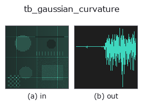
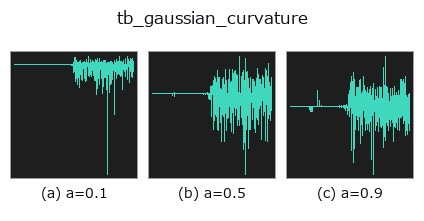
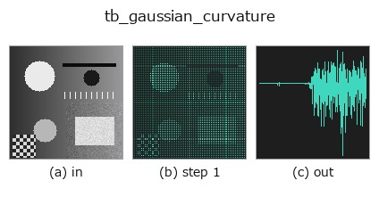
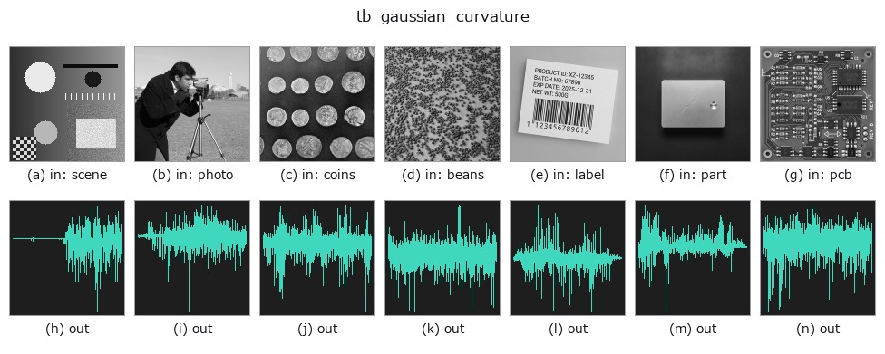

# tb_gaussian_curvature — 2D `typed` op

- **データ種**: `points` → `signal`
- **呼び出し**: `fullseye.apply(img, "tb_gaussian_curvature", a=0.5, b=0.5)` (2-D は 1 画像 + 2 スカラつまみ `a,b∈[0,1]` のモデル)



*図は合成の入力 128×128 で実際に走らせた出力。左が入力、右が出力。点群は上から見た散布(明るさ = z)、1-D 列は折れ線、体積は z 方向の最大値投影、動画は中央フレーム、複素画像は振幅、絵にならない返り値は値そのもの。*

**つまみ a を振る**(0.1 / 0.5 / 0.9、もう一方は既定):



*つまみ b は出力を変えない(実測: 0.1 / 0.5 / 0.9 で同一)。*

**段階**(前置きの op → この op。左から順):



**別の画像でも**(合成シーン / 写真 / 硬貨。上段が入力、下段がその出力。つまみは既定):



## 使い方

ガウス曲率 K=k1·k2(法線の反転に不変)。→ (N,)。

    補足:
    - ``principal_curvatures`` と同じ局所二次曲面フィットで ``k1 * k2`` を返す。符号は法線の向きに依らないため ``normals`` 引数を持たない(向き付けは常に近傍重心ヒューリスティクス)。
    - 単位は 1/長さ²。半径 R の球なら ``1/R²``、円柱・平面は 0、鞍点は負(k1 と k2 が異符号)。
    - ``k`` は近傍点数(既定 25、N-1 に切り詰め)。近傍が 5 点未満の点は 0。
    - 楕円点(K>0)/放物点(K=0)/双曲点(K<0)の分類に使う。凸凹の区別は ``mean_curvature`` か ``shape_index`` に ``normals`` を渡して行う。
    - 入力は (N,3) の点群。決定論的。

2-D 進化レジストリへ橋渡しした 3d の op ``gaussian_curvature``。実装は同じで、呼び出し規約だけ ``op(v, a, b)`` に合わせてある。``a`` が ``k``(既定 25)を振る。``b`` は未使用。

## 参考(サンプルデータ・文献)

- [サンプルデータ カタログ(DL URL / ライセンス)](../../SAMPLES.md) — 2-D は skimage.data(BSD/public)+ 合成、3-D は実データ源(Stanford/PDS 等)の DL URL。
- [演算子の来歴・参考文献](../../../REFERENCES.md) — この op 族の元になった研究/手法の出典。

## Studio で試す

下のプログラムは実際に走ることを確かめてある(図と同じ入力)。Studio のヘルプではこのブロックがボタンになり、その場で読み込んで実行できる。

```program
img_to_points 0.50 0.50
tb_gaussian_curvature 0.50 0.50
```

## 実行できる例(この op を実際に呼ぶ検証済みサンプル)

次の例は元の台帳 op `gaussian_curvature` を呼ぶもの。この橋渡し op は同じ実装を `fn(v, a, b)` 規約に合わせただけなので、挙動はそのまま当てはまる(呼び出し形だけ違う)。
- [curvature_grasp](../../../../examples_3d/curvature_grasp.py) — `py -3.11 examples_3d/curvature_grasp.py`
- [curvature_shape_index](../../../../examples_3d/curvature_shape_index.py) — `py -3.11 examples_3d/curvature_shape_index.py`

## 型が繋がる次の op(`signal` を入力に取れる)

[identity](../misc/identity.md) · [tb_create_funct_1d_array](tb_create_funct_1d_array.md) · [tb_smooth_funct_1d_gauss](tb_smooth_funct_1d_gauss.md) · [tb_smooth_funct_1d_mean](tb_smooth_funct_1d_mean.md) · [tb_derivate_funct_1d](tb_derivate_funct_1d.md) · [tb_integrate_funct_1d](tb_integrate_funct_1d.md) · [tb_zero_crossings_funct_1d](tb_zero_crossings_funct_1d.md) · [tb_abs_funct_1d](tb_abs_funct_1d.md)

## 同カテゴリ(`typed`)

[tb_points_to_voxel](tb_points_to_voxel.md) · [tb_estimate_point_normals](tb_estimate_point_normals.md) · [tb_iss_keypoints](tb_iss_keypoints.md) · [tb_project_points](tb_project_points.md) · [tb_render_point_depth](tb_render_point_depth.md) · [tb_statistical_outlier_removal](tb_statistical_outlier_removal.md) · [tb_radius_outlier_removal](tb_radius_outlier_removal.md) · [tb_voxel_grid_downsample](tb_voxel_grid_downsample.md)

---
*Provenance: ops.py — 2D operator registry. この per-op ノートは `tools/opdocs.py md` が自動生成(手編集しない)。*

© 2026 Kazufumi Furuse — Fullseye operator documentation. Licensed under Apache-2.0.
