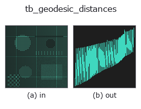
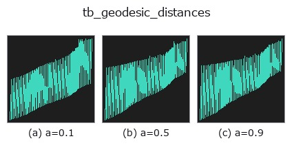
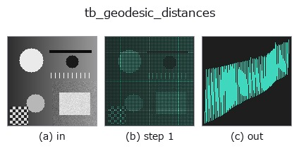
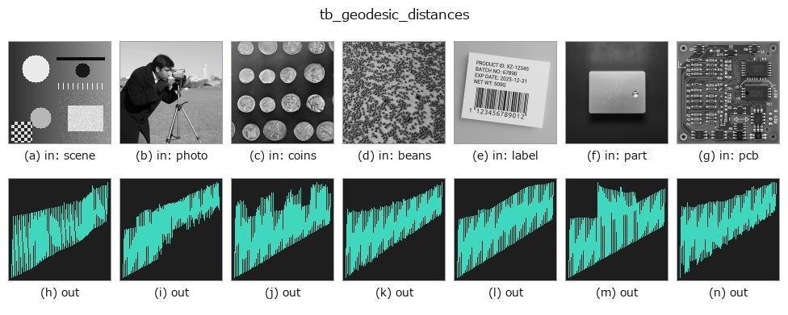

# tb_geodesic_distances — 2D `typed` op

- **データ種**: `points` → `signal`
- **呼び出し**: `fullseye.apply(img, "tb_geodesic_distances", a=0.5, b=0.5)` (2-D は 1 画像 + 2 スカラつまみ `a,b∈[0,1]` のモデル)



*図は合成の入力 128×128 で実際に走らせた出力。左が入力、右が出力。点群は上から見た散布(明るさ = z)、1-D 列は折れ線、体積は z 方向の最大値投影、動画は中央フレーム、複素画像は振幅、絵にならない返り値は値そのもの。*

**つまみ a を振る**(0.1 / 0.5 / 0.9、もう一方は既定):



*つまみ b は出力を変えない(実測: 0.1 / 0.5 / 0.9 で同一)。*

**段階**(前置きの op → この op。左から順):



**別の画像でも**(合成シーン / 写真 / 硬貨。上段が入力、下段がその出力。つまみは既定):



## 使い方

source から全点への測地距離(kNN グラフ上 Dijkstra)。→ (N,) float(不達は inf)。

    ``knn_graph(points, k)`` で作った k 近傍グラフ(辺の重み = 点間の Euclid 距離 = 弦長)を
    ``directed=False`` で無向化し、``scipy.sparse.csgraph.dijkstra`` で単一始点最短路を解く。
    ``d[i]`` は source から点 i までのグラフ上の経路長で ``d[source] = 0``、source と繋がっていない
    連結成分の点は ``inf``。単位は座標の単位そのまま。

    - ``points``: (N,3) の点群(float64 に変換)。
    - ``source``: 始点の添字(0..N-1 の整数。範囲外は scipy 側で例外)。
    - ``k``: 近傍数(既定 8)。小さいとグラフが分断されて ``inf`` が増え、大きいと離れた面どうしを
      直結する「近道」が生まれて曲面に沿わない距離になる(薄い板の表裏、折り返した面など)。

    精度: 辺が弦長なので弧をわずかに過小評価する一方、経路のジグザグが過大評価を生む(モジュール
    docstring の Bernstein らの挟み込み評価を参照)。三角メッシュがあるなら近傍数に依存しない
    ``geodesic_mesh`` を使う。この距離で均等に間引くには ``farthest_point_sampling``。

2-D 進化レジストリへ橋渡しした 3d の op ``geodesic_distances``。実装は同じで、呼び出し規約だけ ``op(v, a, b)`` に合わせてある。``a`` が ``k``(既定 8)を振る。``b`` は未使用。

## 参考(サンプルデータ・文献)

- [サンプルデータ カタログ(DL URL / ライセンス)](../../SAMPLES.md) — 2-D は skimage.data(BSD/public)+ 合成、3-D は実データ源(Stanford/PDS 等)の DL URL。
- [演算子の来歴・参考文献](../../../REFERENCES.md) — この op 族の元になった研究/手法の出典。

## Studio で試す

下のプログラムは実際に走ることを確かめてある(図と同じ入力)。Studio のヘルプではこのブロックがボタンになり、その場で読み込んで実行できる。

```program
img_to_points 0.50 0.50
tb_geodesic_distances 0.50 0.50
```

## 実行できる例(この op を実際に呼ぶ検証済みサンプル)

次の例は元の台帳 op `geodesic_distances` を呼ぶもの。この橋渡し op は同じ実装を `fn(v, a, b)` 規約に合わせただけなので、挙動はそのまま当てはまる(呼び出し形だけ違う)。
- [geodesic_distance](../../../../examples_3d/geodesic_distance.py) — `py -3.11 examples_3d/geodesic_distance.py`

## 型が繋がる次の op(`signal` を入力に取れる)

[identity](../misc/identity.md) · [tb_create_funct_1d_array](tb_create_funct_1d_array.md) · [tb_smooth_funct_1d_gauss](tb_smooth_funct_1d_gauss.md) · [tb_smooth_funct_1d_mean](tb_smooth_funct_1d_mean.md) · [tb_derivate_funct_1d](tb_derivate_funct_1d.md) · [tb_integrate_funct_1d](tb_integrate_funct_1d.md) · [tb_zero_crossings_funct_1d](tb_zero_crossings_funct_1d.md) · [tb_abs_funct_1d](tb_abs_funct_1d.md)

## 同カテゴリ(`typed`)

[tb_points_to_voxel](tb_points_to_voxel.md) · [tb_estimate_point_normals](tb_estimate_point_normals.md) · [tb_iss_keypoints](tb_iss_keypoints.md) · [tb_angle_3points](tb_angle_3points.md) · [tb_project_points](tb_project_points.md) · [tb_render_point_depth](tb_render_point_depth.md) · [tb_statistical_outlier_removal](tb_statistical_outlier_removal.md) · [tb_radius_outlier_removal](tb_radius_outlier_removal.md)

---
*Provenance: ops.py — 2D operator registry. この per-op ノートは `tools/opdocs.py md` が自動生成(手編集しない)。*

© 2026 Kazufumi Furuse — Fullseye operator documentation. Licensed under Apache-2.0.
