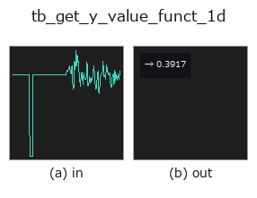
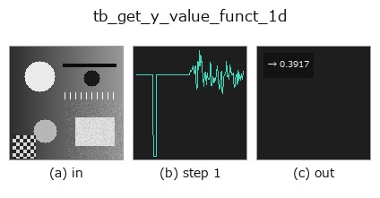

# tb_get_y_value_funct_1d — 2D `typed` op

- **データ種**: `signal` → `feature`
- **呼び出し**: `fullseye.apply(img, "tb_get_y_value_funct_1d", a=0.5, b=0.5)` (2-D は 1 画像 + 2 スカラつまみ `a,b∈[0,1]` のモデル)



*図は合成の入力 128×128 で実際に走らせた出力。左が入力、右が出力。点群は上から見た散布(明るさ = z)、1-D 列は折れ線、体積は z 方向の最大値投影、動画は中央フレーム、複素画像は振幅、絵にならない返り値は値そのもの。*

*つまみ a は出力を変えない(実測: 0.1 / 0.5 / 0.9 で同一)。*

*つまみ b は出力を変えない(実測: 0.1 / 0.5 / 0.9 で同一)。*

**段階**(前置きの op → この op。左から順):



## 使い方

The y-value at (fractional) position *x* (HALCON ``get_y_value_funct_1d``).

    With ``interpolate=True`` (default) the value is linearly interpolated
    between the two neighbouring samples; with ``interpolate=False`` the nearest
    sample is returned.

    Domain policy (documented, not extrapolated): *x* outside ``[0, n-1]``
    **clamps** to the boundary value (``numpy.interp`` end-hold semantics /
    index clip). HALCON's ``'zero'``-border variant is not offered.

    :param y: 1-D function, at least 1 sample.
    :param x: finite scalar position in index units.
    :param interpolate: linear interpolation (True) or nearest sample (False).
    :returns: float.
    :raises ValueError: non-1-D / NaN / Inf input, empty input, or non-finite *x*.

Typed bridge of the 1d op ``get_y_value_funct_1d`` into the 2-D evolution registry: the same implementation, called under the ``op(v, a, b)`` convention. This op has no tunable parameter; ``a`` and ``b`` are unused.

## 参考(サンプルデータ・文献)

- [サンプルデータ カタログ(DL URL / ライセンス)](../../SAMPLES.md) — 2-D は skimage.data(BSD/public)+ 合成、3-D は実データ源(Stanford/PDS 等)の DL URL。
- [演算子の来歴・参考文献](../../../REFERENCES.md) — この op 族の元になった研究/手法の出典。

## Studio で試す

下のプログラムは実際に走ることを確かめてある(図と同じ入力)。Studio のヘルプではこのブロックがボタンになり、その場で読み込んで実行できる。

```program
img_to_signal 0.50 0.50
tb_get_y_value_funct_1d 0.50 0.50
```

## 実行できる例(この op を実際に呼ぶ検証済みサンプル)

- (まだありません)

## 型が繋がる次の op(`feature` を入力に取れる)

[identity](../misc/identity.md)

## 同カテゴリ(`typed`)

[tb_points_to_voxel](tb_points_to_voxel.md) · [tb_estimate_point_normals](tb_estimate_point_normals.md) · [tb_iss_keypoints](tb_iss_keypoints.md) · [tb_angle_3points](tb_angle_3points.md) · [tb_project_points](tb_project_points.md) · [tb_render_point_depth](tb_render_point_depth.md) · [tb_statistical_outlier_removal](tb_statistical_outlier_removal.md) · [tb_radius_outlier_removal](tb_radius_outlier_removal.md)

---
*Provenance: ops.py — 2D operator registry. この per-op ノートは `tools/opdocs.py md` が自動生成(手編集しない)。*

© 2026 Kazufumi Furuse — Fullseye operator documentation. Licensed under Apache-2.0.
