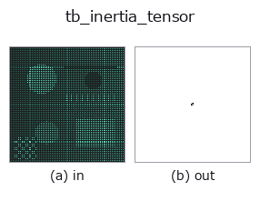
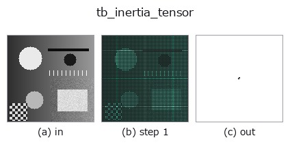
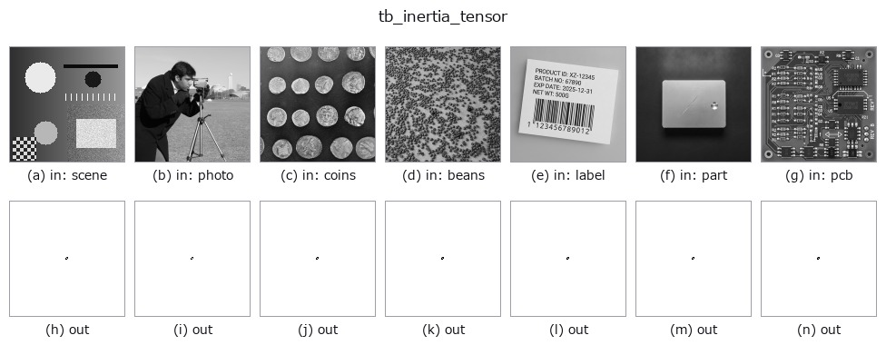

# tb_inertia_tensor — 2D `typed` op

- **データ種**: `points` → `matrix`
- **呼び出し**: `fullseye.apply(img, "tb_inertia_tensor", a=0.5, b=0.5)` (2-D は 1 画像 + 2 スカラつまみ `a,b∈[0,1]` のモデル)



*図は合成の入力 128×128 で実際に走らせた出力。左が入力、右が出力。点群は上から見た散布(明るさ = z)、1-D 列は折れ線、体積は z 方向の最大値投影、動画は中央フレーム、複素画像は振幅、絵にならない返り値は値そのもの。*

*つまみ a は出力を変えない(実測: 0.1 / 0.5 / 0.9 で同一)。*

*つまみ b は出力を変えない(実測: 0.1 / 0.5 / 0.9 で同一)。*

**段階**(前置きの op → この op。左から順):



**別の画像でも**(合成シーン / 写真 / 硬貨。上段が入力、下段がその出力。つまみは既定):



## 使い方

点群の慣性テンソル (3,3)(中心 2 次モーメントから、等質量・総質量 1)。

    I_xx = mean(y²+z²), I_yy = mean(x²+z²), I_zz = mean(x²+y²),
    I_xy = -mean(xy), I_xz = -mean(xz), I_yz = -mean(yz)。
    共分散 C を使うと I = tr(C)·E₃ − C(E₃ は単位行列)と等価。対称・半正定値。
    重心中心化のため並進不変。

    Returns
    -------
    np.ndarray, shape (3, 3)
        対称な慣性テンソル。

    補足:
    - 単位は長さ²(質量 1 の等質量点とみなすので密度は入らない)。点群を回転で回すと ``R I Rᵀ`` に写り、固有値(``principal_moments``)が回転不変量、固有ベクトルが主軸(``moment_axes``)。
    - 入力は (N,3)、N >= 1(1 点なら零行列)。形状不正・非有限は ``ValueError``。
    - 共分散 C とは ``I = tr(C)·E₃ - C`` の関係で、C と I の固有ベクトルは同じ、固有値は ``tr(C) - c_i``。
    - 実体(体積)のモーメントではなく **サンプル点** のモーメントなので、同じ形でも点密度の偏りで値が変わる。密度を均すなら前段で ``voxel_grid_downsample``。決定論的。

2-D 進化レジストリへ橋渡しした 3d の op ``inertia_tensor``。実装は同じで、呼び出し規約だけ ``op(v, a, b)`` に合わせてある。この op に調整点は無く、``a`` も ``b`` も使われない。

## 参考(サンプルデータ・文献)

- [サンプルデータ カタログ(DL URL / ライセンス)](../../SAMPLES.md) — 2-D は skimage.data(BSD/public)+ 合成、3-D は実データ源(Stanford/PDS 等)の DL URL。
- [演算子の来歴・参考文献](../../../REFERENCES.md) — この op 族の元になった研究/手法の出典。

## Studio で試す

下のプログラムは実際に走ることを確かめてある(図と同じ入力)。Studio のヘルプではこのブロックがボタンになり、その場で読み込んで実行できる。

```program
img_to_points 0.50 0.50
tb_inertia_tensor 0.50 0.50
```

## 実行できる例(この op を実際に呼ぶ検証済みサンプル)

次の例は元の台帳 op `inertia_tensor` を呼ぶもの。この橋渡し op は同じ実装を `fn(v, a, b)` 規約に合わせただけなので、挙動はそのまま当てはまる(呼び出し形だけ違う)。
- [moment_invariants](../../../../examples_3d/moment_invariants.py) — `py -3.11 examples_3d/moment_invariants.py`

## 型が繋がる次の op(`matrix` を入力に取れる)

[identity](../misc/identity.md) · [tb_mat_pinv](tb_mat_pinv.md) · [tb_mat_cond](tb_mat_cond.md) · [tb_stat_covariance](tb_stat_covariance.md) · [tb_stat_correlation](tb_stat_correlation.md)

## 同カテゴリ(`typed`)

[tb_points_to_voxel](tb_points_to_voxel.md) · [tb_estimate_point_normals](tb_estimate_point_normals.md) · [tb_iss_keypoints](tb_iss_keypoints.md) · [tb_angle_3points](tb_angle_3points.md) · [tb_project_points](tb_project_points.md) · [tb_render_point_depth](tb_render_point_depth.md) · [tb_statistical_outlier_removal](tb_statistical_outlier_removal.md) · [tb_radius_outlier_removal](tb_radius_outlier_removal.md)

---
*Provenance: ops.py — 2D operator registry. この per-op ノートは `tools/opdocs.py md` が自動生成(手編集しない)。*

© 2026 Kazufumi Furuse — Fullseye operator documentation. Licensed under Apache-2.0.
