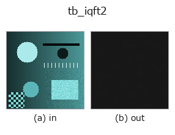
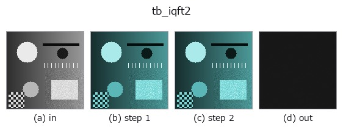
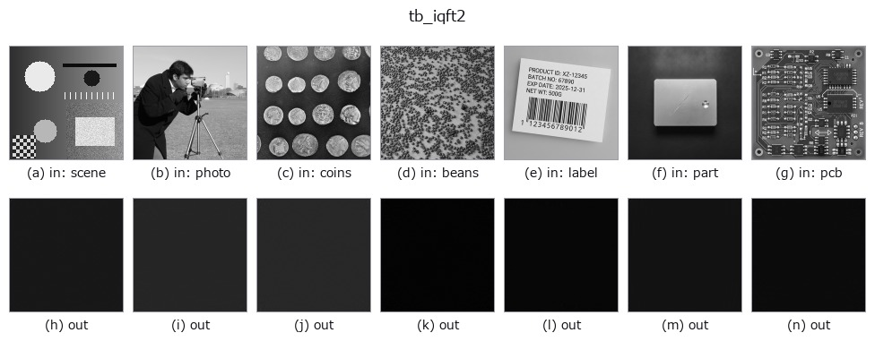

# tb_iqft2 — 2D `typed` op

- **データ種**: `qimage` → `qimage`
- **呼び出し**: `fullseye.apply(img, "tb_iqft2", a=0.5, b=0.5)` (2-D は 1 画像 + 2 スカラつまみ `a,b∈[0,1]` のモデル)



*図は合成の入力 128×128 で実際に走らせた出力。左が入力、右が出力。点群は上から見た散布(明るさ = z)、1-D 列は折れ線、体積は z 方向の最大値投影、動画は中央フレーム、複素画像は振幅、絵にならない返り値は値そのもの。*

*つまみ a は出力を変えない(実測: 0.1 / 0.5 / 0.9 で同一)。*

*つまみ b は出力を変えない(実測: 0.1 / 0.5 / 0.9 で同一)。*

**段階**(前置きの op → この op。左から順):



**別の画像でも**(合成シーン / 写真 / 硬貨。上段が入力、下段がその出力。つまみは既定):



## 使い方

Inverse quaternion Fourier transform of a **centred** spectrum. → (H, W, 4).

    The exact inverse of :func:`qft2` **for the same side and the same mu**:
    measured round-trip error ``2.22e-15`` for both sides on a standard-normal
    ``(32, 32, 4)`` field. The kernel is ``exp(+mu * 2*pi*(...))`` applied on the
    side named, and the ``1/(H*W)`` normalisation is carried here, as in
    ``numpy.fft.ifft2``.

    **Using the wrong side does not raise.** ``iqft2(qft2(q, "left"), "right")``
    returns a finite, plausible quaternion image that is simply not ``q``:
    measured ``max|err| = 1.113`` on a random colour image whose own range is
    ``0.9994`` (another seed: 1.063 against 1.0), and — the dangerous case — only ``0.054`` against a range of
    ``1.076`` on a grey-axis-dominated one, which is small enough to survive a
    look at the picture. The ``side`` argument is required at both ends for
    exactly this reason, and the two calls must agree: nothing in the data
    records which transform produced it, so nothing downstream can catch the
    mismatch for you.

    **Raises** ``ValueError``: *spectrum* is not a valid ``(H, W, 4)`` field;
    *side* is not ``'left'`` / ``'right'``; *mu* is not a finite non-zero
    3-vector.

Typed bridge of the quat op ``iqft2`` into the 2-D evolution registry: the same implementation, called under the ``op(v, a, b)`` convention. This op has no tunable parameter; ``a`` and ``b`` are unused.

## 参考(サンプルデータ・文献)

- [サンプルデータ カタログ(DL URL / ライセンス)](../../SAMPLES.md) — 2-D は skimage.data(BSD/public)+ 合成、3-D は実データ源(Stanford/PDS 等)の DL URL。
- [演算子の来歴・参考文献](../../../REFERENCES.md) — この op 族の元になった研究/手法の出典。

## Studio で試す

下のプログラムは実際に走ることを確かめてある(図と同じ入力)。Studio のヘルプではこのブロックがボタンになり、その場で読み込んで実行できる。

```program
img_to_rgb 0.50 0.50
tb_rgb_to_quaternion 0.50 0.50
tb_iqft2 0.50 0.50
```

## 実行できる例(この op を実際に呼ぶ検証済みサンプル)

次の例は元の台帳 op `iqft2` を呼ぶもの。この橋渡し op は同じ実装を `fn(v, a, b)` 規約に合わせただけなので、挙動はそのまま当てはまる(呼び出し形だけ違う)。
- [quaternion_monogenic](../../../../examples/quaternion_monogenic.py) — `py -3.11 examples/quaternion_monogenic.py`

## 型が繋がる次の op(`qimage` を入力に取れる)

[identity](../misc/identity.md) · [tb_quaternion_to_rgb](tb_quaternion_to_rgb.md) · [tb_quat_norm](tb_quat_norm.md) · [tb_quat_conjugate_image](tb_quat_conjugate_image.md) · [tb_quat_normalize_image](tb_quat_normalize_image.md) · [tb_monogenic_amplitude](tb_monogenic_amplitude.md) · [tb_monogenic_phase](tb_monogenic_phase.md) · [tb_monogenic_orientation](tb_monogenic_orientation.md)

## 同カテゴリ(`typed`)

[tb_points_to_voxel](tb_points_to_voxel.md) · [tb_estimate_point_normals](tb_estimate_point_normals.md) · [tb_iss_keypoints](tb_iss_keypoints.md) · [tb_project_points](tb_project_points.md) · [tb_render_point_depth](tb_render_point_depth.md) · [tb_statistical_outlier_removal](tb_statistical_outlier_removal.md) · [tb_radius_outlier_removal](tb_radius_outlier_removal.md) · [tb_voxel_grid_downsample](tb_voxel_grid_downsample.md)

---
*Provenance: ops.py — 2D operator registry. この per-op ノートは `tools/opdocs.py md` が自動生成(手編集しない)。*

© 2026 Kazufumi Furuse — Fullseye operator documentation. Licensed under Apache-2.0.
