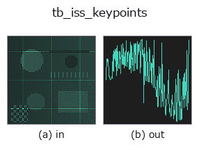
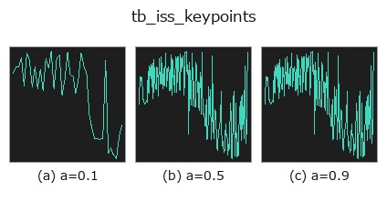
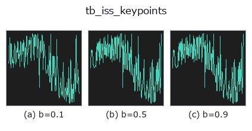
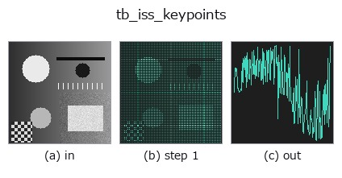
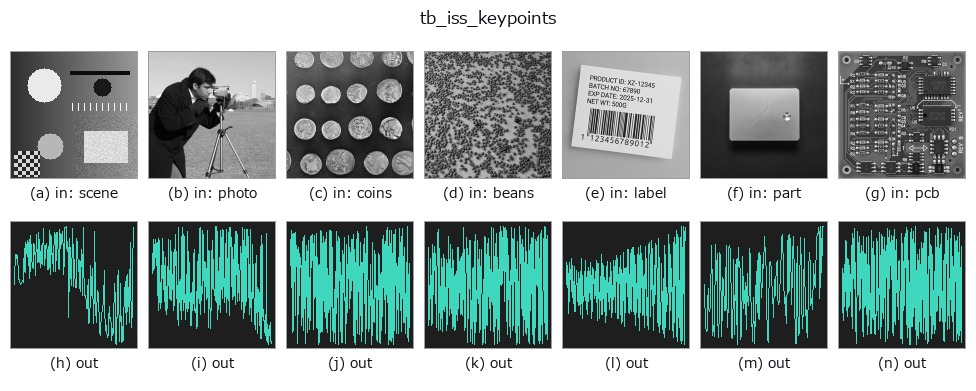

# tb_iss_keypoints — 2D `typed` op

- **データ種**: `points` → `signal`
- **呼び出し**: `fullseye.apply(img, "tb_iss_keypoints", a=0.5, b=0.5)` (2-D は 1 画像 + 2 スカラつまみ `a,b∈[0,1]` のモデル)



*図は合成の入力 128×128 で実際に走らせた出力。左が入力、右が出力。点群は上から見た散布(明るさ = z)、1-D 列は折れ線、体積は z 方向の最大値投影、動画は中央フレーム、複素画像は振幅、絵にならない返り値は値そのもの。*

**つまみ a を振る**(0.1 / 0.5 / 0.9、もう一方は既定):



**つまみ b を振る**(0.1 / 0.5 / 0.9、もう一方は既定):



**段階**(前置きの op → この op。左から順):



**別の画像でも**(合成シーン / 写真 / 硬貨。上段が入力、下段がその出力。つまみは既定):



## 使い方

ISS(Intrinsic Shape Signatures、3D Harris 相当)キーポイント検出。
    局所共分散の最小固有値 λ3 を saliency とし、固有値が distinct(向きが
    well-defined)な点のみ候補にして NMS で疎に選ぶ。回転不変。返り値=点 index 配列。

    引数:
    - ``points`` (N,3)。``radius``: saliency 用の近傍球半径(点群と同じ単位)。
    - ``nms_radius``: 非最大抑制の距離。None なら ``0.6*radius``。
    - ``gamma21``・``gamma32``: 固有値比 λ2/λ1、λ3/λ2 の上限(既定 0.99)。両方ともこれ
    未満の点だけが候補(比が 1 に近い=等方で向きが決まらない点を除く)。
    - ``max_kp``: 返す上限。``min_neighbors``: 近傍がこれ未満の点は候補にしない(既定 8)。
    手順: 各点で ``radius`` 内の近傍を集め、注目点を原点とした 2 次モーメント行列
    ``(qᵀq)/n`` の固有値 λ1≥λ2≥λ3 を求める(λ1 が 1e-12 以下なら除外)。λ3 を saliency と
    して降順に走査し、採用済みの点から ``nms_radius`` 未満にあるものを捨てる貪欲 NMS。
    返り値は int64 の点インデックス配列(saliency 降順)。候補が無ければ長さ 0。
    注意: 近傍は注目点で中心化する(重心ではない)ため、平面上の点でも λ3 は厳密には 0 に
    ならない。全点で近傍探索する Python ループなので、数万点を超える雲は
    ``voxel_grid_downsample`` で間引いてから使う。``shot_descriptor`` のキーポイント入力に
    直結し、``register_shot`` は内部で ``radius`` の 0.6 倍・NMS 0.3 倍で呼ぶ。

2-D 進化レジストリへ橋渡しした 3d の op ``iss_keypoints``。実装は同じで、呼び出し規約だけ ``op(v, a, b)`` に合わせてある。``a`` が ``gamma21``(既定 0.99)、``b`` が ``gamma32``(既定 0.99)を振る。

## 参考(サンプルデータ・文献)

- [サンプルデータ カタログ(DL URL / ライセンス)](../../SAMPLES.md) — 2-D は skimage.data(BSD/public)+ 合成、3-D は実データ源(Stanford/PDS 等)の DL URL。
- [演算子の来歴・参考文献](../../../REFERENCES.md) — この op 族の元になった研究/手法の出典。

## Studio で試す

下のプログラムは実際に走ることを確かめてある(図と同じ入力)。Studio のヘルプではこのブロックがボタンになり、その場で読み込んで実行できる。

```program
img_to_points 0.50 0.50
tb_iss_keypoints 0.50 0.50
```

## 実行できる例(この op を実際に呼ぶ検証済みサンプル)

次の例は元の台帳 op `iss_keypoints` を呼ぶもの。この橋渡し op は同じ実装を `fn(v, a, b)` 規約に合わせただけなので、挙動はそのまま当てはまる(呼び出し形だけ違う)。
- [feature_register](../../../../examples_3d/feature_register.py) — `py -3.11 examples_3d/feature_register.py`

## 型が繋がる次の op(`signal` を入力に取れる)

[identity](../misc/identity.md) · [tb_create_funct_1d_array](tb_create_funct_1d_array.md) · [tb_smooth_funct_1d_gauss](tb_smooth_funct_1d_gauss.md) · [tb_smooth_funct_1d_mean](tb_smooth_funct_1d_mean.md) · [tb_derivate_funct_1d](tb_derivate_funct_1d.md) · [tb_integrate_funct_1d](tb_integrate_funct_1d.md) · [tb_zero_crossings_funct_1d](tb_zero_crossings_funct_1d.md) · [tb_abs_funct_1d](tb_abs_funct_1d.md)

## 同カテゴリ(`typed`)

[tb_points_to_voxel](tb_points_to_voxel.md) · [tb_estimate_point_normals](tb_estimate_point_normals.md) · [tb_angle_3points](tb_angle_3points.md) · [tb_project_points](tb_project_points.md) · [tb_render_point_depth](tb_render_point_depth.md) · [tb_statistical_outlier_removal](tb_statistical_outlier_removal.md) · [tb_radius_outlier_removal](tb_radius_outlier_removal.md) · [tb_voxel_grid_downsample](tb_voxel_grid_downsample.md)

---
*Provenance: ops.py — 2D operator registry. この per-op ノートは `tools/opdocs.py md` が自動生成(手編集しない)。*

© 2026 Kazufumi Furuse — Fullseye operator documentation. Licensed under Apache-2.0.
