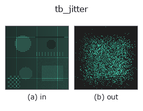
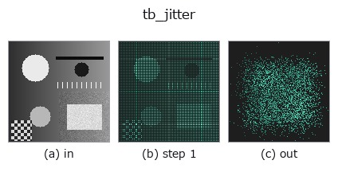
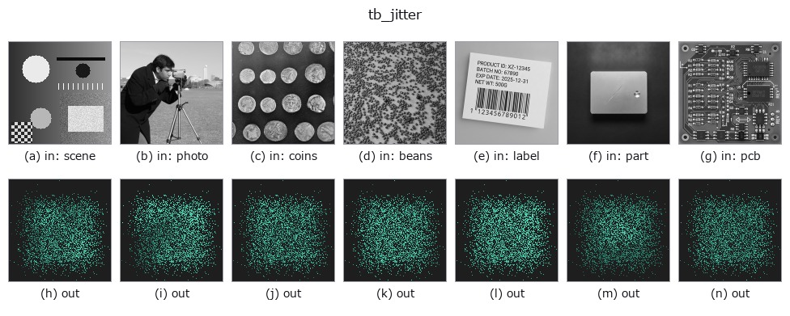

# tb_jitter — 2D `typed` op

- **データ種**: `points` → `points`
- **呼び出し**: `fullseye.apply(img, "tb_jitter", a=0.5, b=0.5)` (2-D は 1 画像 + 2 スカラつまみ `a,b∈[0,1]` のモデル)



*図は合成の入力 128×128 で実際に走らせた出力。左が入力、右が出力。点群は上から見た散布(明るさ = z)、1-D 列は折れ線、体積は z 方向の最大値投影、動画は中央フレーム、複素画像は振幅、絵にならない返り値は値そのもの。*

*つまみ a は出力を変えない(実測: 0.1 / 0.5 / 0.9 で同一)。*

*つまみ b は出力を変えない(実測: 0.1 / 0.5 / 0.9 で同一)。*

**段階**(前置きの op → この op。左から順):



**別の画像でも**(合成シーン / 写真 / 硬貨。上段が入力、下段がその出力。つまみは既定):



## 使い方

各点に等方ガウスノイズ ``N(0, sigma)`` を付加(センサ位置ノイズの模倣)。

    ``sigma`` はワールド単位の標準偏差(ユーザ指定パラメータ)。``clip`` を与えると
    各成分の変位を ``[-clip, clip]`` に切り詰める(外れ変位の抑制)。大 N ではノイズの
    平均≈0・標準偏差≈sigma となる。返り値は入力と同形状 ``(N,3)``。

    - ``sigma < 0`` は ``ValueError``。``sigma == 0`` または空入力は入力のコピーを返す。
    - ``clip`` は与えるなら ``> 0``(それ以外は ``ValueError``)。切り詰めは成分ごとなので
    変位ベクトルの長さは最大 ``√3·clip``。
    - ``seed`` で決定論的(``np.random.default_rng(seed)``)。同 seed・同形状なら同じノイズ。
    - 入力は ``(N,3)`` の有限値のみ(長さ 3 の 1-D は 1 点に昇格、それ以外や NaN は
    ``ValueError``)。返り値は float64。
    - 位置合わせ(``register_fpfh`` 等)のノイズ耐性を測るとき、``sigma`` を点間隔
    (``voxel_grid_downsample`` の格子幅など)に対する比で決めると条件を比較しやすい。

2-D 進化レジストリへ橋渡しした 3d の op ``jitter``。実装は同じで、呼び出し規約だけ ``op(v, a, b)`` に合わせてある。この op に調整点は無く、``a`` も ``b`` も使われない。

## 参考(サンプルデータ・文献)

- [サンプルデータ カタログ(DL URL / ライセンス)](../../SAMPLES.md) — 2-D は skimage.data(BSD/public)+ 合成、3-D は実データ源(Stanford/PDS 等)の DL URL。
- [演算子の来歴・参考文献](../../../REFERENCES.md) — この op 族の元になった研究/手法の出典。

## Studio で試す

下のプログラムは実際に走ることを確かめてある(図と同じ入力)。Studio のヘルプではこのブロックがボタンになり、その場で読み込んで実行できる。

```program
img_to_points 0.50 0.50
tb_jitter 0.50 0.50
```

## 実行できる例(この op を実際に呼ぶ検証済みサンプル)

次の例は元の台帳 op `jitter` を呼ぶもの。この橋渡し op は同じ実装を `fn(v, a, b)` 規約に合わせただけなので、挙動はそのまま当てはまる(呼び出し形だけ違う)。
- [augment_pointcloud](../../../../examples_3d/augment_pointcloud.py) — `py -3.11 examples_3d/augment_pointcloud.py`

## 型が繋がる次の op(`points` を入力に取れる)

[identity](../misc/identity.md) · [tb_points_to_voxel](tb_points_to_voxel.md) · [tb_estimate_point_normals](tb_estimate_point_normals.md) · [tb_iss_keypoints](tb_iss_keypoints.md) · [tb_project_points](tb_project_points.md) · [tb_render_point_depth](tb_render_point_depth.md) · [tb_statistical_outlier_removal](tb_statistical_outlier_removal.md) · [tb_radius_outlier_removal](tb_radius_outlier_removal.md)

## 同カテゴリ(`typed`)

[tb_points_to_voxel](tb_points_to_voxel.md) · [tb_estimate_point_normals](tb_estimate_point_normals.md) · [tb_iss_keypoints](tb_iss_keypoints.md) · [tb_project_points](tb_project_points.md) · [tb_render_point_depth](tb_render_point_depth.md) · [tb_statistical_outlier_removal](tb_statistical_outlier_removal.md) · [tb_radius_outlier_removal](tb_radius_outlier_removal.md) · [tb_voxel_grid_downsample](tb_voxel_grid_downsample.md)

---
*Provenance: ops.py — 2D operator registry. この per-op ノートは `tools/opdocs.py md` が自動生成(手編集しない)。*

© 2026 Kazufumi Furuse — Fullseye operator documentation. Licensed under Apache-2.0.
