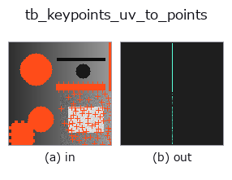
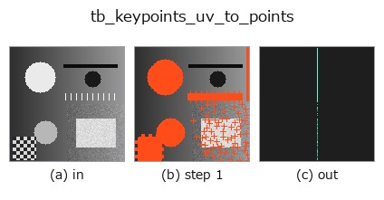
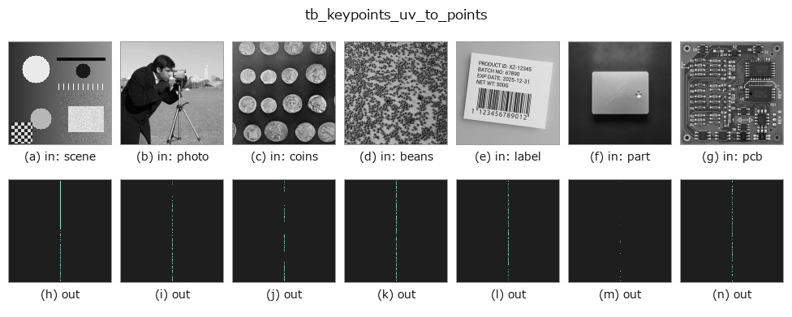

# tb_keypoints_uv_to_points — 2D `typed` op

- **データ種**: `keypoints` → `points`
- **呼び出し**: `fullseye.apply(img, "tb_keypoints_uv_to_points", a=0.5, b=0.5)` (2-D は 1 画像 + 2 スカラつまみ `a,b∈[0,1]` のモデル)



*図は合成の入力 128×128 で実際に走らせた出力。左が入力、右が出力。点群は上から見た散布(明るさ = z)、1-D 列は折れ線、体積は z 方向の最大値投影、動画は中央フレーム、複素画像は振幅、絵にならない返り値は値そのもの。*

*つまみ a は出力を変えない(実測: 0.1 / 0.5 / 0.9 で同一)。*

*つまみ b は出力を変えない(実測: 0.1 / 0.5 / 0.9 で同一)。*

**段階**(前置きの op → この op。左から順):



**別の画像でも**(合成シーン / 写真 / 硬貨。上段が入力、下段がその出力。つまみは既定):



## 使い方

画像座標 ``(N,2) = (u, v)`` → 点群 ``(N,3) = (z, y, x)``。``keypoints`` の出口。

    **op 名に軸の約束が書いてある**のは、この repo で ``keypoints`` を産む
    ``match3d.project_points`` が **(u, v) = (列, 行)** を返し、``points`` を産む
    ``fuse3d.to_points(voxel)`` が **(z, y, x)** を返すから —— 素直に「先頭 2 列」
    として繋ぐと**例外も NaN も出ないまま行と列が入れ替わる**。ここでは
    ``y = v``、``x = u`` と明示的に入れ替えて渡す。

    :func:`points_zyx_to_keypoints_uv` と往復して **bit 一致**(z を渡した向き)。

    Args:
        keypoints: (N, 2) の (u, v)。
        z: 載せる平面の z(スカラ、または (N,) の配列)。
    Returns:
        (N, 3) float64 の (z, y, x)。
    Raises:
        ValueError: 形状不正 / 非有限 / z の長さ不一致。

2-D 進化レジストリへ橋渡しした reprconv の op ``keypoints_uv_to_points``。実装は同じで、呼び出し規約だけ ``op(v, a, b)`` に合わせてある。この op に調整点は無く、``a`` も ``b`` も使われない。

## 参考(サンプルデータ・文献)

- [サンプルデータ カタログ(DL URL / ライセンス)](../../SAMPLES.md) — 2-D は skimage.data(BSD/public)+ 合成、3-D は実データ源(Stanford/PDS 等)の DL URL。
- [演算子の来歴・参考文献](../../../REFERENCES.md) — この op 族の元になった研究/手法の出典。

## Studio で試す

下のプログラムは実際に走ることを確かめてある(図と同じ入力)。Studio のヘルプではこのブロックがボタンになり、その場で読み込んで実行できる。

```program
img_to_keypoints 0.50 0.50
tb_keypoints_uv_to_points 0.50 0.50
```

## 実行できる例(この op を実際に呼ぶ検証済みサンプル)

次の例は元の台帳 op `keypoints_uv_to_points` を呼ぶもの。この橋渡し op は同じ実装を `fn(v, a, b)` 規約に合わせただけなので、挙動はそのまま当てはまる(呼び出し形だけ違う)。
- [representation_roundtrip](../../../../examples/representation_roundtrip.py) — `py -3.11 examples/representation_roundtrip.py`

## 型が繋がる次の op(`points` を入力に取れる)

[identity](../misc/identity.md) · [tb_points_to_voxel](tb_points_to_voxel.md) · [tb_estimate_point_normals](tb_estimate_point_normals.md) · [tb_iss_keypoints](tb_iss_keypoints.md) · [tb_project_points](tb_project_points.md) · [tb_render_point_depth](tb_render_point_depth.md) · [tb_statistical_outlier_removal](tb_statistical_outlier_removal.md) · [tb_radius_outlier_removal](tb_radius_outlier_removal.md)

## 同カテゴリ(`typed`)

[tb_points_to_voxel](tb_points_to_voxel.md) · [tb_estimate_point_normals](tb_estimate_point_normals.md) · [tb_iss_keypoints](tb_iss_keypoints.md) · [tb_project_points](tb_project_points.md) · [tb_render_point_depth](tb_render_point_depth.md) · [tb_statistical_outlier_removal](tb_statistical_outlier_removal.md) · [tb_radius_outlier_removal](tb_radius_outlier_removal.md) · [tb_voxel_grid_downsample](tb_voxel_grid_downsample.md)

---
*Provenance: ops.py — 2D operator registry. この per-op ノートは `tools/opdocs.py md` が自動生成(手編集しない)。*

© 2026 Kazufumi Furuse — Fullseye operator documentation. Licensed under Apache-2.0.
