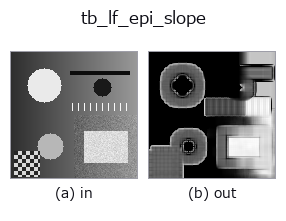
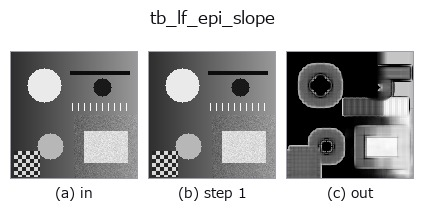
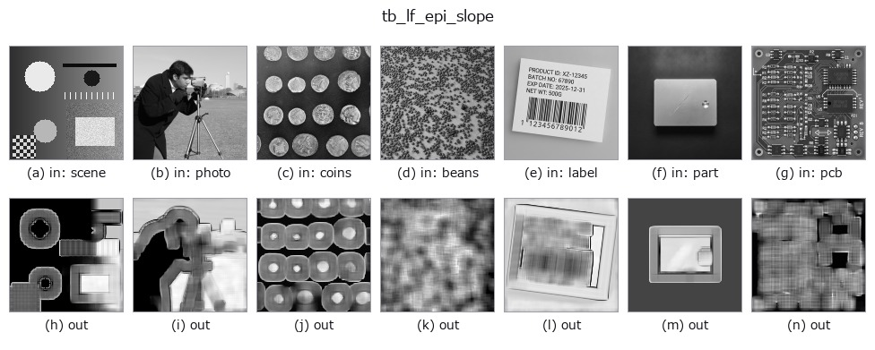

# tb_lf_epi_slope — 2D `typed` op

- **データ種**: `lightfield` → `image`
- **呼び出し**: `fullseye.apply(img, "tb_lf_epi_slope", a=0.5, b=0.5)` (2-D は 1 画像 + 2 スカラつまみ `a,b∈[0,1]` のモデル)



*図は合成の入力 128×128 で実際に走らせた出力。左が入力、右が出力。点群は上から見た散布(明るさ = z)、1-D 列は折れ線、体積は z 方向の最大値投影、動画は中央フレーム、複素画像は振幅、絵にならない返り値は値そのもの。*

*つまみ a は出力を変えない(実測: 0.1 / 0.5 / 0.9 で同一)。*

*つまみ b は出力を変えない(実測: 0.1 / 0.5 / 0.9 で同一)。*

**段階**(前置きの op → この op。左から順):



**別の画像でも**(合成シーン / 写真 / 硬貨。上段が入力、下段がその出力。つまみは既定):



## 使い方

Per-pixel slope from the **EPI line orientation** (structure tensor, one pass).

    A scene point traces a straight line in the epipolar-plane image
    (:func:`lf_epi`), so along that line the intensity is constant:
    ``E_u + s * E_x = 0``. Accumulating that constraint over the whole angular
    grid and a ``window x window`` spatial neighbourhood gives the closed-form
    least-squares slope ``s = -(J_ux + J_vy) / (J_xx + J_yy)`` with
    ``J_ab = sum(E_a * E_b)`` — one pass over the light field, no sweep, both
    the horizontal and vertical EPI directions pooled.

    **This estimator is biased, and the bias is the reason to also run**
    :func:`lf_depth_from_focus`. It is ordinary (not total) least squares on
    finite differences, so it needs the EPI line to advance less than roughly
    one texture correlation length per view. Measured 2026-09-01 on
    5x5x64x64 synthetic fields, median over the interior: with texture
    ``sigma = 1.5`` px, true ``+1.00 -> +1.0004``, ``+0.50 -> +0.5285``,
    ``+1.50 -> +1.3018``, ``+2.00 -> +1.4614``; with ``sigma = 5.0`` px the same
    slopes give ``+1.0003``, ``+0.5029``, ``+1.4827``, ``+1.9482``. Integer
    slopes on a wrapped field come back within 4e-4 and ``s = 0`` is exact;
    ``|s| > 1`` is under-estimated, by 27% at ``s = 2`` on the roughest texture.
    Use it as a fast dense initialiser, not as the final word.

    Returns ``(slope_map, energy)``: the ``(H, W)`` slope map and the ``(H, W)``
    gradient energy ``J_xx + J_yy`` that was the denominator. Pixels whose
    energy is below *min_energy* have **no** measurable parallax (a flat patch
    of sky); their slope is set to 0 and their energy reported as-is, so you
    threshold on ``energy`` instead of being handed a plausible-looking number
    divided by ~0.

    **Raises** ``ValueError``: *lf* not a valid light field, an angular/spatial
    shape where *neither* EPI direction carries information (the horizontal EPI
    needs ``U >= 2`` **and** ``W >= 2``, the vertical needs ``V >= 2`` and
    ``H >= 2``), an even or non-positive *window*, a non-positive *min_energy*.

Typed bridge of the lightfield op ``lf_epi_slope`` into the 2-D evolution registry: the same implementation, called under the ``op(v, a, b)`` convention. This op has no tunable parameter; ``a`` and ``b`` are unused.

## 参考(サンプルデータ・文献)

- [サンプルデータ カタログ(DL URL / ライセンス)](../../SAMPLES.md) — 2-D は skimage.data(BSD/public)+ 合成、3-D は実データ源(Stanford/PDS 等)の DL URL。
- [演算子の来歴・参考文献](../../../REFERENCES.md) — この op 族の元になった研究/手法の出典。

## Studio で試す

下のプログラムは実際に走ることを確かめてある(図と同じ入力)。Studio のヘルプではこのブロックがボタンになり、その場で読み込んで実行できる。

```program
img_to_lightfield 0.50 0.50
tb_lf_epi_slope 0.50 0.50
```

## 実行できる例(この op を実際に呼ぶ検証済みサンプル)

次の例は元の台帳 op `lf_epi_slope` を呼ぶもの。この橋渡し op は同じ実装を `fn(v, a, b)` 規約に合わせただけなので、挙動はそのまま当てはまる(呼び出し形だけ違う)。
- [lightfield_depth](../../../../examples/lightfield_depth.py) — `py -3.11 examples/lightfield_depth.py`
- [poc_lightfield_depth](../../../../examples/poc_lightfield_depth.py) — `py -3.11 examples/poc_lightfield_depth.py`

## 型が繋がる次の op(`image` を入力に取れる)

[identity](../misc/identity.md) · [gaussian](../smoothing/gaussian.md) · [mean_box](../smoothing/mean_box.md) · [bilateral](../smoothing/bilateral.md) · [unsharp](../smoothing/unsharp.md) · [median](../rank/median.md) · [min_filter](../rank/min_filter.md) · [max_filter](../rank/max_filter.md)

## 同カテゴリ(`typed`)

[tb_points_to_voxel](tb_points_to_voxel.md) · [tb_estimate_point_normals](tb_estimate_point_normals.md) · [tb_iss_keypoints](tb_iss_keypoints.md) · [tb_project_points](tb_project_points.md) · [tb_render_point_depth](tb_render_point_depth.md) · [tb_statistical_outlier_removal](tb_statistical_outlier_removal.md) · [tb_radius_outlier_removal](tb_radius_outlier_removal.md) · [tb_voxel_grid_downsample](tb_voxel_grid_downsample.md)

---
*Provenance: ops.py — 2D operator registry. この per-op ノートは `tools/opdocs.py md` が自動生成(手編集しない)。*

© 2026 Kazufumi Furuse — Fullseye operator documentation. Licensed under Apache-2.0.
