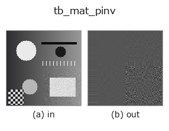
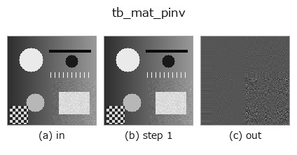
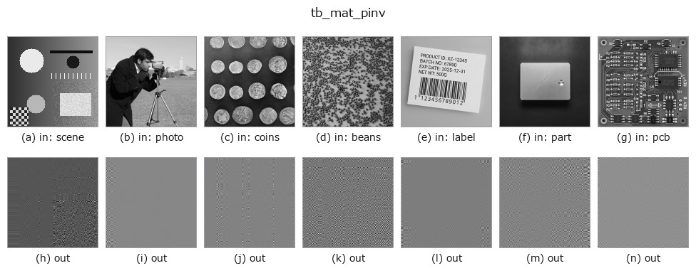

# tb_mat_pinv — 2D `typed` op

- **データ種**: `matrix` → `matrix`
- **呼び出し**: `fullseye.apply(img, "tb_mat_pinv", a=0.5, b=0.5)` (2-D は 1 画像 + 2 スカラつまみ `a,b∈[0,1]` のモデル)



*図は合成の入力 128×128 で実際に走らせた出力。左が入力、右が出力。点群は上から見た散布(明るさ = z)、1-D 列は折れ線、体積は z 方向の最大値投影、動画は中央フレーム、複素画像は振幅、絵にならない返り値は値そのもの。*

*つまみ a は出力を変えない(実測: 0.1 / 0.5 / 0.9 で同一)。*

*つまみ b は出力を変えない(実測: 0.1 / 0.5 / 0.9 で同一)。*

**段階**(前置きの op → この op。左から順):



**別の画像でも**(合成シーン / 写真 / 硬貨。上段が入力、下段がその出力。つまみは既定):



## 使い方

Moore-Penrose pseudo-inverse via SVD, with the cutoff **explicit**.

    Singular values below ``rcond * s_max`` are treated as zero — that cutoff
    *is* the regularisation, so it is a named, documented parameter here
    (default ``1e-12``) rather than a hidden library default: raising it
    discards noisy directions (stabler, more biased), lowering it keeps them
    (exact for well-conditioned *A*, explosive near rank deficiency).

    Works for any ``(m, n)``: ``pinv(A) @ b`` is the least-squares solution for
    ``m > n`` and the minimum-norm solution for ``m < n``.

    HALCON: no direct operator — HALCON reaches the same result through
    ``svd_matrix`` + reciprocal singular values.

Typed bridge of the math op ``mat_pinv`` into the 2-D evolution registry: the same implementation, called under the ``op(v, a, b)`` convention. ``a`` drives ``rcond`` (default 1e-12); ``b`` is unused.

## 参考(サンプルデータ・文献)

- [サンプルデータ カタログ(DL URL / ライセンス)](../../SAMPLES.md) — 2-D は skimage.data(BSD/public)+ 合成、3-D は実データ源(Stanford/PDS 等)の DL URL。
- [演算子の来歴・参考文献](../../../REFERENCES.md) — この op 族の元になった研究/手法の出典。

## Studio で試す

下のプログラムは実際に走ることを確かめてある(図と同じ入力)。Studio のヘルプではこのブロックがボタンになり、その場で読み込んで実行できる。

```program
img_to_matrix 0.50 0.50
tb_mat_pinv 0.50 0.50
```

## 実行できる例(この op を実際に呼ぶ検証済みサンプル)

次の例は元の台帳 op `mat_pinv` を呼ぶもの。この橋渡し op は同じ実装を `fn(v, a, b)` 規約に合わせただけなので、挙動はそのまま当てはまる(呼び出し形だけ違う)。
- [math_metrology](../../../../examples/math_metrology.py) — `py -3.11 examples/math_metrology.py`
- [poc_machine_condition_fusion](../../../../examples/poc_machine_condition_fusion.py) — `py -3.11 examples/poc_machine_condition_fusion.py`

## 型が繋がる次の op(`matrix` を入力に取れる)

[identity](../misc/identity.md) · [tb_mat_cond](tb_mat_cond.md) · [tb_stat_covariance](tb_stat_covariance.md) · [tb_stat_correlation](tb_stat_correlation.md)

## 同カテゴリ(`typed`)

[tb_points_to_voxel](tb_points_to_voxel.md) · [tb_estimate_point_normals](tb_estimate_point_normals.md) · [tb_iss_keypoints](tb_iss_keypoints.md) · [tb_project_points](tb_project_points.md) · [tb_render_point_depth](tb_render_point_depth.md) · [tb_statistical_outlier_removal](tb_statistical_outlier_removal.md) · [tb_radius_outlier_removal](tb_radius_outlier_removal.md) · [tb_voxel_grid_downsample](tb_voxel_grid_downsample.md)

---
*Provenance: ops.py — 2D operator registry. この per-op ノートは `tools/opdocs.py md` が自動生成(手編集しない)。*

© 2026 Kazufumi Furuse — Fullseye operator documentation. Licensed under Apache-2.0.
