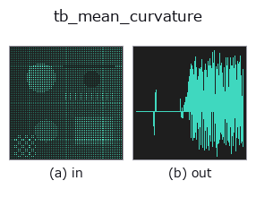
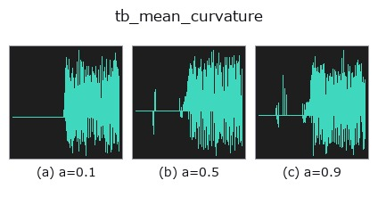
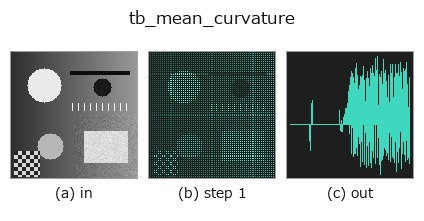
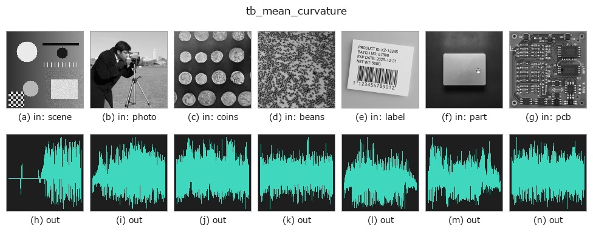

# tb_mean_curvature — 2D `typed` op

- **データ種**: `points` → `signal`
- **呼び出し**: `fullseye.apply(img, "tb_mean_curvature", a=0.5, b=0.5)` (2-D は 1 画像 + 2 スカラつまみ `a,b∈[0,1]` のモデル)



*図は合成の入力 128×128 で実際に走らせた出力。左が入力、右が出力。点群は上から見た散布(明るさ = z)、1-D 列は折れ線、体積は z 方向の最大値投影、動画は中央フレーム、複素画像は振幅、絵にならない返り値は値そのもの。*

**つまみ a を振る**(0.1 / 0.5 / 0.9、もう一方は既定):



*つまみ b は出力を変えない(実測: 0.1 / 0.5 / 0.9 で同一)。*

**段階**(前置きの op → この op。左から順):



**別の画像でも**(合成シーン / 写真 / 硬貨。上段が入力、下段がその出力。つまみは既定):



## 使い方

平均曲率 H=(k1+k2)/2。→ (N,)。向きに依存する量。

    normals(向き付き参照法線, (N,3))未指定時は凸側ヒューリスティクス(開面の凹/凸符号は不定)。
    向き付き法線を渡すと大域向きに整合し正しい符号を出す。

    補足:
    - 計算は ``principal_curvatures`` と同じ(k+1 近傍の PCA 法線 + 局所二次曲面フィット)で、``(k1 + k2) / 2`` を返す。単位は 1/長さ。
    - 符号は凸を正とする規約で、``normals`` を渡したときだけ大域的な凹/凸に対応する。未指定では開いた面の H は常に凸側(絶対値相当)。
    - 近傍が 5 点未満の点は 0。``k`` は N-1 に切り詰められる。
    - 半径 R の球なら ``1/R``、円柱は ``1/(2R)``、平面は 0。鞍点(k1 = -k2)も 0 だが ``gaussian_curvature`` は負になるので区別できる。
    - ``normals`` は (N,3) で有限かつ非ゼロ行(``ValueError``)。決定論的。

2-D 進化レジストリへ橋渡しした 3d の op ``mean_curvature``。実装は同じで、呼び出し規約だけ ``op(v, a, b)`` に合わせてある。``a`` が ``k``(既定 25)を振る。``b`` は未使用。

## 参考(サンプルデータ・文献)

- [サンプルデータ カタログ(DL URL / ライセンス)](../../SAMPLES.md) — 2-D は skimage.data(BSD/public)+ 合成、3-D は実データ源(Stanford/PDS 等)の DL URL。
- [演算子の来歴・参考文献](../../../REFERENCES.md) — この op 族の元になった研究/手法の出典。

## Studio で試す

下のプログラムは実際に走ることを確かめてある(図と同じ入力)。Studio のヘルプではこのブロックがボタンになり、その場で読み込んで実行できる。

```program
img_to_points 0.50 0.50
tb_mean_curvature 0.50 0.50
```

## 実行できる例(この op を実際に呼ぶ検証済みサンプル)

次の例は元の台帳 op `mean_curvature` を呼ぶもの。この橋渡し op は同じ実装を `fn(v, a, b)` 規約に合わせただけなので、挙動はそのまま当てはまる(呼び出し形だけ違う)。
- [curvature_shape_index](../../../../examples_3d/curvature_shape_index.py) — `py -3.11 examples_3d/curvature_shape_index.py`

## 型が繋がる次の op(`signal` を入力に取れる)

[identity](../misc/identity.md) · [tb_create_funct_1d_array](tb_create_funct_1d_array.md) · [tb_smooth_funct_1d_gauss](tb_smooth_funct_1d_gauss.md) · [tb_smooth_funct_1d_mean](tb_smooth_funct_1d_mean.md) · [tb_derivate_funct_1d](tb_derivate_funct_1d.md) · [tb_integrate_funct_1d](tb_integrate_funct_1d.md) · [tb_zero_crossings_funct_1d](tb_zero_crossings_funct_1d.md) · [tb_abs_funct_1d](tb_abs_funct_1d.md)

## 同カテゴリ(`typed`)

[tb_points_to_voxel](tb_points_to_voxel.md) · [tb_estimate_point_normals](tb_estimate_point_normals.md) · [tb_iss_keypoints](tb_iss_keypoints.md) · [tb_angle_3points](tb_angle_3points.md) · [tb_project_points](tb_project_points.md) · [tb_render_point_depth](tb_render_point_depth.md) · [tb_statistical_outlier_removal](tb_statistical_outlier_removal.md) · [tb_radius_outlier_removal](tb_radius_outlier_removal.md)

---
*Provenance: ops.py — 2D operator registry. この per-op ノートは `tools/opdocs.py md` が自動生成(手編集しない)。*

© 2026 Kazufumi Furuse — Fullseye operator documentation. Licensed under Apache-2.0.
