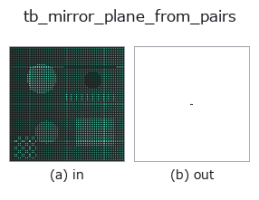
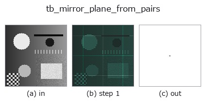
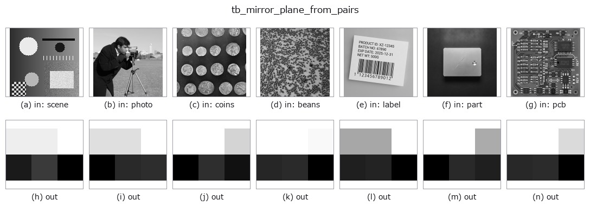

# tb_mirror_plane_from_pairs — 2D `typed` op

- **データ種**: `points` → `matrix`
- **呼び出し**: `fullseye.apply(img, "tb_mirror_plane_from_pairs", a=0.5, b=0.5)` (2-D は 1 画像 + 2 スカラつまみ `a,b∈[0,1]` のモデル)



*図は合成の入力 128×128 で実際に走らせた出力。左が入力、右が出力。点群は上から見た散布(明るさ = z)、1-D 列は折れ線、体積は z 方向の最大値投影、動画は中央フレーム、複素画像は振幅、絵にならない返り値は値そのもの。*

*つまみ a は出力を変えない(実測: 0.1 / 0.5 / 0.9 で同一)。*

*つまみ b は出力を変えない(実測: 0.1 / 0.5 / 0.9 で同一)。*

**段階**(前置きの op → この op。左から順):



**別の画像でも**(合成シーン / 写真 / 硬貨。上段が入力、下段がその出力。つまみは既定):



## 使い方

左右の対応ランドマークから正中面を出す。→ ``(2, 3)``(1 行目 = 点、2 行目 = 法線)。

    左右の対 ``(i, j)`` の**中点**は、どれも正中面の上に乗る。だからその中点集合に
    平面を当てればよい —— 変形の量に依らず面が決まるのが要点で、残差を最小に
    する面(:func:`symmetry3d.detect_reflection_symmetry`)とは別物である。

    ★ 2026-09-06 の実測: 6.4 mm の片側変形を入れると、**残差最適面は真の正中面
    から 2.92 mm / 1.72 度ずれ、非対称量の 46 % を消した**(利得 0.54)。この
    ランドマーク面なら利得 1.03。**見つけるなら残差最適面、量を言うならこちら**。

    *midline* は正中線上にある(対にならない)ランドマークの添字。与えると
    中点集合に足して面の当てはめを安定させる。

    ``pairs=None`` は**前半と後半を対にする**規約(``i`` と ``i + N//2``)。
    左のランドマークを全部並べてから右を同じ順で並べる、という保存形式が
    形態計測では一般的なので、それに合わせてある。**点数が奇数なら拒否する**
    —— 半分に割れない並びを黙って切り詰めると、対が 1 つずつずれて全部の
    符号が入れ替わる。

2-D 進化レジストリへ橋渡しした shapestat の op ``mirror_plane_from_pairs``。実装は同じで、呼び出し規約だけ ``op(v, a, b)`` に合わせてある。この op に調整点は無く、``a`` も ``b`` も使われない。

## 参考(サンプルデータ・文献)

- [サンプルデータ カタログ(DL URL / ライセンス)](../../SAMPLES.md) — 2-D は skimage.data(BSD/public)+ 合成、3-D は実データ源(Stanford/PDS 等)の DL URL。
- [演算子の来歴・参考文献](../../../REFERENCES.md) — この op 族の元になった研究/手法の出典。

## Studio で試す

下のプログラムは実際に走ることを確かめてある(図と同じ入力)。Studio のヘルプではこのブロックがボタンになり、その場で読み込んで実行できる。

```program
img_to_points 0.50 0.50
tb_mirror_plane_from_pairs 0.50 0.50
```

## 実行できる例(この op を実際に呼ぶ検証済みサンプル)

次の例は元の台帳 op `mirror_plane_from_pairs` を呼ぶもの。この橋渡し op は同じ実装を `fn(v, a, b)` 規約に合わせただけなので、挙動はそのまま当てはまる(呼び出し形だけ違う)。
- [shapestat_landmark_tour](../../../../examples/shapestat_landmark_tour.py) — `py -3.11 examples/shapestat_landmark_tour.py`

## 型が繋がる次の op(`matrix` を入力に取れる)

[identity](../misc/identity.md) · [tb_mat_pinv](tb_mat_pinv.md) · [tb_mat_cond](tb_mat_cond.md) · [tb_stat_covariance](tb_stat_covariance.md) · [tb_stat_correlation](tb_stat_correlation.md)

## 同カテゴリ(`typed`)

[tb_points_to_voxel](tb_points_to_voxel.md) · [tb_estimate_point_normals](tb_estimate_point_normals.md) · [tb_iss_keypoints](tb_iss_keypoints.md) · [tb_project_points](tb_project_points.md) · [tb_render_point_depth](tb_render_point_depth.md) · [tb_statistical_outlier_removal](tb_statistical_outlier_removal.md) · [tb_radius_outlier_removal](tb_radius_outlier_removal.md) · [tb_voxel_grid_downsample](tb_voxel_grid_downsample.md)

---
*Provenance: ops.py — 2D operator registry. この per-op ノートは `tools/opdocs.py md` が自動生成(手編集しない)。*

© 2026 Kazufumi Furuse — Fullseye operator documentation. Licensed under Apache-2.0.
