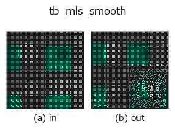
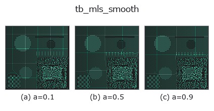
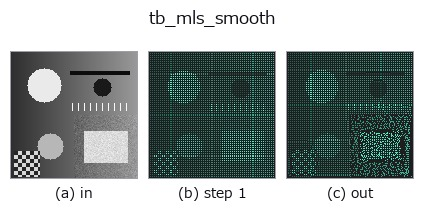
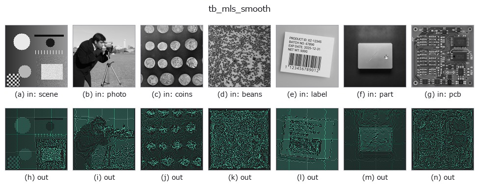

# tb_mls_smooth — 2D `typed` op

- **データ種**: `points` → `points`
- **呼び出し**: `fullseye.apply(img, "tb_mls_smooth", a=0.5, b=0.5)` (2-D は 1 画像 + 2 スカラつまみ `a,b∈[0,1]` のモデル)



*図は合成の入力 128×128 で実際に走らせた出力。左が入力、右が出力。点群は上から見た散布(明るさ = z)、1-D 列は折れ線、体積は z 方向の最大値投影、動画は中央フレーム、複素画像は振幅、絵にならない返り値は値そのもの。*

**つまみ a を振る**(0.1 / 0.5 / 0.9、もう一方は既定):



*つまみ b は出力を変えない(実測: 0.1 / 0.5 / 0.9 で同一)。*

**段階**(前置きの op → この op。左から順):



**別の画像でも**(合成シーン / 写真 / 硬貨。上段が入力、下段がその出力。つまみは既定):



## 使い方

各点を局所多項式曲面へ射影してノイズを落とす(Moving Least Squares 平滑)。

    点ごとに半径 ``radius`` 内の近傍を集め、重み付き PCA で局所平面(法線 n と接平面の
    2 軸)を推定し、近傍の「接平面上座標 (u,v) → 法線方向の高さ h」に order 次の
    多項式曲面をガウス重み付き最小二乗で当てはめる。注目点自身は局所座標の原点 (0,0)
    にあたるので、当てはめた曲面の (0,0) での高さ(= 定数項)ぶんだけ法線方向へ動かして
    曲面上へ射影する。面の形は保ったままセンサノイズだけを均せる。

    Parameters
    ----------
    points : array_like, shape (N, 3)
        入力点群。
    radius : float
        近傍球の半径(> 0)。局所曲面のサポート。
    order : int
        局所多項式の次数(既定 2)。項数は (order+1)(order+2)/2。

    Returns
    -------
    ndarray, shape (N, 3)
        平滑後の点群(順序・点数は保持)。近傍が多項式の項数に満たない点は原位置のまま。

    Notes
    -----
    近似手法である。近傍数が項数未満/局所平面が縮退する点は動かさず原位置を維持する
    (穴や境界で暴れないための安全策)。``radius <= 0`` は ValueError、空入力は空を返す。

2-D 進化レジストリへ橋渡しした 3d の op ``mls_smooth``。実装は同じで、呼び出し規約だけ ``op(v, a, b)`` に合わせてある。``a`` が ``order``(既定 2)を振る。``b`` は未使用。

## 参考(サンプルデータ・文献)

- [サンプルデータ カタログ(DL URL / ライセンス)](../../SAMPLES.md) — 2-D は skimage.data(BSD/public)+ 合成、3-D は実データ源(Stanford/PDS 等)の DL URL。
- [演算子の来歴・参考文献](../../../REFERENCES.md) — この op 族の元になった研究/手法の出典。

## Studio で試す

下のプログラムは実際に走ることを確かめてある(図と同じ入力)。Studio のヘルプではこのブロックがボタンになり、その場で読み込んで実行できる。

```program
img_to_points 0.50 0.50
tb_mls_smooth 0.50 0.50
```

## 実行できる例(この op を実際に呼ぶ検証済みサンプル)

次の例は元の台帳 op `mls_smooth` を呼ぶもの。この橋渡し op は同じ実装を `fn(v, a, b)` 規約に合わせただけなので、挙動はそのまま当てはまる(呼び出し形だけ違う)。
- [pcl_geodesic](../../../../examples_3d/pcl_geodesic.py) — `py -3.11 examples_3d/pcl_geodesic.py`

## 型が繋がる次の op(`points` を入力に取れる)

[identity](../misc/identity.md) · [tb_points_to_voxel](tb_points_to_voxel.md) · [tb_estimate_point_normals](tb_estimate_point_normals.md) · [tb_iss_keypoints](tb_iss_keypoints.md) · [tb_project_points](tb_project_points.md) · [tb_render_point_depth](tb_render_point_depth.md) · [tb_statistical_outlier_removal](tb_statistical_outlier_removal.md) · [tb_radius_outlier_removal](tb_radius_outlier_removal.md)

## 同カテゴリ(`typed`)

[tb_points_to_voxel](tb_points_to_voxel.md) · [tb_estimate_point_normals](tb_estimate_point_normals.md) · [tb_iss_keypoints](tb_iss_keypoints.md) · [tb_project_points](tb_project_points.md) · [tb_render_point_depth](tb_render_point_depth.md) · [tb_statistical_outlier_removal](tb_statistical_outlier_removal.md) · [tb_radius_outlier_removal](tb_radius_outlier_removal.md) · [tb_voxel_grid_downsample](tb_voxel_grid_downsample.md)

---
*Provenance: ops.py — 2D operator registry. この per-op ノートは `tools/opdocs.py md` が自動生成(手編集しない)。*

© 2026 Kazufumi Furuse — Fullseye operator documentation. Licensed under Apache-2.0.
