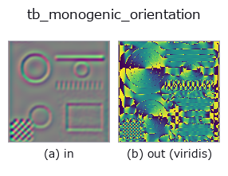
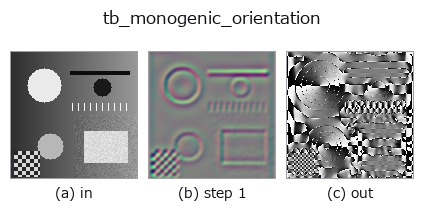
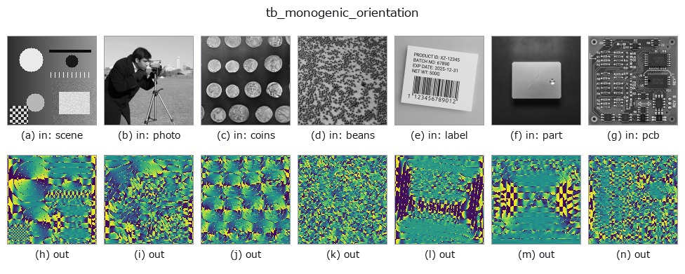

# tb_monogenic_orientation — 2D `typed` op

- **データ種**: `qimage` → `image`
- **呼び出し**: `fullseye.apply(img, "tb_monogenic_orientation", a=0.5, b=0.5)` (2-D は 1 画像 + 2 スカラつまみ `a,b∈[0,1]` のモデル)



*図は合成の入力 128×128 で実際に走らせた出力。左が入力、右が出力。点群は上から見た散布(明るさ = z)、1-D 列は折れ線、体積は z 方向の最大値投影、動画は中央フレーム、複素画像は振幅、絵にならない返り値は値そのもの。*

*出力は viridis 風の疑似カラー(暗い紫 = 小、黄 = 大)。距離・位相・向き・深度のような「量の場」を読むため。*

*つまみ a は出力を変えない(実測: 0.1 / 0.5 / 0.9 で同一)。*

*つまみ b は出力を変えない(実測: 0.1 / 0.5 / 0.9 で同一)。*

**段階**(前置きの op → この op。左から順):



**別の画像でも**(合成シーン / 写真 / 硬貨。上段が入力、下段がその出力。つまみは既定):



## 使い方

Local orientation ``atan2(R2, R1)`` of a monogenic signal. → (H, W).

    Radians in ``[0, pi)``: an orientation is defined modulo ``pi`` (a grating at
    10 degrees and one at 190 degrees are the same grating), and the value is
    folded into that range rather than left in ``(-pi, pi]`` where the same
    structure would read as two different numbers on either side of a contrast
    reversal. ``display=True`` maps it to ``[0, 1]``.

    **Continuous, not quantised** — the angle is read directly from two filters,
    for any angle, where a steerable bank with ``K`` orientations interpolates
    between its ``K``. Measured against eight grid-exact grating orientations the
    error is at most **3.6e-15 rad**, including the obliques. (Whether that
    buys anything downstream is a separate question, and the measured answer is
    mostly *no* — see :func:`riesz_displacement`.)

    **Where it is undefined, and the mask is not the one you expect.** The
    orientation dies where the *Riesz vector* dies, which is at every
    even-symmetric point — local phase 0 or pi, the crest of a bright or dark
    line — and **the amplitude is at full strength there**. Measured on a 45-degree
    grating, the worst orientation error over the whole frame is 0.2764 rad, at a
    pixel where ``|R| = 6.8e-16`` and :func:`monogenic_amplitude` reads
    ``1.0000``. So masking on the amplitude does not protect you; mask on
    ``hypot(q[..., 1], q[..., 2])``, the Riesz magnitude. With that mask the
    error over the same eight orientations is at most 3.6e-15 rad.

    Where the Riesz vector is exactly zero, ``atan2(0, 0) = 0`` is returned —
    a *value*, not a measurement.

    **Raises** ``ValueError``: the input is not a valid quaternion field, or its
    ``k`` component is non-zero; *display* is not a bool.

Typed bridge of the quat op ``monogenic_orientation`` into the 2-D evolution registry: the same implementation, called under the ``op(v, a, b)`` convention. This op has no tunable parameter; ``a`` and ``b`` are unused.

## 参考(サンプルデータ・文献)

- [サンプルデータ カタログ(DL URL / ライセンス)](../../SAMPLES.md) — 2-D は skimage.data(BSD/public)+ 合成、3-D は実データ源(Stanford/PDS 等)の DL URL。
- [演算子の来歴・参考文献](../../../REFERENCES.md) — この op 族の元になった研究/手法の出典。

## Studio で試す

下のプログラムは実際に走ることを確かめてある(図と同じ入力)。Studio のヘルプではこのブロックがボタンになり、その場で読み込んで実行できる。

```program
img_to_monogenic 0.50 0.50
tb_monogenic_orientation 0.50 0.50
```

## 実行できる例(この op を実際に呼ぶ検証済みサンプル)

次の例は元の台帳 op `monogenic_orientation` を呼ぶもの。この橋渡し op は同じ実装を `fn(v, a, b)` 規約に合わせただけなので、挙動はそのまま当てはまる(呼び出し形だけ違う)。
- [quaternion_monogenic](../../../../examples/quaternion_monogenic.py) — `py -3.11 examples/quaternion_monogenic.py`

## 型が繋がる次の op(`image` を入力に取れる)

[identity](../misc/identity.md) · [gaussian](../smoothing/gaussian.md) · [mean_box](../smoothing/mean_box.md) · [bilateral](../smoothing/bilateral.md) · [unsharp](../smoothing/unsharp.md) · [median](../rank/median.md) · [min_filter](../rank/min_filter.md) · [max_filter](../rank/max_filter.md)

## 同カテゴリ(`typed`)

[tb_points_to_voxel](tb_points_to_voxel.md) · [tb_estimate_point_normals](tb_estimate_point_normals.md) · [tb_iss_keypoints](tb_iss_keypoints.md) · [tb_project_points](tb_project_points.md) · [tb_render_point_depth](tb_render_point_depth.md) · [tb_statistical_outlier_removal](tb_statistical_outlier_removal.md) · [tb_radius_outlier_removal](tb_radius_outlier_removal.md) · [tb_voxel_grid_downsample](tb_voxel_grid_downsample.md)

---
*Provenance: ops.py — 2D operator registry. この per-op ノートは `tools/opdocs.py md` が自動生成(手編集しない)。*

© 2026 Kazufumi Furuse — Fullseye operator documentation. Licensed under Apache-2.0.
