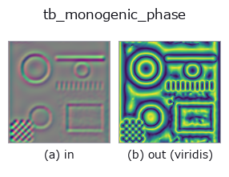
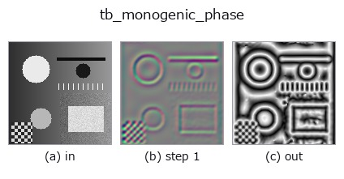
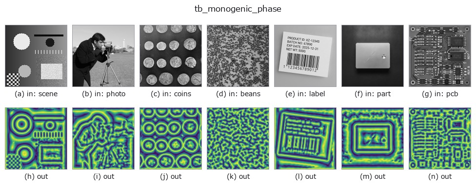

# tb_monogenic_phase — 2D `typed` op

- **データ種**: `qimage` → `image`
- **呼び出し**: `fullseye.apply(img, "tb_monogenic_phase", a=0.5, b=0.5)` (2-D は 1 画像 + 2 スカラつまみ `a,b∈[0,1]` のモデル)



*図は合成の入力 128×128 で実際に走らせた出力。左が入力、右が出力。点群は上から見た散布(明るさ = z)、1-D 列は折れ線、体積は z 方向の最大値投影、動画は中央フレーム、複素画像は振幅、絵にならない返り値は値そのもの。*

*出力は viridis 風の疑似カラー(暗い紫 = 小、黄 = 大)。距離・位相・向き・深度のような「量の場」を読むため。*

*つまみ a は出力を変えない(実測: 0.1 / 0.5 / 0.9 で同一)。*

*つまみ b は出力を変えない(実測: 0.1 / 0.5 / 0.9 で同一)。*

**段階**(前置きの op → この op。左から順):



**別の画像でも**(合成シーン / 写真 / 硬貨。上段が入力、下段がその出力。つまみは既定):



## 使い方

Local phase ``atan2(|R|, f)`` of a monogenic signal. → (H, W).

    In ``[0, pi]`` — the monogenic phase is measured against the *magnitude* of
    the Riesz vector, whose sign is carried by the orientation instead, so the
    range is a half turn rather than a full one. That is the standard
    convention (Felsberg & Sommer) and it is stated here because a caller
    arriving from ``complexops.cx_phase`` (whose raw range is ``(-pi, pi]``) will
    otherwise assume a full turn and see a "wrapped" map that is not wrapped.

    ``display=True`` maps ``[0, pi]`` to ``[0, 1]`` for viewing; the default is
    ``False`` — the **opposite** of ``cx_phase``'s default, deliberately,
    because the consumers of this quantity in this module are numerical, and a
    display scaling that arrives silently in a measurement is a factor of ``pi``
    that nothing announces.

    Phase is the quantity a translation shifts linearly, which is why the whole
    motion half of this module reads it. For an edge, phase 0 means the peak of
    a bright line, ``pi/2`` a step edge and ``pi`` the peak of a dark line — the
    local *structure type*, independent of contrast.

    **Raises** ``ValueError``: the input is not a valid quaternion field, or its
    ``k`` component is non-zero; *display* is not a bool.

Typed bridge of the quat op ``monogenic_phase`` into the 2-D evolution registry: the same implementation, called under the ``op(v, a, b)`` convention. This op has no tunable parameter; ``a`` and ``b`` are unused.

## 参考(サンプルデータ・文献)

- [サンプルデータ カタログ(DL URL / ライセンス)](../../SAMPLES.md) — 2-D は skimage.data(BSD/public)+ 合成、3-D は実データ源(Stanford/PDS 等)の DL URL。
- [演算子の来歴・参考文献](../../../REFERENCES.md) — この op 族の元になった研究/手法の出典。

## Studio で試す

下のプログラムは実際に走ることを確かめてある(図と同じ入力)。Studio のヘルプではこのブロックがボタンになり、その場で読み込んで実行できる。

```program
img_to_monogenic 0.50 0.50
tb_monogenic_phase 0.50 0.50
```

## 実行できる例(この op を実際に呼ぶ検証済みサンプル)

次の例は元の台帳 op `monogenic_phase` を呼ぶもの。この橋渡し op は同じ実装を `fn(v, a, b)` 規約に合わせただけなので、挙動はそのまま当てはまる(呼び出し形だけ違う)。
- [quaternion_monogenic](../../../../examples/quaternion_monogenic.py) — `py -3.11 examples/quaternion_monogenic.py`

## 型が繋がる次の op(`image` を入力に取れる)

[identity](../misc/identity.md) · [gaussian](../smoothing/gaussian.md) · [mean_box](../smoothing/mean_box.md) · [bilateral](../smoothing/bilateral.md) · [unsharp](../smoothing/unsharp.md) · [median](../rank/median.md) · [min_filter](../rank/min_filter.md) · [max_filter](../rank/max_filter.md)

## 同カテゴリ(`typed`)

[tb_points_to_voxel](tb_points_to_voxel.md) · [tb_estimate_point_normals](tb_estimate_point_normals.md) · [tb_iss_keypoints](tb_iss_keypoints.md) · [tb_angle_3points](tb_angle_3points.md) · [tb_project_points](tb_project_points.md) · [tb_render_point_depth](tb_render_point_depth.md) · [tb_statistical_outlier_removal](tb_statistical_outlier_removal.md) · [tb_radius_outlier_removal](tb_radius_outlier_removal.md)

---
*Provenance: ops.py — 2D operator registry. この per-op ノートは `tools/opdocs.py md` が自動生成(手編集しない)。*

© 2026 Kazufumi Furuse — Fullseye operator documentation. Licensed under Apache-2.0.
