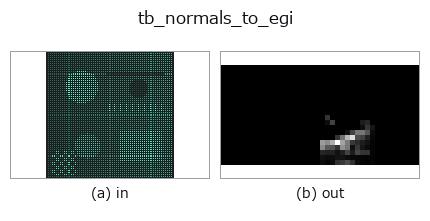
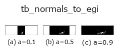
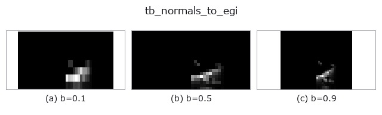
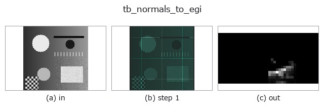
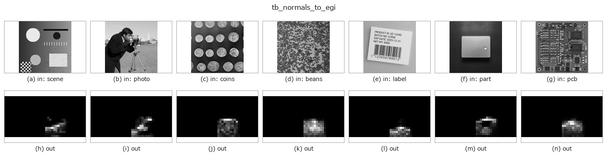

# tb_normals_to_egi — 2D `typed` op

- **データ種**: `points` → `image`
- **呼び出し**: `fullseye.apply(img, "tb_normals_to_egi", a=0.5, b=0.5)` (2-D は 1 画像 + 2 スカラつまみ `a,b∈[0,1]` のモデル)



*図は合成の入力 128×128 で実際に走らせた出力。左が入力、右が出力。点群は上から見た散布(明るさ = z)、1-D 列は折れ線、体積は z 方向の最大値投影、動画は中央フレーム、複素画像は振幅、絵にならない返り値は値そのもの。*

**つまみ a を振る**(0.1 / 0.5 / 0.9、もう一方は既定):



**つまみ b を振る**(0.1 / 0.5 / 0.9、もう一方は既定):



**段階**(前置きの op → この op。左から順):



**別の画像でも**(合成シーン / 写真 / 硬貨。上段が入力、下段がその出力。つまみは既定):



## 使い方

法線 ``(N,3)`` → 拡張ガウス像 ``(n_el, n_az)`` の ``image2d``。

    方向の 2-D ヒストグラム(Horn, *Extended Gaussian Images*, Proc. IEEE 72(12)
    1984)。「どの向きの面がどれだけあるか」の地図で、平面が支配的な物体では
    1 つの bin に山が立つ。**不可逆** —— bin 幅ぶんの方向解像度を捨てる。
    捨てた量は測れる: 最頻 bin の中心方向と入力の平均方向の角度差が量子化誤差で、
    既定 (36, 18) では bin 幅 10 度に対し実測 3.7 度(``selftest`` が出す)。

    仰角の bin は ``sin(el)`` で等分する(等立体角)。度で等分すると極が過剰に
    細かくなり、「北極に面が集中している」という嘘の山が立つ。

    Args:
        normals: (N, 3)。
        n_az: 方位の bin 数(既定 36 = 10 度刻み)。
        n_el: 仰角の bin 数(既定 18)。
    ★**位置の点群を渡しても例外は出ない**。``backends_typed.TYPE_TO_SORT`` が
    ``normals`` を ``points`` に畳んでいるので、進化器も台帳も両者を区別しない。
    この op は方向しか見ない(長さは捨てる)ので、``(N,3)`` の座標を渡すと
    「原点から各点を見た向き」のヒストグラムが**もっともらしく**返る。実測
    (2026-09-08、200 点の曲線 vs 全部真上の法線): 非零 bin が 1 → 12、
    最大 bin が 200 → 44 に変わるだけで、**総和はどちらも 200**。
    「総和が点数と合うから正しい」では区別がつかない。
    ``fullseye.set_system("extra_checks", "on")`` にすると、単位長から外れた
    ベクトルを**拒否**する(下の Raises)。

    Args:
        normals: (N, 3)。
        n_az: 方位の bin 数(既定 36 = 10 度刻み)。
        n_el: 仰角の bin 数(既定 18)。
    Returns:
        (n_el, n_az) float64 の計数マップ(行 = 仰角、列 = 方位)。
    Raises:
        ValueError: bin 数が 1 未満 / 上限超 / 入力不正。
        ValueError: ``extra_checks='on'`` で、長さが 1 から 1e-6 を超えて外れる
            ベクトルを含むとき(位置の点群を法線として渡した事故を捕まえる)。

2-D 進化レジストリへ橋渡しした reprconv の op ``normals_to_egi``。実装は同じで、呼び出し規約だけ ``op(v, a, b)`` に合わせてある。``a`` が ``n_az``(既定 36)、``b`` が ``n_el``(既定 18)を振る。

## 参考(サンプルデータ・文献)

- [サンプルデータ カタログ(DL URL / ライセンス)](../../SAMPLES.md) — 2-D は skimage.data(BSD/public)+ 合成、3-D は実データ源(Stanford/PDS 等)の DL URL。
- [演算子の来歴・参考文献](../../../REFERENCES.md) — この op 族の元になった研究/手法の出典。

## Studio で試す

下のプログラムは実際に走ることを確かめてある(図と同じ入力)。Studio のヘルプではこのブロックがボタンになり、その場で読み込んで実行できる。

```program
img_to_points 0.50 0.50
tb_normals_to_egi 0.50 0.50
```

## 実行できる例(この op を実際に呼ぶ検証済みサンプル)

次の例は元の台帳 op `normals_to_egi` を呼ぶもの。この橋渡し op は同じ実装を `fn(v, a, b)` 規約に合わせただけなので、挙動はそのまま当てはまる(呼び出し形だけ違う)。
- [representation_conversion](../../../../examples/representation_conversion.py) — `py -3.11 examples/representation_conversion.py`

## 型が繋がる次の op(`image` を入力に取れる)

[identity](../misc/identity.md) · [gaussian](../smoothing/gaussian.md) · [mean_box](../smoothing/mean_box.md) · [bilateral](../smoothing/bilateral.md) · [unsharp](../smoothing/unsharp.md) · [median](../rank/median.md) · [min_filter](../rank/min_filter.md) · [max_filter](../rank/max_filter.md)

## 同カテゴリ(`typed`)

[tb_points_to_voxel](tb_points_to_voxel.md) · [tb_estimate_point_normals](tb_estimate_point_normals.md) · [tb_iss_keypoints](tb_iss_keypoints.md) · [tb_project_points](tb_project_points.md) · [tb_render_point_depth](tb_render_point_depth.md) · [tb_statistical_outlier_removal](tb_statistical_outlier_removal.md) · [tb_radius_outlier_removal](tb_radius_outlier_removal.md) · [tb_voxel_grid_downsample](tb_voxel_grid_downsample.md)

---
*Provenance: ops.py — 2D operator registry. この per-op ノートは `tools/opdocs.py md` が自動生成(手編集しない)。*

© 2026 Kazufumi Furuse — Fullseye operator documentation. Licensed under Apache-2.0.
