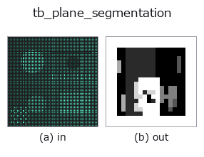
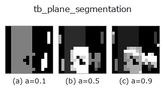
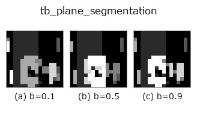
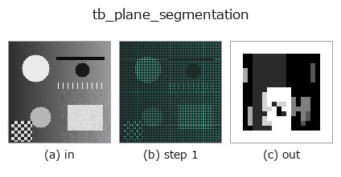
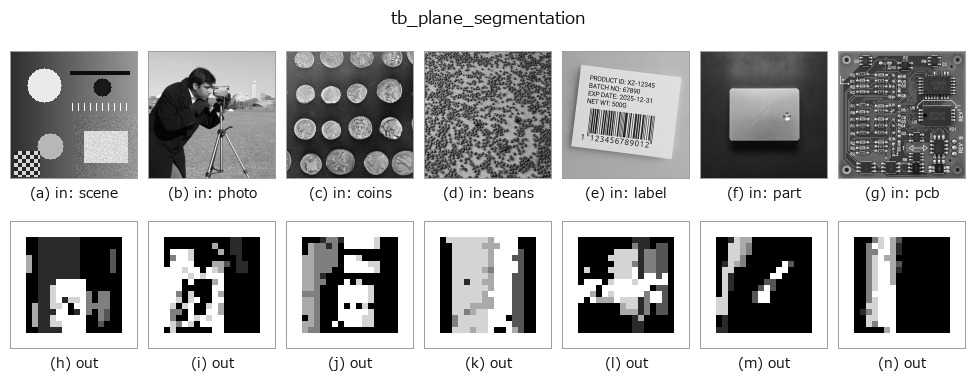

# tb_plane_segmentation — 2D `typed` op

- **データ種**: `points` → `volume`
- **呼び出し**: `fullseye.apply(img, "tb_plane_segmentation", a=0.5, b=0.5)` (2-D は 1 画像 + 2 スカラつまみ `a,b∈[0,1]` のモデル)



*図は合成の入力 128×128 で実際に走らせた出力。左が入力、右が出力。点群は上から見た散布(明るさ = z)、1-D 列は折れ線、体積は z 方向の最大値投影、動画は中央フレーム、複素画像は振幅、絵にならない返り値は値そのもの。*

**つまみ a を振る**(0.1 / 0.5 / 0.9、もう一方は既定):



**つまみ b を振る**(0.1 / 0.5 / 0.9、もう一方は既定):



**段階**(前置きの op → この op。左から順):



**別の画像でも**(合成シーン / 写真 / 硬貨。上段が入力、下段がその出力。つまみは既定):



**動き**(GIF: フレーム / 視点 / スライスを順に。静止の図が完成形で、GIF は補助):


## 使い方

反復 RANSAC で最大 max_planes 枚の平面を逐次抽出(残差点 -1)。

    残り点集合に :func:`ransac_fit.ransac_plane` を掛け、その最大 consensus 平面の
    inlier 数が ``min_inliers`` 以上なら新ラベルを与えて除去 → 残りで再検出、を繰り返す。
    複数の床/壁/階段状の面を一度に分離する(単一平面適合の pcseg との差)。inlier が
    ``min_inliers`` に満たなくなった時点で停止し、以降の点は残差 -1(球や複雑物体はここに残る)。

    Args:
        points: (N,3) 点群。
        thresh: 点-平面距離の inlier しきい値(距離、要 > 0)。
        min_inliers: 平面として採用する最小 inlier 数(要 >= 3)。
        max_planes: 抽出する平面の最大枚数(要 >= 1)。
        iters: 各 RANSAC 反復数。
        seed: 乱数シード(決定論。各平面で seed+平面index を使う)。

    Returns:
        labels: (N,) int。検出順(=consensus 大きい順に近い)に 0,1,2,... を平面へ付与、
        どの平面にも属さない残差点は -1。空入力は shape (0,)。

2-D 進化レジストリへ橋渡しした 3d の op ``plane_segmentation``。実装は同じで、呼び出し規約だけ ``op(v, a, b)`` に合わせてある。``a`` が ``max_planes``(既定 5)、``b`` が ``iters``(既定 300)を振る。

## 参考(サンプルデータ・文献)

- [サンプルデータ カタログ(DL URL / ライセンス)](../../SAMPLES.md) — 2-D は skimage.data(BSD/public)+ 合成、3-D は実データ源(Stanford/PDS 等)の DL URL。
- [演算子の来歴・参考文献](../../../REFERENCES.md) — この op 族の元になった研究/手法の出典。

## Studio で試す

下のプログラムは実際に走ることを確かめてある(図と同じ入力)。Studio のヘルプではこのブロックがボタンになり、その場で読み込んで実行できる。

```program
img_to_points 0.50 0.50
tb_plane_segmentation 0.50 0.50
```

## 実行できる例(この op を実際に呼ぶ検証済みサンプル)

次の例は元の台帳 op `plane_segmentation` を呼ぶもの。この橋渡し op は同じ実装を `fn(v, a, b)` 規約に合わせただけなので、挙動はそのまま当てはまる(呼び出し形だけ違う)。
- [object_segmentation](../../../../examples_3d/object_segmentation.py) — `py -3.11 examples_3d/object_segmentation.py`

## 型が繋がる次の op(`volume` を入力に取れる)

[identity](../misc/identity.md) · [vol_gaussian](../3d/vol_gaussian.md) · [vol_median](../3d/vol_median.md) · [vol_erode](../3d/vol_erode.md) · [vol_dilate](../3d/vol_dilate.md) · [vol_threshold](../3d/vol_threshold.md) · [vol_reg_dilate](../3d/vol_reg_dilate.md) · [vol_reg_erode](../3d/vol_reg_erode.md)

## 同カテゴリ(`typed`)

[tb_points_to_voxel](tb_points_to_voxel.md) · [tb_estimate_point_normals](tb_estimate_point_normals.md) · [tb_iss_keypoints](tb_iss_keypoints.md) · [tb_project_points](tb_project_points.md) · [tb_render_point_depth](tb_render_point_depth.md) · [tb_statistical_outlier_removal](tb_statistical_outlier_removal.md) · [tb_radius_outlier_removal](tb_radius_outlier_removal.md) · [tb_voxel_grid_downsample](tb_voxel_grid_downsample.md)

---
*Provenance: ops.py — 2D operator registry. この per-op ノートは `tools/opdocs.py md` が自動生成(手編集しない)。*

© 2026 Kazufumi Furuse — Fullseye operator documentation. Licensed under Apache-2.0.
