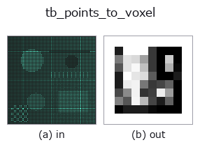
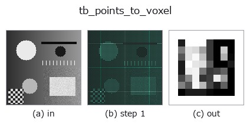
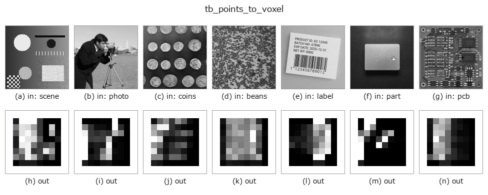

# tb_points_to_voxel — 2D `typed` op

- **データ種**: `points` → `volume`
- **呼び出し**: `fullseye.apply(img, "tb_points_to_voxel", a=0.5, b=0.5)` (2-D は 1 画像 + 2 スカラつまみ `a,b∈[0,1]` のモデル)



*図は合成の入力 128×128 で実際に走らせた出力。左が入力、右が出力。点群は上から見た散布(明るさ = z)、1-D 列は折れ線、体積は z 方向の最大値投影、動画は中央フレーム、複素画像は振幅、絵にならない返り値は値そのもの。*

*つまみ a は出力を変えない(実測: 0.1 / 0.5 / 0.9 で同一)。*

*つまみ b は出力を変えない(実測: 0.1 / 0.5 / 0.9 で同一)。*

**段階**(前置きの op → この op。左から順):



**別の画像でも**(合成シーン / 写真 / 硬貨。上段が入力、下段がその出力。つまみは既定):



**動き**(GIF: フレーム / 視点 / スライスを順に。静止の図が完成形で、GIF は補助):


## 使い方

点群 (N,3) → 密度 voxel (size³)。scatter_add で splat、任意で gaussian 平滑。

    bounds=(lo,hi) を与えれば複数雲を同一格子に載せられる(=マッチング前提)。

    手順: 各点を ``idx = floor((p − lo)/(hi − lo)·(size − 1))`` で整数格子に落とし、その voxel に
    1 を加算する(値 = その voxel に落ちた点の個数)。``smooth > 0`` なら σ=``smooth``(voxel 単位)
    の gaussian を 3 軸分離 conv で掛ける(半径 ``max(1, int(4σ + 0.5))``、端は replicate)。
    出力の軸順は **点の列の順そのまま**(``points[:, 0]`` → 軸 0)で、(depth,row,col) への
    並べ替えはしない。

    - ``bounds``: ``(lo, hi)`` の 3 次元ベクトル 2 本。None なら点群自身の min/max(雲ごとに
    格子が変わるので、2 つの雲を比べるときは必ず同じ bounds を渡す)。長さ 3 でない・非有限・
    ``hi <= lo`` の軸があると ValueError(tsdf 系の ``((xmin,xmax),...)`` 流儀は長さ 2 として拒否)。
    - 範囲外の点は捨てずに **端の voxel へ clip される**(端に偽の密度が溜まる)。切り落としたい
    なら事前に点群側で除く。
    - ``size``: 一辺の voxel 数。``hi − lo`` が 0 の軸は 1e-9 に置換されるだけで警告しない。
    - 空の点群で bounds=None は numpy の min が例外を出す。
    - 返り値: ``(size, size, size)`` float64 numpy(device で計算しても CPU に戻す)。値は個数
    (平滑後は個数の重み分布)で正規化はしない。

    後段: ``match_points_ncc`` / ``signed_distance_field`` / ``voxel_to_mesh`` の入力に。

2-D 進化レジストリへ橋渡しした 3d の op ``points_to_voxel``。実装は同じで、呼び出し規約だけ ``op(v, a, b)`` に合わせてある。この op に調整点は無く、``a`` も ``b`` も使われない。

## 参考(サンプルデータ・文献)

- [サンプルデータ カタログ(DL URL / ライセンス)](../../SAMPLES.md) — 2-D は skimage.data(BSD/public)+ 合成、3-D は実データ源(Stanford/PDS 等)の DL URL。
- [演算子の来歴・参考文献](../../../REFERENCES.md) — この op 族の元になった研究/手法の出典。

## Studio で試す

下のプログラムは実際に走ることを確かめてある(図と同じ入力)。Studio のヘルプではこのブロックがボタンになり、その場で読み込んで実行できる。

```program
img_to_points 0.50 0.50
tb_points_to_voxel 0.50 0.50
```

## 実行できる例(この op を実際に呼ぶ検証済みサンプル)

次の例は元の台帳 op `points_to_voxel` を呼ぶもの。この橋渡し op は同じ実装を `fn(v, a, b)` 規約に合わせただけなので、挙動はそのまま当てはまる(呼び出し形だけ違う)。
- [sh_descriptor_retrieval](../../../../examples_3d/sh_descriptor_retrieval.py) — `py -3.11 examples_3d/sh_descriptor_retrieval.py`
- [shape_desc_pose](../../../../examples_3d/shape_desc_pose.py) — `py -3.11 examples_3d/shape_desc_pose.py`

## 型が繋がる次の op(`volume` を入力に取れる)

[identity](../misc/identity.md) · [vol_gaussian](../3d/vol_gaussian.md) · [vol_median](../3d/vol_median.md) · [vol_erode](../3d/vol_erode.md) · [vol_dilate](../3d/vol_dilate.md) · [vol_threshold](../3d/vol_threshold.md) · [vol_reg_dilate](../3d/vol_reg_dilate.md) · [vol_reg_erode](../3d/vol_reg_erode.md)

## 同カテゴリ(`typed`)

[tb_estimate_point_normals](tb_estimate_point_normals.md) · [tb_iss_keypoints](tb_iss_keypoints.md) · [tb_project_points](tb_project_points.md) · [tb_render_point_depth](tb_render_point_depth.md) · [tb_statistical_outlier_removal](tb_statistical_outlier_removal.md) · [tb_radius_outlier_removal](tb_radius_outlier_removal.md) · [tb_voxel_grid_downsample](tb_voxel_grid_downsample.md) · [tb_mls_smooth](tb_mls_smooth.md)

---
*Provenance: ops.py — 2D operator registry. この per-op ノートは `tools/opdocs.py md` が自動生成(手編集しない)。*

© 2026 Kazufumi Furuse — Fullseye operator documentation. Licensed under Apache-2.0.
