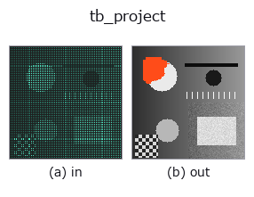
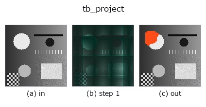
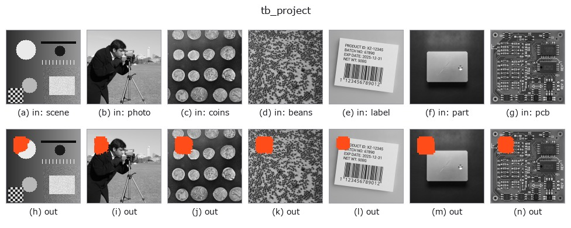

# tb_project — 2D `typed` op

- **データ種**: `points` → `image`
- **呼び出し**: `fullseye.apply(img, "tb_project", a=0.5, b=0.5)` (2-D は 1 画像 + 2 スカラつまみ `a,b∈[0,1]` のモデル)



*図は合成の入力 128×128 で実際に走らせた出力。左が入力、右が出力。点群は上から見た散布(明るさ = z)、1-D 列は折れ線、体積は z 方向の最大値投影、動画は中央フレーム、複素画像は振幅、絵にならない返り値は値そのもの。*

*つまみ a は出力を変えない(実測: 0.1 / 0.5 / 0.9 で同一)。*

*つまみ b は出力を変えない(実測: 0.1 / 0.5 / 0.9 で同一)。*

**段階**(前置きの op → この op。左から順):



**別の画像でも**(合成シーン / 写真 / 硬貨。上段が入力、下段がその出力。つまみは既定):



## 使い方

3D 点 (n,3) をカメラ (rvec,t,K) で 2D (n,2) に射影(透視除算)。

    ``X_cam = R(rvec) @ X + t``、``x = K @ X_cam``、``uv = x[:2] / x[2]`` を全点まとめて計算する
    (``project_points`` と同じ規約)。``rvec`` は回転ベクトル(軸 × 角 [rad]、scipy の
    ``Rotation.from_rotvec``)、``t`` は (3,) 並進、``K`` は (3,3) 内部行列。返り値は (n,2) float で
    列 0 が u(横・列方向)、列 1 が v(縦・行方向)、単位は K に従いピクセル。

    注意(検証なし): カメラ後方や像平面上の点(``Z_cam <= 0``)を弾かず、そのまま除算する。
    ``Z_cam = 0`` は 0 割で inf/NaN、負の Z は画像内に見える偽の座標になるので、可視性の判定は
    呼び出し側で行う。形状の検証もしない(``np.asarray`` で float 化するのみ)。
    ``bundle_adjust`` / ``mean_reprojection_error`` の再投影残差はこの関数で作られる。

2-D 進化レジストリへ橋渡しした 3d の op ``project``。実装は同じで、呼び出し規約だけ ``op(v, a, b)`` に合わせてある。この op に調整点は無く、``a`` も ``b`` も使われない。

## 参考(サンプルデータ・文献)

- [サンプルデータ カタログ(DL URL / ライセンス)](../../SAMPLES.md) — 2-D は skimage.data(BSD/public)+ 合成、3-D は実データ源(Stanford/PDS 等)の DL URL。
- [演算子の来歴・参考文献](../../../REFERENCES.md) — この op 族の元になった研究/手法の出典。

## Studio で試す

下のプログラムは実際に走ることを確かめてある(図と同じ入力)。Studio のヘルプではこのブロックがボタンになり、その場で読み込んで実行できる。

```program
img_to_points 0.50 0.50
tb_project 0.50 0.50
```

## 実行できる例(この op を実際に呼ぶ検証済みサンプル)

次の例は元の台帳 op `project` を呼ぶもの。この橋渡し op は同じ実装を `fn(v, a, b)` 規約に合わせただけなので、挙動はそのまま当てはまる(呼び出し形だけ違う)。
- [bundle_adjust](../../../../examples_3d/bundle_adjust.py) — `py -3.11 examples_3d/bundle_adjust.py`

## 型が繋がる次の op(`image` を入力に取れる)

[identity](../misc/identity.md) · [gaussian](../smoothing/gaussian.md) · [mean_box](../smoothing/mean_box.md) · [bilateral](../smoothing/bilateral.md) · [unsharp](../smoothing/unsharp.md) · [median](../rank/median.md) · [min_filter](../rank/min_filter.md) · [max_filter](../rank/max_filter.md)

## 同カテゴリ(`typed`)

[tb_points_to_voxel](tb_points_to_voxel.md) · [tb_estimate_point_normals](tb_estimate_point_normals.md) · [tb_iss_keypoints](tb_iss_keypoints.md) · [tb_project_points](tb_project_points.md) · [tb_render_point_depth](tb_render_point_depth.md) · [tb_statistical_outlier_removal](tb_statistical_outlier_removal.md) · [tb_radius_outlier_removal](tb_radius_outlier_removal.md) · [tb_voxel_grid_downsample](tb_voxel_grid_downsample.md)

---
*Provenance: ops.py — 2D operator registry. この per-op ノートは `tools/opdocs.py md` が自動生成(手編集しない)。*

© 2026 Kazufumi Furuse — Fullseye operator documentation. Licensed under Apache-2.0.
