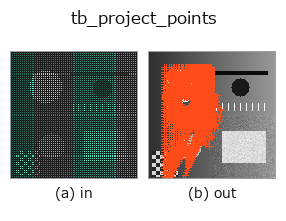
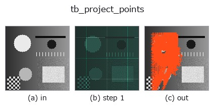
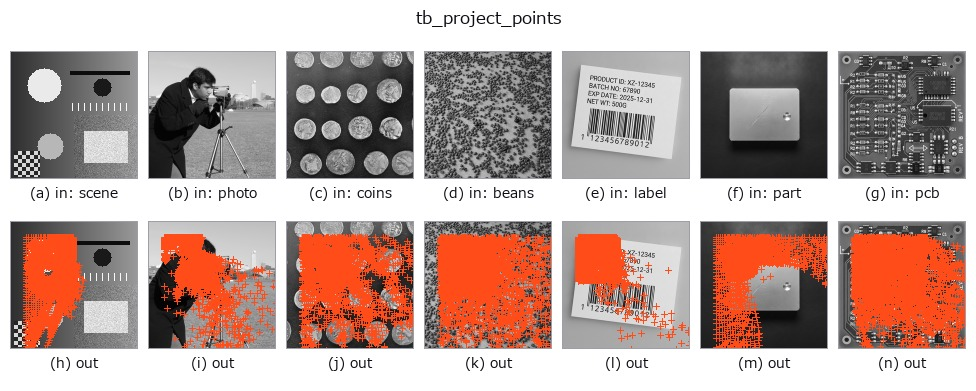

# tb_project_points — 2D `typed` op

- **データ種**: `points` → `keypoints`
- **呼び出し**: `fullseye.apply(img, "tb_project_points", a=0.5, b=0.5)` (2-D は 1 画像 + 2 スカラつまみ `a,b∈[0,1]` のモデル)



*図は合成の入力 128×128 で実際に走らせた出力。左が入力、右が出力。点群は上から見た散布(明るさ = z)、1-D 列は折れ線、体積は z 方向の最大値投影、動画は中央フレーム、複素画像は振幅、絵にならない返り値は値そのもの。*

*つまみ a は出力を変えない(実測: 0.1 / 0.5 / 0.9 で同一)。*

*つまみ b は出力を変えない(実測: 0.1 / 0.5 / 0.9 で同一)。*

**段階**(前置きの op → この op。左から順):



**別の画像でも**(合成シーン / 写真 / 硬貨。上段が入力、下段がその出力。つまみは既定):



## 使い方

3D 点群 (N,3) → 画像座標 (u,v) と深度。ピンホール(depth_to_points の順方向)。

    K=カメラ内部行列 [[fx,0,cx],[0,fy,cy],[0,0,1]]。R,t で外部姿勢。世界モデルの観測写像。

    ``P_cam = R @ P + t``(``R`` (3,3)、``t`` (3,)。None は恒等・零)を ``u = fx·X/Z + cx``、
    ``v = fy·Y/Z + cy`` で投影する。返り値 ``(uv (N,2), depth (N,))``: ``uv[:,0] = u``(列)、
    ``uv[:,1] = v``(行)、``depth`` はカメラ座標の Z(clip 前の生値で、負もそのまま)。
    ``K`` は ``K[0,0]`` 等で添字するので numpy 配列(nested list は不可)。
    Z は ``1e-6`` 以上に clip してから割るので、**カメラ後方の点も捨てず**巨大な u,v になる
    (``depth > 0`` で呼び手が除く)。画像外の点も返す(``render_point_depth`` が範囲で切る)。
    ``depth_to_points`` の逆で、``depth_to_points(render_point_depth(...))`` が往復になる。

2-D 進化レジストリへ橋渡しした 3d の op ``project_points``。実装は同じで、呼び出し規約だけ ``op(v, a, b)`` に合わせてある。この op に調整点は無く、``a`` も ``b`` も使われない。

## 参考(サンプルデータ・文献)

- [サンプルデータ カタログ(DL URL / ライセンス)](../../SAMPLES.md) — 2-D は skimage.data(BSD/public)+ 合成、3-D は実データ源(Stanford/PDS 等)の DL URL。
- [演算子の来歴・参考文献](../../../REFERENCES.md) — この op 族の元になった研究/手法の出典。

## Studio で試す

下のプログラムは実際に走ることを確かめてある(図と同じ入力)。Studio のヘルプではこのブロックがボタンになり、その場で読み込んで実行できる。

```program
img_to_points 0.50 0.50
tb_project_points 0.50 0.50
```

## 実行できる例(この op を実際に呼ぶ検証済みサンプル)

次の例は元の台帳 op `project_points` を呼ぶもの。この橋渡し op は同じ実装を `fn(v, a, b)` 規約に合わせただけなので、挙動はそのまま当てはまる(呼び出し形だけ違う)。
- [pnp_pose_outliers](../../../../examples_3d/pnp_pose_outliers.py) — `py -3.11 examples_3d/pnp_pose_outliers.py`
- [pose_estimation](../../../../examples_3d/pose_estimation.py) — `py -3.11 examples_3d/pose_estimation.py`

## 型が繋がる次の op(`keypoints` を入力に取れる)

[identity](../misc/identity.md) · [tb_keypoints_uv_to_points](tb_keypoints_uv_to_points.md) · [tb_keypoints_to_image2d](tb_keypoints_to_image2d.md)

## 同カテゴリ(`typed`)

[tb_points_to_voxel](tb_points_to_voxel.md) · [tb_estimate_point_normals](tb_estimate_point_normals.md) · [tb_iss_keypoints](tb_iss_keypoints.md) · [tb_render_point_depth](tb_render_point_depth.md) · [tb_statistical_outlier_removal](tb_statistical_outlier_removal.md) · [tb_radius_outlier_removal](tb_radius_outlier_removal.md) · [tb_voxel_grid_downsample](tb_voxel_grid_downsample.md) · [tb_mls_smooth](tb_mls_smooth.md)

---
*Provenance: ops.py — 2D operator registry. この per-op ノートは `tools/opdocs.py md` が自動生成(手編集しない)。*

© 2026 Kazufumi Furuse — Fullseye operator documentation. Licensed under Apache-2.0.
