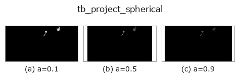
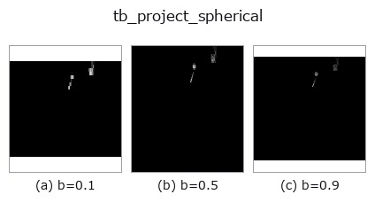
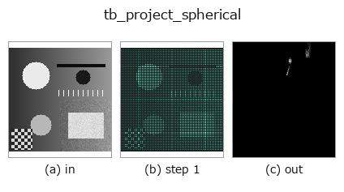
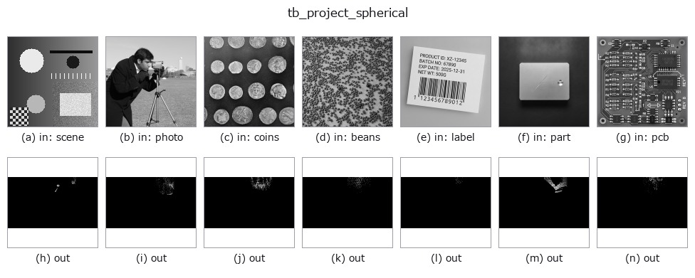

# tb_project_spherical — 2D `typed` op

- **データ種**: `points` → `image`
- **呼び出し**: `fullseye.apply(img, "tb_project_spherical", a=0.5, b=0.5)` (2-D は 1 画像 + 2 スカラつまみ `a,b∈[0,1]` のモデル)


*図は合成の入力 128×128 で実際に走らせた出力。左が入力、右が出力。点群は上から見た散布(明るさ = z)、1-D 列は折れ線、体積は z 方向の最大値投影、動画は中央フレーム、複素画像は振幅、絵にならない返り値は値そのもの。*

**つまみ a を振る**(0.1 / 0.5 / 0.9、もう一方は既定):



**つまみ b を振る**(0.1 / 0.5 / 0.9、もう一方は既定):



**段階**(前置きの op → この op。左から順):



**別の画像でも**(合成シーン / 写真 / 硬貨。上段が入力、下段がその出力。つまみは既定):



## 使い方

回転式 LiDAR の球面レンジ画像へ投影 (v_res, h_res)。空セル=0, 近い点優先(最小 range)。

    各点を方位角(列)× 仰角(行)ビンへ落とし、センサ原点からの range(slant distance)を書く。
    v_fov=(v_min,v_max)[度] の仰角帯の外側、原点上(r=0)、非有限座標の点は落とす(honest drop)。
    空/全 drop の場合は全ゼロ画像を返す(=何も見えていない、honest)。

    - ``points``: (N,3)、センサ原点基準で x=前, y=左, z=上。非 (N,3) は ``ValueError``。
    - ``h_res`` / ``v_res``: 列数(方位角 360° の等分)・行数(仰角帯の等分)。正でなければ ``ValueError``。
    - ``v_fov``: (v_min, v_max) [度]。``v_min < v_max`` でなければ ``ValueError``。

    列は ``floor((atan2(y,x) + π) / 2π · h_res)`` で、列 0 が真後ろ(-x)、``h_res//2`` が正面(+x)、
    反時計回りに増える。行は ``(v_res-1) - floor((θ - v_min)/(v_max - v_min) · v_res)``(θ は仰角
    [度])で、行 0 が帯の上端(θ=v_max)。画素値は slant range ``sqrt(x²+y²+z²)``(座標の単位)。
    同じセルに複数点が落ちたら ``np.minimum.at`` で最小 range を残す(奥の点は失われる)。
    逆変換は ``unproject_spherical``(同じ ``v_fov`` を渡す)。高さで層を切る変種が
    ``project_cylindrical``。

2-D 進化レジストリへ橋渡しした 3d の op ``project_spherical``。実装は同じで、呼び出し規約だけ ``op(v, a, b)`` に合わせてある。``a`` が ``h_res``(既定 1024)、``b`` が ``v_res``(既定 64)を振る。

## 参考(サンプルデータ・文献)

- [サンプルデータ カタログ(DL URL / ライセンス)](../../SAMPLES.md) — 2-D は skimage.data(BSD/public)+ 合成、3-D は実データ源(Stanford/PDS 等)の DL URL。
- [演算子の来歴・参考文献](../../../REFERENCES.md) — この op 族の元になった研究/手法の出典。

## Studio で試す

下のプログラムは実際に走ることを確かめてある(図と同じ入力)。Studio のヘルプではこのブロックがボタンになり、その場で読み込んで実行できる。

```program
img_to_points 0.50 0.50
tb_project_spherical 0.50 0.50
```

## 実行できる例(この op を実際に呼ぶ検証済みサンプル)

次の例は元の台帳 op `project_spherical` を呼ぶもの。この橋渡し op は同じ実装を `fn(v, a, b)` 規約に合わせただけなので、挙動はそのまま当てはまる(呼び出し形だけ違う)。
- [lidar_projection](../../../../examples_3d/lidar_projection.py) — `py -3.11 examples_3d/lidar_projection.py`

## 型が繋がる次の op(`image` を入力に取れる)

[identity](../misc/identity.md) · [gaussian](../smoothing/gaussian.md) · [mean_box](../smoothing/mean_box.md) · [bilateral](../smoothing/bilateral.md) · [unsharp](../smoothing/unsharp.md) · [median](../rank/median.md) · [min_filter](../rank/min_filter.md) · [max_filter](../rank/max_filter.md)

## 同カテゴリ(`typed`)

[tb_points_to_voxel](tb_points_to_voxel.md) · [tb_estimate_point_normals](tb_estimate_point_normals.md) · [tb_iss_keypoints](tb_iss_keypoints.md) · [tb_project_points](tb_project_points.md) · [tb_render_point_depth](tb_render_point_depth.md) · [tb_statistical_outlier_removal](tb_statistical_outlier_removal.md) · [tb_radius_outlier_removal](tb_radius_outlier_removal.md) · [tb_voxel_grid_downsample](tb_voxel_grid_downsample.md)

---
*Provenance: ops.py — 2D operator registry. この per-op ノートは `tools/opdocs.py md` が自動生成(手編集しない)。*

© 2026 Kazufumi Furuse — Fullseye operator documentation. Licensed under Apache-2.0.
