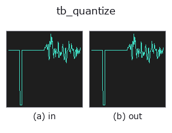
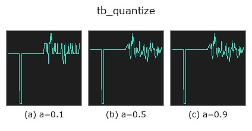
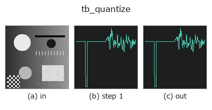
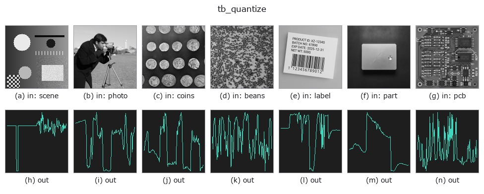

# tb_quantize — 2D `typed` op

- **データ種**: `signal` → `signal`
- **呼び出し**: `fullseye.apply(img, "tb_quantize", a=0.5, b=0.5)` (2-D は 1 画像 + 2 スカラつまみ `a,b∈[0,1]` のモデル)



*図は合成の入力 128×128 で実際に走らせた出力。左が入力、右が出力。点群は上から見た散布(明るさ = z)、1-D 列は折れ線、体積は z 方向の最大値投影、動画は中央フレーム、複素画像は振幅、絵にならない返り値は値そのもの。*

**つまみ a を振る**(0.1 / 0.5 / 0.9、もう一方は既定):



*つまみ b は出力を変えない(実測: 0.1 / 0.5 / 0.9 で同一)。*

**段階**(前置きの op → この op。左から順):



**別の画像でも**(合成シーン / 写真 / 硬貨。上段が入力、下段がその出力。つまみは既定):



## 使い方

Scalar quantiser with the error model stated, plus optional dither.

    *bits* sets the number of levels ``L = 2**bits`` over the signal's own
    min..max range. *mode* is ``"round"`` (mid-tread, unbiased) or ``"truncate"``
    (floor, the convention PIL's posterize and most fixed-point casts use).

    **The two differ by more than a rounding convention.** With step
    ``Delta = range/(L-1)`` both have error variance ``Delta**2/12``, but
    truncation also carries a mean of ``-Delta/2``, so its mean square error is

        truncate:  Delta**2/12 + (Delta/2)**2 = Delta**2/3
        round:     Delta**2/12

    — a factor of **4**. Anything that measures a level (not just displays it)
    must round.

    *dither* adds noise **before** quantising so the error stops being a function
    of the signal: ``"tpdf"`` (triangular, the audio standard — two uniform draws
    summed, so the error's variance no longer depends on the sample value) or
    ``"rpdf"`` (one uniform draw). Dither raises the total error power but removes
    the correlation that makes quantisation audible as distortion rather than as
    hiss. ``seed`` fixes the draw so the op stays deterministic.

    **Applicability.** (1) The range is taken from *this* signal, so two signals
    quantised separately do not share a scale. (2) ``bits=1`` with no dither is a
    comparator, not a quantiser — the error model does not apply. (3) The error
    model assumes the signal moves by more than a step between samples; on a flat
    stretch the error is a constant offset, not noise.

Typed bridge of the 1d op ``quantize`` into the 2-D evolution registry: the same implementation, called under the ``op(v, a, b)`` convention. ``a`` drives ``bits`` (default 8); ``b`` is unused.

## 参考(サンプルデータ・文献)

- [サンプルデータ カタログ(DL URL / ライセンス)](../../SAMPLES.md) — 2-D は skimage.data(BSD/public)+ 合成、3-D は実データ源(Stanford/PDS 等)の DL URL。
- [演算子の来歴・参考文献](../../../REFERENCES.md) — この op 族の元になった研究/手法の出典。

## Studio で試す

下のプログラムは実際に走ることを確かめてある(図と同じ入力)。Studio のヘルプではこのブロックがボタンになり、その場で読み込んで実行できる。

```program
img_to_signal 0.50 0.50
tb_quantize 0.50 0.50
```

## 実行できる例(この op を実際に呼ぶ検証済みサンプル)

次の例は元の台帳 op `quantize` を呼ぶもの。この橋渡し op は同じ実装を `fn(v, a, b)` 規約に合わせただけなので、挙動はそのまま当てはまる(呼び出し形だけ違う)。
- [poc_cold_chain_excursion](../../../../examples/poc_cold_chain_excursion.py) — `py -3.11 examples/poc_cold_chain_excursion.py`

## 型が繋がる次の op(`signal` を入力に取れる)

[identity](../misc/identity.md) · [tb_create_funct_1d_array](tb_create_funct_1d_array.md) · [tb_smooth_funct_1d_gauss](tb_smooth_funct_1d_gauss.md) · [tb_smooth_funct_1d_mean](tb_smooth_funct_1d_mean.md) · [tb_derivate_funct_1d](tb_derivate_funct_1d.md) · [tb_integrate_funct_1d](tb_integrate_funct_1d.md) · [tb_zero_crossings_funct_1d](tb_zero_crossings_funct_1d.md) · [tb_abs_funct_1d](tb_abs_funct_1d.md)

## 同カテゴリ(`typed`)

[tb_points_to_voxel](tb_points_to_voxel.md) · [tb_estimate_point_normals](tb_estimate_point_normals.md) · [tb_iss_keypoints](tb_iss_keypoints.md) · [tb_project_points](tb_project_points.md) · [tb_render_point_depth](tb_render_point_depth.md) · [tb_statistical_outlier_removal](tb_statistical_outlier_removal.md) · [tb_radius_outlier_removal](tb_radius_outlier_removal.md) · [tb_voxel_grid_downsample](tb_voxel_grid_downsample.md)

---
*Provenance: ops.py — 2D operator registry. この per-op ノートは `tools/opdocs.py md` が自動生成(手編集しない)。*

© 2026 Kazufumi Furuse — Fullseye operator documentation. Licensed under Apache-2.0.
