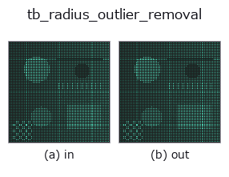
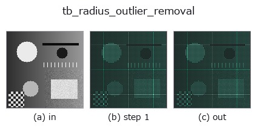
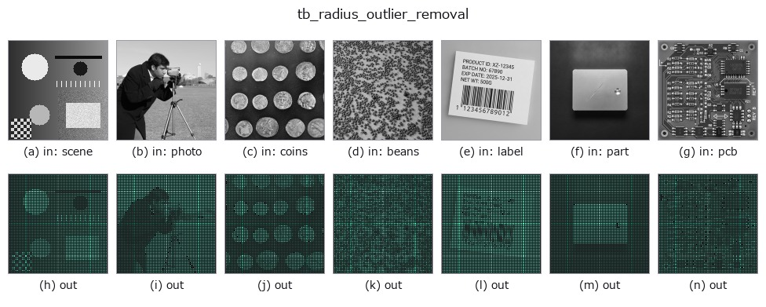

# tb_radius_outlier_removal — 2D `typed` op

- **データ種**: `points` → `points`
- **呼び出し**: `fullseye.apply(img, "tb_radius_outlier_removal", a=0.5, b=0.5)` (2-D は 1 画像 + 2 スカラつまみ `a,b∈[0,1]` のモデル)



*図は合成の入力 128×128 で実際に走らせた出力。左が入力、右が出力。点群は上から見た散布(明るさ = z)、1-D 列は折れ線、体積は z 方向の最大値投影、動画は中央フレーム、複素画像は振幅、絵にならない返り値は値そのもの。*

*つまみ a は出力を変えない(実測: 0.1 / 0.5 / 0.9 で同一)。*

*つまみ b は出力を変えない(実測: 0.1 / 0.5 / 0.9 で同一)。*

**段階**(前置きの op → この op。左から順):



**別の画像でも**(合成シーン / 写真 / 硬貨。上段が入力、下段がその出力。つまみは既定):



## 使い方

半径 radius 内の近傍数が min_neighbors 未満の点を除去する(孤立点除去)。

    各点を中心に半径 ``radius`` の球を張り、その中に居る他点の数が ``min_neighbors``
    に満たない点を「孤立した粒」として落とす。統計的手法より局所的・直接的で、
    センサの実スケールが分かっているときにしきい値を決めやすい。

    Parameters
    ----------
    points : array_like, shape (N, 3)
        入力点群。
    radius : float
        近傍とみなす球の半径(> 0)。
    min_neighbors : int
        残すのに必要な近傍数(自分自身は数えない、既定 8)。

    Returns
    -------
    filtered : ndarray, shape (M, 3)
        生き残った点(元の順序を保持)。
    keep_mask : ndarray of bool, shape (N,)
        各入力点を残すか(True=残す)。

    Notes
    -----
    ``radius <= 0`` は ValueError。空入力は空を返す(graceful)。

2-D 進化レジストリへ橋渡しした 3d の op ``radius_outlier_removal``。実装は同じで、呼び出し規約だけ ``op(v, a, b)`` に合わせてある。``a`` が ``min_neighbors``(既定 8)を振る。``b`` は未使用。

## 参考(サンプルデータ・文献)

- [サンプルデータ カタログ(DL URL / ライセンス)](../../SAMPLES.md) — 2-D は skimage.data(BSD/public)+ 合成、3-D は実データ源(Stanford/PDS 等)の DL URL。
- [演算子の来歴・参考文献](../../../REFERENCES.md) — この op 族の元になった研究/手法の出典。

## Studio で試す

下のプログラムは実際に走ることを確かめてある(図と同じ入力)。Studio のヘルプではこのブロックがボタンになり、その場で読み込んで実行できる。

```program
img_to_points 0.50 0.50
tb_radius_outlier_removal 0.50 0.50
```

## 実行できる例(この op を実際に呼ぶ検証済みサンプル)

次の例は元の台帳 op `radius_outlier_removal` を呼ぶもの。この橋渡し op は同じ実装を `fn(v, a, b)` 規約に合わせただけなので、挙動はそのまま当てはまる(呼び出し形だけ違う)。
- [pcl_geodesic](../../../../examples_3d/pcl_geodesic.py) — `py -3.11 examples_3d/pcl_geodesic.py`

## 型が繋がる次の op(`points` を入力に取れる)

[identity](../misc/identity.md) · [tb_points_to_voxel](tb_points_to_voxel.md) · [tb_estimate_point_normals](tb_estimate_point_normals.md) · [tb_iss_keypoints](tb_iss_keypoints.md) · [tb_project_points](tb_project_points.md) · [tb_render_point_depth](tb_render_point_depth.md) · [tb_statistical_outlier_removal](tb_statistical_outlier_removal.md) · [tb_voxel_grid_downsample](tb_voxel_grid_downsample.md)

## 同カテゴリ(`typed`)

[tb_points_to_voxel](tb_points_to_voxel.md) · [tb_estimate_point_normals](tb_estimate_point_normals.md) · [tb_iss_keypoints](tb_iss_keypoints.md) · [tb_project_points](tb_project_points.md) · [tb_render_point_depth](tb_render_point_depth.md) · [tb_statistical_outlier_removal](tb_statistical_outlier_removal.md) · [tb_voxel_grid_downsample](tb_voxel_grid_downsample.md) · [tb_mls_smooth](tb_mls_smooth.md)

---
*Provenance: ops.py — 2D operator registry. この per-op ノートは `tools/opdocs.py md` が自動生成(手編集しない)。*

© 2026 Kazufumi Furuse — Fullseye operator documentation. Licensed under Apache-2.0.
