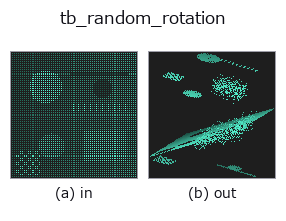
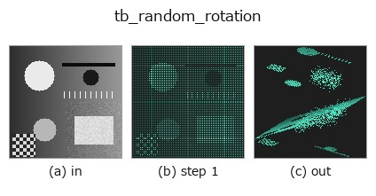
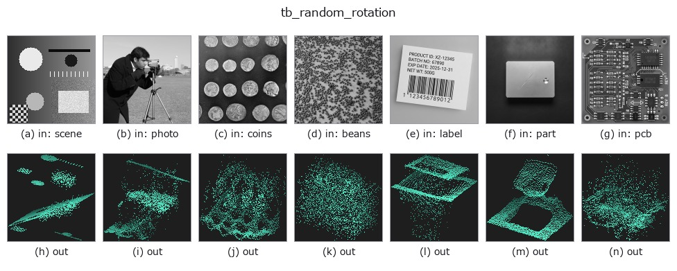

# tb_random_rotation — 2D `typed` op

- **データ種**: `points` → `points`
- **呼び出し**: `fullseye.apply(img, "tb_random_rotation", a=0.5, b=0.5)` (2-D は 1 画像 + 2 スカラつまみ `a,b∈[0,1]` のモデル)



*図は合成の入力 128×128 で実際に走らせた出力。左が入力、右が出力。点群は上から見た散布(明るさ = z)、1-D 列は折れ線、体積は z 方向の最大値投影、動画は中央フレーム、複素画像は振幅、絵にならない返り値は値そのもの。*

*つまみ a は出力を変えない(実測: 0.1 / 0.5 / 0.9 で同一)。*

*つまみ b は出力を変えない(実測: 0.1 / 0.5 / 0.9 で同一)。*

**段階**(前置きの op → この op。左から順):



**別の画像でも**(合成シーン / 写真 / 硬貨。上段が入力、下段がその出力。つまみは既定):



## 使い方

ランダム回転を適用し ``(rotated, R)`` を返す(視点変化の模倣)。

    ``R`` は正規直交・``det=+1``(``rotated = points @ R.T`` = 各点に ``R`` を左作用、
    逆変換は ``rotated @ R``)。``max_angle=None`` なら Shoemake 法で一様ランダム回転、
    ``max_angle`` 指定(ラジアン, 期待 ``[0, π]``)なら軸を球面一様・角を ``[0, max_angle]``
    一様に取り、回転角を制限する(``arccos((tr R -1)/2) ≤ max_angle`` を厳密に保証)。

    ``max_angle < 0`` は ``ValueError``、``max_angle=0`` は単位行列。単位はラジアン(度で
    渡すと桁違いに大きくなる)。``max_angle=None`` の一様回転は上限 π までの大きな回転も
    普通に出るので、視点変化の範囲を絞りたいときは ``max_angle`` を使う。回転は原点まわり
    で、雲が原点から離れていれば重心も動く。``R`` の規約 ``rotated = points @ R.T`` は
    ``register_fpfh``・``register_shot`` が返す ``dst ≈ src @ R.T + t`` と同じ向きなので、
    推定結果との角度誤差は ``arccos((tr(R_est·Rᵀ)-1)/2)`` で測れる。``seed`` で決定論的
    (同 seed なら同じ ``R``)。返り値は float64 の ``(N,3)`` と ``(3,3)``。

2-D 進化レジストリへ橋渡しした 3d の op ``random_rotation``。実装は同じで、呼び出し規約だけ ``op(v, a, b)`` に合わせてある。この op に調整点は無く、``a`` も ``b`` も使われない。

## 参考(サンプルデータ・文献)

- [サンプルデータ カタログ(DL URL / ライセンス)](../../SAMPLES.md) — 2-D は skimage.data(BSD/public)+ 合成、3-D は実データ源(Stanford/PDS 等)の DL URL。
- [演算子の来歴・参考文献](../../../REFERENCES.md) — この op 族の元になった研究/手法の出典。

## Studio で試す

下のプログラムは実際に走ることを確かめてある(図と同じ入力)。Studio のヘルプではこのブロックがボタンになり、その場で読み込んで実行できる。

```program
img_to_points 0.50 0.50
tb_random_rotation 0.50 0.50
```

## 実行できる例(この op を実際に呼ぶ検証済みサンプル)

次の例は元の台帳 op `random_rotation` を呼ぶもの。この橋渡し op は同じ実装を `fn(v, a, b)` 規約に合わせただけなので、挙動はそのまま当てはまる(呼び出し形だけ違う)。
- [augment_pointcloud](../../../../examples_3d/augment_pointcloud.py) — `py -3.11 examples_3d/augment_pointcloud.py`
- [sh_descriptor_retrieval](../../../../examples_3d/sh_descriptor_retrieval.py) — `py -3.11 examples_3d/sh_descriptor_retrieval.py`
- [shape_retrieval](../../../../examples_3d/shape_retrieval.py) — `py -3.11 examples_3d/shape_retrieval.py`

## 型が繋がる次の op(`points` を入力に取れる)

[identity](../misc/identity.md) · [tb_points_to_voxel](tb_points_to_voxel.md) · [tb_estimate_point_normals](tb_estimate_point_normals.md) · [tb_iss_keypoints](tb_iss_keypoints.md) · [tb_project_points](tb_project_points.md) · [tb_render_point_depth](tb_render_point_depth.md) · [tb_statistical_outlier_removal](tb_statistical_outlier_removal.md) · [tb_radius_outlier_removal](tb_radius_outlier_removal.md)

## 同カテゴリ(`typed`)

[tb_points_to_voxel](tb_points_to_voxel.md) · [tb_estimate_point_normals](tb_estimate_point_normals.md) · [tb_iss_keypoints](tb_iss_keypoints.md) · [tb_project_points](tb_project_points.md) · [tb_render_point_depth](tb_render_point_depth.md) · [tb_statistical_outlier_removal](tb_statistical_outlier_removal.md) · [tb_radius_outlier_removal](tb_radius_outlier_removal.md) · [tb_voxel_grid_downsample](tb_voxel_grid_downsample.md)

---
*Provenance: ops.py — 2D operator registry. この per-op ノートは `tools/opdocs.py md` が自動生成(手編集しない)。*

© 2026 Kazufumi Furuse — Fullseye operator documentation. Licensed under Apache-2.0.
