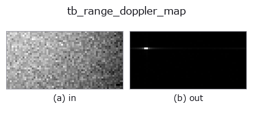
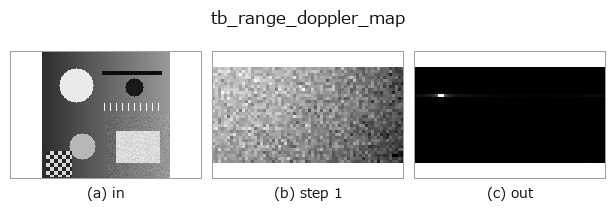
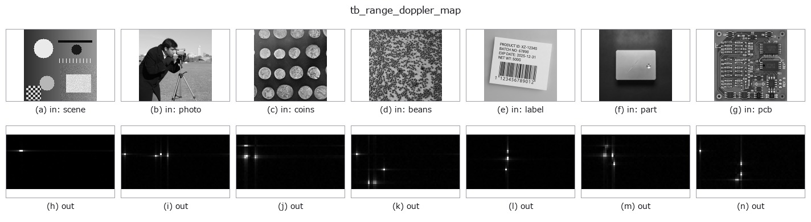

# tb_range_doppler_map — 2D `typed` op

- **データ種**: `beatcube` → `image`
- **呼び出し**: `fullseye.apply(img, "tb_range_doppler_map", a=0.5, b=0.5)` (2-D は 1 画像 + 2 スカラつまみ `a,b∈[0,1]` のモデル)



*図は合成の入力 128×128 で実際に走らせた出力。左が入力、右が出力。点群は上から見た散布(明るさ = z)、1-D 列は折れ線、体積は z 方向の最大値投影、動画は中央フレーム、複素画像は振幅、絵にならない返り値は値そのもの。*

*つまみ a は出力を変えない(実測: 0.1 / 0.5 / 0.9 で同一)。*

*つまみ b は出力を変えない(実測: 0.1 / 0.5 / 0.9 で同一)。*

**段階**(前置きの op → この op。左から順):



**別の画像でも**(合成シーン / 写真 / 硬貨。上段が入力、下段がその出力。つまみは既定):



## 使い方

The 2-D FFT of a beat cube -> a ``(n_doppler, n_range)`` magnitude map.

    Fast time transforms to **range** (last axis, not shifted: bin ``j`` is
    ``j * c*f_s/(2*S*N_s)`` metres, and a physical range is always positive so
    the whole ``[0, f_s)`` band is used). Slow time transforms to **velocity**
    (middle axis, ``fftshift``ed so the map is centred on zero velocity: bin
    ``i`` is ``(i - N_c//2) * lambda/(2*N_c*T_c)`` metres per second, positive =
    receding).

    The antenna axis is collapsed by *combine*: ``"incoherent"`` (default) is the
    **mean of the magnitudes**, which is angle independent and therefore the
    right default for detection; ``"coherent"`` is the **magnitude of the mean**,
    i.e. a beam pointed at boresight, which attenuates an off-boresight target on
    purpose. ``antenna=k`` uses element ``k`` alone. For a single-element cube
    all three agree exactly.

    ``normalize=True`` divides by ``N_c * N_s``, so a bin-centred target of
    amplitude ``a`` peaks at exactly ``a`` (measured: 1.0 for a unit target,
    absolute error 0.0). The default ``False`` keeps the raw FFT magnitude.

    No window is applied — compose :func:`fmcw_window_apply` first if you want
    one. The output is a plain 2-D float64 array, so every 2-D operator in
    Fullseye (threshold, morphology, labelling, blob measurement — the pieces a
    CFAR detector is made of) applies to it directly.

    **Raises** ``ValueError``: a real-valued cube (it would put a mirror ghost of
    every target at a fabricated range), fewer than 2 chirps or 2 samples, an
    out-of-range *antenna* index, an unknown *combine*, a cube over the element
    cap, an FFT that overflows to NaN, or NaN/Inf on the way in.

Typed bridge of the rangedoppler op ``range_doppler_map`` into the 2-D evolution registry: the same implementation, called under the ``op(v, a, b)`` convention. This op has no tunable parameter; ``a`` and ``b`` are unused.

## 参考(サンプルデータ・文献)

- [サンプルデータ カタログ(DL URL / ライセンス)](../../SAMPLES.md) — 2-D は skimage.data(BSD/public)+ 合成、3-D は実データ源(Stanford/PDS 等)の DL URL。
- [演算子の来歴・参考文献](../../../REFERENCES.md) — この op 族の元になった研究/手法の出典。

## Studio で試す

下のプログラムは実際に走ることを確かめてある(図と同じ入力)。Studio のヘルプではこのブロックがボタンになり、その場で読み込んで実行できる。

```program
img_to_beatcube 0.50 0.50
tb_range_doppler_map 0.50 0.50
```

## 実行できる例(この op を実際に呼ぶ検証済みサンプル)

次の例は元の台帳 op `range_doppler_map` を呼ぶもの。この橋渡し op は同じ実装を `fn(v, a, b)` 規約に合わせただけなので、挙動はそのまま当てはまる(呼び出し形だけ違う)。
- [fmcw_range_doppler](../../../../examples/fmcw_range_doppler.py) — `py -3.11 examples/fmcw_range_doppler.py`

## 型が繋がる次の op(`image` を入力に取れる)

[identity](../misc/identity.md) · [gaussian](../smoothing/gaussian.md) · [mean_box](../smoothing/mean_box.md) · [bilateral](../smoothing/bilateral.md) · [unsharp](../smoothing/unsharp.md) · [median](../rank/median.md) · [min_filter](../rank/min_filter.md) · [max_filter](../rank/max_filter.md)

## 同カテゴリ(`typed`)

[tb_points_to_voxel](tb_points_to_voxel.md) · [tb_estimate_point_normals](tb_estimate_point_normals.md) · [tb_iss_keypoints](tb_iss_keypoints.md) · [tb_project_points](tb_project_points.md) · [tb_render_point_depth](tb_render_point_depth.md) · [tb_statistical_outlier_removal](tb_statistical_outlier_removal.md) · [tb_radius_outlier_removal](tb_radius_outlier_removal.md) · [tb_voxel_grid_downsample](tb_voxel_grid_downsample.md)

---
*Provenance: ops.py — 2D operator registry. この per-op ノートは `tools/opdocs.py md` が自動生成(手編集しない)。*

© 2026 Kazufumi Furuse — Fullseye operator documentation. Licensed under Apache-2.0.
